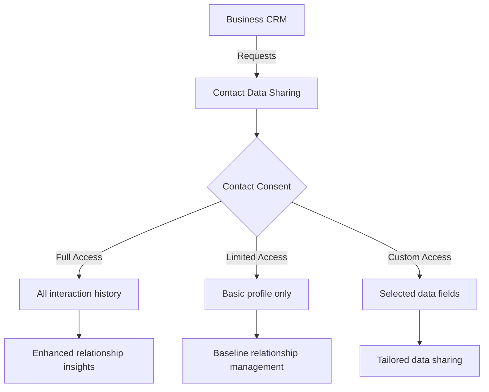
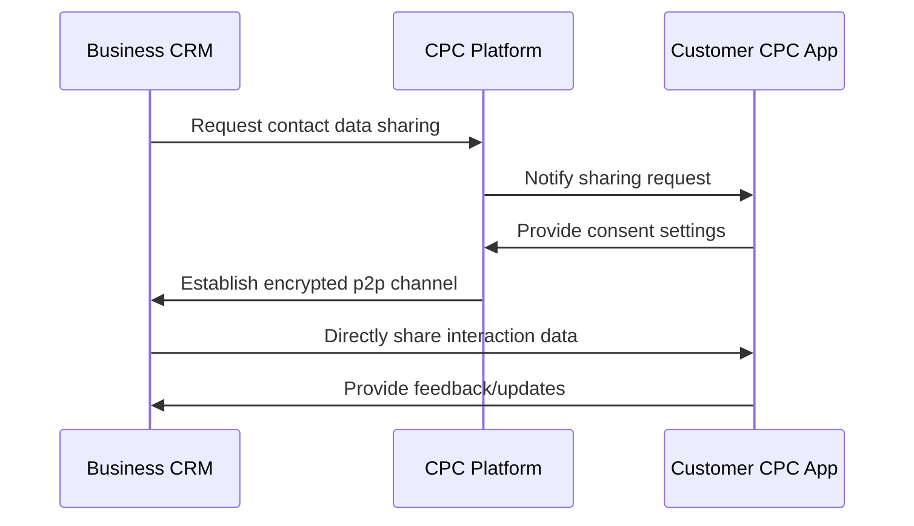

# CPC CRM Module Architecture

## Vision Statement

Design a lightweight CRM system that leverages the unique capability of our platform where both businesses and customers can exist as participants within the CPC ecosystem, while still supporting management of external (off-platform) contacts. This creates a powerful network effect where interactions on the platform generate value for both parties.

## Core Principles

1. **Platform-Native Relationships**: When both business and customer are CPC users, enable direct p2p connections with consent-based data sharing
2. **Hybrid Model Support**: Seamlessly manage both platform-native contacts and traditional external contacts
3. **Privacy by Design**: Implement granular consent controls for contact data sharing
4. **Network Effects**: Create value through the platform's connectivity, not just data storage
5. **Progressive Disclosure**: Start simple but design for future expansion to advanced CRM features

## Key Differentiators

### 1. Dual-Mode Contact Management

The CRM handles two distinct contact types with different capabilities:

| Feature | Platform-Native Contact | External Contact |
|---------|-------------------------|------------------|
| Identity | CPC User ID (with verified profile) | Traditional contact info |
| Data Sharing | Direct p2p with consent controls | Business-owned data only |
| Interaction Tracking | Full interaction history (with consent) | Business-recorded interactions only |
| Network Effects | ✓ (creates platform value) | ✗ |
| Shared Context | ✓ (common groups, interests, etc.) | ✗ |

### 2. Consent-Based Data Sharing Framework

When both parties are on platform, implement a sophisticated consent model:



### 3. Value Exchange Mechanism

The platform creates mutual value when both parties participate:

- **For Businesses**: Richer customer insights, automated relationship nurturing
- **For Customers**: Control over their data, reduced spam, meaningful engagement
- **For Platform**: Network effects that strengthen the ecosystem

## Domain Model Design

### Core Entities

#### 1. Contact (Domain)

```rust
pub enum ContactType {
    PlatformNative(UserId, ConsentSettings),
    External(ExternalContactData),
}

pub struct Contact {
    id: ContactId,
    contact_type: ContactType,
    name: String,
    primary_email: Option<Email>,
    primary_phone: Option<Phone>,
    company: Option<String>,
    tags: Vec<String>,
    created_at: DateTime<Utc>,
    updated_at: DateTime<Utc>,
    last_interaction: Option<DateTime<Utc>>,
}

pub struct ConsentSettings {
    share_profile: DataSharingLevel,
    share_interaction_history: DataSharingLevel,
    share_preferences: DataSharingLevel,
    custom_fields: HashMap<String, DataSharingLevel>,
}

pub enum DataSharingLevel {
    None,
    ViewOnly,
    Editable,
}
```

#### 2. Interaction (Domain)

```rust
pub enum InteractionType {
    Call,
    Email,
    Meeting,
    Message,
    PlatformEvent(PlatformEventId), // Reference to platform-native interaction
}

pub struct Interaction {
    id: InteractionId,
    contact_id: ContactId,
    interaction_type: InteractionType,
    summary: String,
    details: Option<String>,
    timestamp: DateTime<Utc>,
    duration: Option<Duration>,
    created_by: UserId,
    is_platform_native: bool, // Indicates if this was a platform-mediated interaction
}
```

#### 3. Sales Pipeline (Domain)

```rust
pub struct Pipeline {
    id: PipelineId,
    name: String,
    stages: Vec<PipelineStage>,
    owner_id: UserId,
    is_shared: bool,
    shared_with: Vec<UserId>,
}

pub struct PipelineStage {
    id: StageId,
    name: String,
    probability: u8, // 0-100%
    estimated_value: Option<MonetaryAmount>,
    position: u8,
}
```

#### 4. Deal (Domain)

```rust
pub struct Deal {
    id: DealId,
    contact_id: ContactId,
    pipeline_id: PipelineId,
    current_stage: StageId,
    title: String,
    value: MonetaryAmount,
    expected_close_date: Option<DateTime<Utc>>,
    notes: Vec<DealNote>,
    created_at: DateTime<Utc>,
    updated_at: DateTime<Utc>,
    is_platform_deal: bool, // Indicates if customer is platform-native
}
```

## Layer Architecture

### Domain Layer

- Pure business logic with zero external dependencies
- Contains core entities and their validation rules
- Implements domain services for business rules
- No awareness of storage or presentation

**Key Domain Services:**
- `ContactConsentService`: Manages consent workflows and validation
- `RelationshipStrengthCalculator`: Determines relationship quality based on interactions
- `PipelineStagePredictor`: Predicts likely progression through sales stages

### Application Layer

- Orchestrates domain objects to implement use cases
- Handles transactions and error management
- Translates between domain and infrastructure layers

**Key Use Cases:**
1. `CreateContact`: Handles both platform-native and external contact creation
2. `RecordInteraction`: Captures interaction with proper consent checks
3. `CreateDeal`: Creates sales opportunities with pipeline integration
4. `ShareContactData`: Manages the consent-based data sharing flow

### Infrastructure Layer

#### Database Implementation
- Separate tables for platform-native vs. external contacts
- Relationship tables for consent settings and data sharing
- Optimized indexes for common CRM queries (by last interaction, pipeline stage)

#### P2P Implementation
- **Platform-Native Connections**: Direct p2p channels using p2panda
- **Data Sharing Protocol**: Implements our consent framework for CRM data
- **Conflict Resolution**: CRDTs for collaborative editing of shared data
- **Notification System**: Real-time updates for shared interactions



### Presentation Layer

#### Yew Components (Web)
- Contact management interface with toggle between platform-native/external views
- Visual pipeline board with drag-and-drop functionality
- Interaction timeline showing both platform and recorded interactions
- Consent management panel for platform-native contacts

#### Bevy Components (3D Visualization)
- Relationship network visualization showing connections between contacts
- Sales pipeline 3D flow with deal progression
- Geographic mapping of customer locations (with privacy controls)

## Integration Strategy

### With Invoicing Module
- Link contacts to invoices and quotes
- Automatically create contacts from invoice recipients
- Show payment history in contact profile

### With Calendar Module
- Schedule follow-ups directly from interaction records
- See contact availability (with consent) for platform-native contacts
- Sync meeting records to interaction history

### With Documents Module
- Attach files to contacts and deals
- Template generation for sales documents
- Document sharing with consent controls

## Privacy & Security Considerations

### Data Classification
- **Public**: Basic contact info (name, company)
- **Private**: Full contact details, interaction history
- **Sensitive**: Financial data, personal preferences

### Security Controls
- Double Ratchet encryption for all p2p CRM data sharing
- Automatic session rotation for data sharing channels
- Memory-safe handling of sensitive data
- Audit trails for all data access

### Consent Management
- Granular per-field sharing controls
- Time-limited consent options
- Easy revocation process
- Clear visual indicators of sharing status

## Implementation Roadmap

### Phase 1: Core CRM Functionality (MVP)
- Basic contact management (both platform-native and external)
- Simple interaction tracking
- Single sales pipeline with 3 stages
- Basic consent framework for platform-native contacts

### Phase 2: Enhanced Relationship Management
- Relationship strength metrics
- Automated follow-up suggestions
- Advanced consent management
- Integration with Calendar module

### Phase 3: Sales Optimization
- Pipeline analytics
- Deal forecasting
- Team collaboration features
- Advanced reporting

## Validation Criteria

| Criteria | Verification Method |
|----------|---------------------|
| Platform-Native Value | Measure increased engagement between connected businesses/customers |
| Consent Model Effectiveness | Track consent acceptance rates and user satisfaction |
| Performance | Ensure <500ms response time for core operations |
| Privacy Compliance | Audit trail verification for all data access |
| Integration Quality | Test seamless data flow with Invoicing and Calendar modules |

## Conclusion

This architecture creates a CRM that is fundamentally different from traditional solutions by leveraging our platform's unique capability to connect businesses and customers directly. When both parties participate on the platform, we create mutual value through secure, consent-based data sharing that traditional CRMs cannot match.

The modular design ensures we can start simple while building toward more advanced capabilities, all while maintaining our architectural principles of hexagonal design, screaming architecture, and vertical slices.