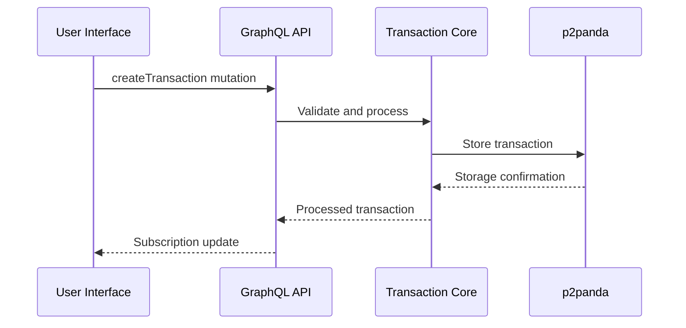
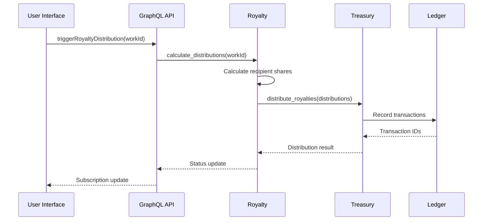

# Personal Finance Module Architecture

## Overview
The finance module provides cooperative financial tools including transaction tracking, treasury management, royalty distribution, and universal basic income. Built with Rust using hexagonal architecture.

## Tech Stack
- **Core Logic**: Rust (cpc-core)
- **Data Storage**: p2panda (cpc-net)
- **API**: GraphQL (Axum) + gRPC for internal services
- **UI**: Yew (web), Tauri (desktop), Kotlin (Android)

## Vertical Slices
```
finance/
├── transactions/         # Transaction management
├── treasury/             # Platform treasury
├── royalties/            # Royalty distribution
├── ubi/                  # Universal basic income
└── wallets/              # Wallet operations
```

## Core Components

### 1. Transaction Management
- **Models**:
  ```rust
  pub struct Transaction {
      pub id: Uuid,
      pub amount: Decimal,
      pub currency: Currency,
      pub timestamp: DateTime<Utc>,
      pub category: TransactionCategory,
      pub description: String,
      pub source_wallet: WalletId,
      pub destination_wallet: WalletId,
  }
  ```
- **Features**: Validation, categorization, reconciliation

### 2. Treasury Service
- Manages platform funds and reserves
- Multi-currency support
- Automated reserve allocations

### 3. Royalty Engine
- Distributes royalties using configurable rules
- Supports percentage splits, fixed amounts, cascading distributions

### 4. Universal Income Service
- Scheduled disbursements
- Eligibility tracking
- Distribution rules engine

### 5. Wallet Service
- Public/private key management
- Transaction signing
- Balance calculations

## Royalty Integration

### Royalty Engine Integration
- **Location**: `packages/cpc-core/src/finance/royalties.rs`
- **Responsibilities**:
  - Manage distribution rules for creative works
  - Calculate royalty distributions based on revenue shares
  - Handle fixed vs percentage-based distributions
  - Prevent overdistribution errors

### Treasury Integration Service
- **Location**: `packages/cpc-core/src/finance/treasury_royalty.rs` (to be created)
- **Responsibilities**:
  - Execute royalty distributions through treasury service
  - Convert royalty distributions to transactions
  - Handle currency conversion and validation
  - Maintain audit trails for royalty payments

### Content Service Implementation
- **Location**: `apps/backend/src/services/content.rs` (to be created)
- **Responsibilities**:
  - Manage royalty rules associated with creative works
  - Trigger royalty distributions on revenue events
  - Maintain connection to media processing pipeline
  - Provide content metadata to royalty engine

### Mobile Integration
- **Android Implementation**:
  - Use shared Rust code through JNI bindings
  - GraphQL API calls through shared networking module
  - Transaction history displays royalty payments
- **Data Flow**:
  1. Mobile app triggers distribution via GraphQL mutation
  2. Subscribes to distribution progress
  3. Displays royalty payments in transaction history
  4. Allows royalty rule management through UI

### Error Handling
- **RoyaltyError Cases**:
  - RuleNotFound: Missing distribution rules for work
  - Overdistribution: Sum of shares exceeds 100%
  - CurrencyMismatch: Treasury vs royalty currency conflict
  - InvalidPercentage: Share values outside 0.0-1.0 range

## Data Storage
Use p2panda documents with schemas:
```graphql
type Transaction @schema {
  id: ID! @unique
  amount: Decimal!
  currency: String!
  timestamp: DateTime!
  # ... other fields
}
```

## API Design

### GraphQL API (Public)
```graphql
type Mutation {
  createTransaction(input: TransactionInput!): Transaction!
  distributeRoyalties(workId: ID!): RoyaltyDistribution!
  requestUBI: UbiDisbursement!
}

type Subscription {
  transactionProcessed: Transaction!
  royaltyDistributed: RoyaltyDistribution!
}
```

### gRPC Service (Internal)
```proto
service FinanceService {
  rpc ProcessTransaction(TransactionRequest) returns (stream TransactionStatus) {}
  rpc CalculateRoyalties(RoyaltyCalculation) returns (stream RoyaltyDistribution) {}
}
```

## Workflow Sequence

### Transaction Processing


### Royalty Distribution


## Implementation Plan
1. Implement core domain models in cpc-core
2. Create p2panda storage adapter in cpc-net
3. Develop GraphQL API in backend
4. Build UI components in Yew
5. Add Android wrapper for shared Rust code

## Security
- All financial operations require wallet signatures
- Sensitive operations use 2FA
- Data encrypted at rest and in transit