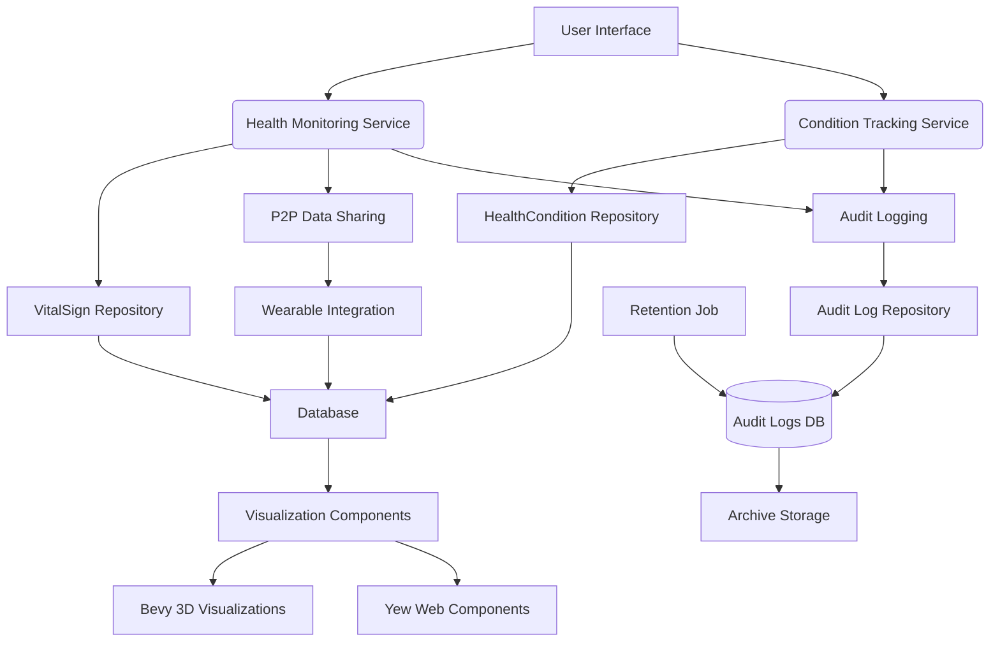

# Health Module Architecture

## Module Structure (Hexagonal Architecture with Vertical Slices)

The health module must be implemented in `packages/cpc-core/health/` to follow screaming architecture principles. All health domain logic exists as vertical slices within the core package.

```
packages/cpc-core/health/
├── Cargo.toml
├── MIGRATION_GUIDE.md  # Migration instructions from old structures
├── README.md           # Module documentation
└── src/
    ├── lib.rs
    ├── domain/          # Pure business models (VitalSign, HealthCondition)
    │   ├── vital_signs.rs
    │   ├── health_condition.rs
    │   ├── primitives.rs
    │   └── mod.rs
    ├── application/     # Service orchestration (HealthMonitoringService, ConditionTrackingService)
    │   ├── monitoring_service.rs
    │   ├── condition_service.rs
    │   └── mod.rs
    ├── infrastructure/  # Concrete implementations (repositories, p2p)
    │   ├── database/
    │   │   ├── models.rs
    │   │   ├── repositories.rs
    │   │   └── mod.rs
    │   ├── p2p/
    │   │   ├── data_sharing.rs
    │   │   └── mod.rs
    │   ├── wearables/
    │   │   ├── api_integration.rs
    │   │   └── mod.rs
    │   └── mod.rs
    └── presentation/    # UI components (Bevy, Yew)
        ├── bevy/
        │   ├── health_viz.rs
        │   └── mod.rs
        ├── yew/
        │   ├── components.rs
        │   └── mod.rs
        └── mod.rs
```

## Domain Models

### Vital Sign Model
```rust
pub struct VitalSign {
    pub id: Uuid,
    pub user_id: Uuid,
    pub timestamp: DateTime<Utc>,
    pub measurement_type: VitalSignType,
    pub value: f32,
    pub unit: String,
    pub source: MeasurementSource,  // Wearable, Manual, MedicalDevice
    pub notes: Option<String>,
}

pub enum VitalSignType {
    HeartRate,
    BloodPressure,
    BloodGlucose,
    BodyTemperature,
    OxygenSaturation,
    RespiratoryRate,
    BodyWeight,
    BodyMassIndex,
}

pub enum MeasurementSource {
    Wearable(String),  // Device model
    Manual,
    MedicalDevice(String),
}
```

### Health Condition Model
```rust
pub struct HealthCondition {
    pub id: Uuid,
    pub user_id: Uuid,
    pub condition_type: ConditionType,
    pub diagnosis_date: DateTime<Utc>,
    pub severity: ConditionSeverity,
    pub status: ConditionStatus,
    pub notes: Option<String>,
    pub created_at: DateTime<Utc>,
    pub updated_at: DateTime<Utc>,
}

pub enum ConditionType {
    Chronic(String),  // e.g., "Diabetes Type 2"
    Acute(String),    // e.g., "Influenza"
    Genetic(String),
    MentalHealth(String),
}

pub enum ConditionSeverity {
    Mild,
    Moderate,
    Severe,
    Critical,
}

pub enum ConditionStatus {
    Active,
    Remission,
    Resolved,
    Chronic,
}
```

## Service Interfaces

### Health Monitoring Service
```rust
pub struct HealthMonitoringService {
    repository: Arc<dyn VitalSignRepository>,
    p2p_manager: Arc<P2PManager>,
}

impl HealthMonitoringService {
    pub async fn record_vital_sign(
        &self,
        user_id: Uuid,
        measurement_type: VitalSignType,
        value: f32,
        unit: String,
        source: MeasurementSource,
        notes: Option<String>,
    ) -> Result<VitalSign, HealthError> {
        let vital_sign = VitalSign::new(
            user_id, 
            measurement_type, 
            value, 
            unit, 
            source, 
            notes,
            Utc::now()
        );
        
        // Anonymize data for research sharing if user has consented
        if let Some(anonymized) = vital_sign.anonymize_for_research() {
            self.p2p_manager.share_health_data(anonymized).await?;
        }
        
        self.repository.save(&vital_sign).await?;
        Ok(vital_sign)
    }
}
```

### Condition Tracking Service
```rust
pub struct ConditionTrackingService {
    repository: Arc<dyn HealthConditionRepository>,
}

impl ConditionTrackingService {
    pub async fn create_condition(
        &self,
        user_id: Uuid,
        condition_type: ConditionType,
        diagnosis_date: DateTime<Utc>,
        severity: ConditionSeverity,
        status: ConditionStatus,
        notes: Option<String>,
    ) -> Result<HealthCondition, HealthError> {
        let condition = HealthCondition::new(
            user_id,
            condition_type,
            diagnosis_date,
            severity,
            status,
            notes,
            Utc::now(),
            Utc::now(),
        );
        self.repository.save(&condition).await?;
        Ok(condition)
    }
}
```

## GraphQL API Design

### Mutations
```graphql
input RecordVitalSignInput {
    measurementType: VitalSignType!
    value: Float!
    unit: String!
    source: MeasurementSourceInput
    notes: String
}

input MeasurementSourceInput {
    type: MeasurementSourceType!
    deviceModel: String
}

input CreateHealthConditionInput {
    conditionType: ConditionTypeInput!
    diagnosisDate: DateTime!
    severity: ConditionSeverity!
    status: ConditionStatus!
    notes: String
}

input ConditionTypeInput {
    type: ConditionCategory!
    description: String!
}

enum ConditionCategory {
    CHRONIC
    ACUTE
    GENETIC
    MENTAL_HEALTH
}

enum MeasurementSourceType {
    WEARABLE
    MANUAL
    MEDICAL_DEVICE
}

type Mutation {
    recordVitalSign(input: RecordVitalSignInput!): VitalSign!
    createHealthCondition(input: CreateHealthConditionInput!): HealthCondition!
    updateHealthCondition(id: ID!, input: CreateHealthConditionInput!): HealthCondition!
}
```

### Queries
```graphql
type Query {
    getVitalSign(id: ID!): VitalSign
    listVitalSigns(
        type: VitalSignType
        startDate: DateTime
        endDate: DateTime
        limit: Int
        offset: Int
    ): [VitalSign!]!
    
    getHealthCondition(id: ID!): HealthCondition
    listHealthConditions(
        status: ConditionStatus
        limit: Int
        offset: Int
    ): [HealthCondition!]!
    
    getHealthTrends(
        type: VitalSignType!
        timeRange: TimeRangeInput!
    ): HealthTrendResult!
}

input TimeRangeInput {
    start: DateTime!
    end: DateTime!
}
```

### Subscriptions
```graphql
type Subscription {
    vitalSignRecorded(userId: ID!): VitalSign!
    healthConditionUpdated(userId: ID!): HealthCondition!
    healthAlertTriggered(userId: ID!): HealthAlert!
}

type HealthAlert {
    id: ID!
    userId: ID!
    alertType: HealthAlertType!
    severity: AlertSeverity!
    message: String!
    timestamp: DateTime!
    relatedData: JSON
}

enum HealthAlertType {
    ABNORMAL_READING
    MEDICATION_REMINDER
    APPOINTMENT_REMINDER
    TREATMENT_MILESTONE
}

enum AlertSeverity {
    LOW
    MEDIUM
    HIGH
    CRITICAL
}
```

## Integration Points

### 1. **Fitness Tracker Integration**:
   - Connects with common wearable devices (Apple Watch, Fitbit, Garmin)
   - Uses standardized health data protocols (HealthKit, Google Fit)
   - Implements privacy-preserving data sharing

### 2. **p2p Data Sharing**:
   - All sensitive health data is shared exclusively through p2panda peer channels
   - Uses Double Ratchet encryption for privacy-preserving health data sharing
   - Implements granular user consent flows for data sharing
   - Supports research data sharing with anonymization

### 3. **Visualization Components**:
   - Bevy-based 3D health visualizations (trend charts, body mapping)
   - Yew-based web components for health dashboard views
   - Interactive timeline for condition tracking

### 4. **Privacy and Consent Management**:
   - HIPAA-compliant data handling
   - Explicit user consent for each data sharing scenario
   - Granular privacy controls for different health data types
   - Data minimization principles applied throughout

### 5. **HIPAA Audit Logging**
   - Comprehensive audit trail for all PHI access
   - Dual authentication requirements for audit log access
   - Automatic anonymization for research data access patterns
   - 1-year archival and 6-year retention policy enforcement

## Data Flow Diagram



## Audit Logging Architecture

```mermaid
sequenceDiagram
    participant Application as Application
    participant AuditService as Audit Service
    participant Repository as Audit Log Repository
    participant Database as Database
    participant RetentionJob as Retention Job

    Application->>AuditService: Access PHI Data
    AuditService->>Repository: Create Audit Log
    Repository->>Database: Store Log (AES-256 encrypted at rest)
    alt Success
        Database-->>Repository: Success
        Repository-->>AuditService: Log Created
    else Failure
        Repository->>AuditService: Log Creation Failed
        AuditService->>Application: Continue with Warning (Fail-safe)
    end

    Note over Application, Database: PHI Anonymization Rules:
    Note over Application, Database: &bullet; user_id = NULL for Research purpose
    Note over Application, Database: &bullet; source_ip partially redacted
    Note over Application, Database: &bullet; device_info omitted for Research

    RetentionJob->>Database: Daily Check
    Database->>RetentionJob: Logs older than 1 year
    RetentionJob->>Database: Archive logs (Move to Archive Table)
    Database->>RetentionJob: Logs older than 6 years
    RetentionJob->>Database: Purge expired logs
```

### Key Components Explained

1. **Event Triggering**: All PHI access (reading vital signs, health conditions) triggers an audit log entry
2. **Fail-safe Pattern**: System continues operation even if logging fails, but issues warnings for monitoring
3. **Encryption**: All audit logs are stored with AES-256 encryption at rest in the database
4. **Retention Lifecycle**:
   - Active storage: 1 year (optimized for frequent access)
   - Archived storage: 5 additional years (cost-optimized storage)
   - Complete purge: After 6 years to meet HIPAA requirements

### PHI Anonymization Rules

Audit logs apply the following anonymization rules based on access purpose:

| Log Field       | UserView | ProviderAccess | Research | DataSync | Admin |
|-----------------|----------|----------------|----------|----------|-------|
| user_id         | Full     | Full           | NULL     | Full     | Full  |
| source_ip       | Full     | Full           | Redacted | Full     | Full  |
| device_info     | Full     | Full           | Omitted  | Full     | Full  |
| data_content    | Full     | Full           | Limited  | Full     | Full  |

Research access automatically anonymizes user identifiers while maintaining data utility for analysis.

### Dual-Authentication Requirements

Access to audit logs requires dual authentication for all administrative operations:

1. Standard user authentication (password/biometric)
2. One-time verification code from a separate device
3. Implementation enforces dual authentication through `check_dual_auth()` in repository layer
4. All audit log access attempts are themselves logged for additional security

## Bevy Visualization Examples

### Component for Vital Sign Visualization
```rust
/// Component for vital sign visualization
#[derive(Component)]
pub struct VitalSignViz {
    pub measurement_type: VitalSignType,
    pub values: Vec<f32>,
}

/// System to update health visualizations
fn update_health_visualizations(
    mut query: Query<(&VitalSignViz, &mut Transform)>,
) {
    for (viz, mut transform) in query.iter_mut() {
        // Real implementation would update based on health data
        // including highlighting abnormal readings and showing trends
        transform.translation.x += 0.01;
    }
}
```

### Example Graph Implementation Using Plotters
```rust
use plotters::prelude::*;

fn create_heart_rate_chart(vital_signs: &[VitalSign]) -> Result<(), Box<dyn std::error::Error>> {
    let root = BitMapBackend::new("heart_rate.png", (800, 600)).into_drawing_area();
    root.fill(&WHITE)?;
    
    let max_value = vital_signs.iter().map(|v| v.value).fold(0.0, f32::max);
    let min_value = vital_signs.iter().map(|v| v.value).fold(1000.0, f32::min);
    
    let mut chart = ChartBuilder::on(&root)
        .caption("Heart Rate Trend", ("sans-serif", 40))
        .margin(10)
        .x_label_area_size(40)
        .y_label_area_size(40)
        .build_ranged(
            *vital_signs.first().unwrap().timestamp..*vital_signs.last().unwrap().timestamp,
            min_value-10.0..max_value+10.0
        )?;
    
    chart.configure_mesh().draw()?;
    
    chart.draw_series(
        LineSeries::new(
            vital_signs.iter().map(|v| (v.timestamp, v.value)),
            &RED,
        ),
    )?;
    
    root.present()?;
    Ok(())
}
```

### Privacy-Preserving Visualization Patterns

#### Implement Blurred Sensitive Ranges Using Bevy's Shaders
```rust
// In health_viz.rs
fn update_health_visualizations(
    mut query: Query<(&VitalSignViz, &mut Visibility)>,
    privacy_settings: Res<PrivacySettings>,
) {
    for (viz, mut visibility) in query.iter_mut() {
        // Hide critical health metrics if user has restricted visibility
        if privacy_settings.hide_critical_metrics &&
           matches!(viz.measurement_type, VitalSignType::BloodPressure | VitalSignType::BloodGlucose) {
            *visibility = Visibility::Hidden;
        } else {
            *visibility = Visibility::Visible;
        }
    }
}
```

## Health Module Quick Start

### Getting Started with Bevy Visualizations

1. Add the health module to your project:
```toml
[dependencies]
cpc-core-health = { path = "../../packages/cpc-core/health" }
```

2. Import the HealthVizPlugin in your Bevy app:
```rust
use cpc_core::health::presentation::bevy::HealthVizPlugin;

fn main() {
    App::new()
        .add_plugins(DefaultPlugins)
        .add_plugin(HealthVizPlugin)
        .run();
}
```

3. Create a vital sign visualization:
```rust
fn setup_health_dashboard(mut commands: Commands) {
    commands.spawn(VitalSignViz {
        measurement_type: VitalSignType::HeartRate,
        values: vec![72.0, 75.0, 78.0, 74.0, 76.0],
    });
}
```

4. Customize visualization appearance based on privacy settings:
```rust
fn update_health_privacy(
    mut query: Query<&mut Style, With<VitalSignViz>>,
    privacy_settings: Res<PrivacySettings>,
) {
    for mut style in query.iter_mut() {
        if privacy_settings.hide_critical_metrics {
            style.visibility = Visibility::Hidden;
        }
    }
}
```

### Testing with Sample Data

Generate sample vital signs for development:
```rust
fn generate_sample_vital_signs() -> Vec<VitalSign> {
    let now = Utc::now();
    (0..24)
        .map(|i| {
            VitalSign::new(
                Uuid::new_v4(),
                VitalSignType::HeartRate,
                70.0 + (i % 10) as f32,
                "bpm".to_string(),
                MeasurementSource::Wearable("Fitbit Versa".to_string()),
                None,
                now - chrono::Duration::hours(24 - i),
            )
        })
        .collect()
}
```