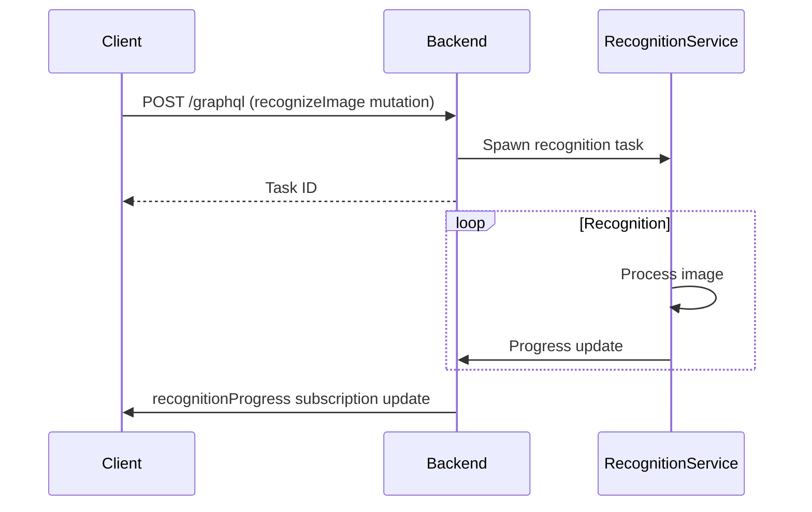

# Image Recognition Architecture

## Objective
Implement cross-platform image recognition feature using shared Rust codebase.

## Requirements
- Cross-platform support (Android + Desktop)
- Offline-first capability
- MIT/Apache 2.0 licensed dependencies
- Integration with GraphQL API

## Technology Choices
| Component          | Technology      | License     |
|--------------------|-----------------|-------------|
| Image Processing   | image-rs        | MIT/Apache 2.0 |
| Machine Learning   | tract           | Apache 2.0 |
| Model Format       | ONNX            | MIT         |
| Android FFI        | JNI             | Apache 2.0 |
| Desktop Integration| Tauri Commands  | MIT/Apache 2.0 |
| API Layer          | GraphQL         | MIT         |

## Architecture Components

### Core Recognition Service
```rust
// packages/cpc-core/src/vision/mod.rs

pub struct ImageRecognizer {
    model: tract::onnx::InferenceModel,
}

impl ImageRecognizer {
    pub fn new(model_path: &str) -> Result<Self> {
        // Load ONNX model
    }
    
    pub fn recognize(&self, image: &DynamicImage) -> Vec<RecognitionResult> {
        // Preprocess, infer, postprocess
    }
}
```

### Data Models
```rust
// packages/cpc-core/src/vision/models.rs

pub struct RecognitionResult {
    pub label: String,
    pub confidence: f32,
    pub bounding_box: Option<Rect>,
}
```

### Android Integration
```rust
// packages/cpc-core/src/ffi/android/vision.rs

#[jni_fn("com.cpc.vision.ImageRecognizer")]
pub fn recognizeImage(env: JNIEnv, image: JObject) -> JObject {
    // Convert Android Bitmap to Rust image
    // Call ImageRecognizer
    // Return results
}
```

### Desktop Integration
```rust
// apps/pds/src-tauri/src/vision.rs

#[tauri::command]
async fn recognize_image(image_path: PathBuf) -> Result<Vec<RecognitionResult>> {
    let recognizer = ImageRecognizer::new("model.onnx")?;
    let image = image::open(image_path)?;
    recognizer.recognize(&image)
}
```

## API Layer
### GraphQL Schema
```graphql
type RecognitionResult {
  label: String!
  confidence: Float!
  boundingBox: BoundingBox
}

input RecognizeImageInput {
  image: Upload!
}

extend type Mutation {
  recognizeImage(input: RecognizeImageInput!): ID! # Returns task ID
}

extend type Subscription {
  recognitionProgress(taskId: ID!): RecognitionResult!
}
```

## Sequence Diagram


## Validation Criteria
- Offline model execution verified
- Cross-platform consistency checks
- License compliance audit
- Performance benchmarks (time/memory)

## Next Steps
1. Implement core recognition service
2. Create Android JNI bindings
3. Add Tauri commands for desktop
4. Implement GraphQL API