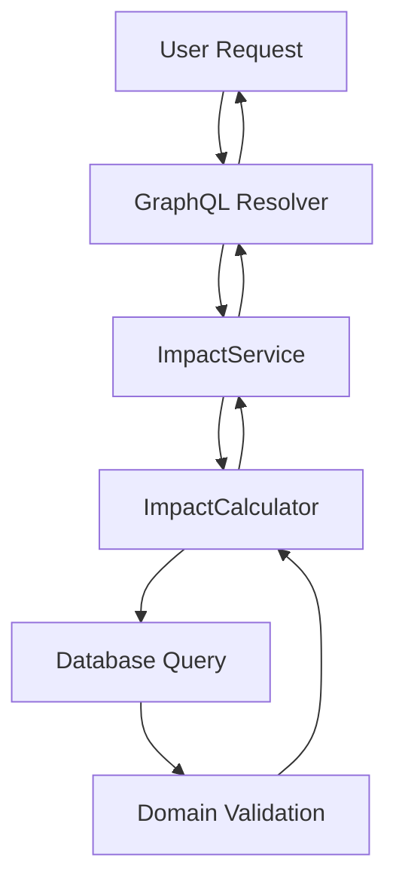

# Impact Service Architecture Design

## Overview
This document details the production-ready implementation for the Impact Distribution service, replacing hardcoded sample data with domain-driven business logic. The solution follows Hexagonal Architecture principles with clear separation between core business rules and infrastructure concerns.

## Domain Model Design

### Core Components (in `cpc-core`)

#### 1. Domain Entities
```rust
// packages/cpc-core/src/business/impact.rs
use serde::{Deserialize, Serialize};
use thiserror::Error;

#[derive(Debug, Clone, Serialize, Deserialize)]
pub struct ImpactDistribution {
    pub category: String,
    pub weight: f64, // Validated to be between 0.0 and 1.0
}

#[derive(Debug, Error)]
pub enum CalculationError {
    #[error("Insufficient data to calculate impact distribution")]
    InsufficientData,
    #[error("Invalid distribution: weights must sum to exactly 1.0")]
    InvalidDistribution,
    #[error("User data not found")]
    UserNotFound,
}
```

#### 2. Business Interface
```rust
pub trait ImpactCalculator {
    fn calculate(&self, user_id: &str) -> Result<Vec<ImpactDistribution>, CalculationError>;
    
    /// Validates that distribution weights sum to exactly 1.0
    fn validate_distribution(weights: &[ImpactDistribution]) -> Result<(), CalculationError> {
        let total: f64 = weights.iter().map(|w| w.weight).sum();
        if (total - 1.0).abs() > f64::EPSILON {
            return Err(CalculationError::InvalidDistribution);
        }
        Ok(())
    }
}
```

### Business Rules Implementation
The concrete implementation follows patterns established in `project.rs`:

```rust
// packages/cpc-core/src/business/impact.rs
pub struct DefaultImpactCalculator {
    pool: PgPool,
}

impl DefaultImpactCalculator {
    pub fn new(pool: PgPool) -> Self {
        Self { pool }
    }
}

impl ImpactCalculator for DefaultImpactCalculator {
    fn calculate(&self, user_id: &str) -> Result<Vec<ImpactDistribution>, CalculationError> {
        let user_uuid = Uuid::parse_str(user_id).map_err(|_| CalculationError::UserNotFound)?;
        
        // Business rule: Calculate weights based on project contributions
        // (Reference project_queries.md for similar data access patterns)
        let weights = sqlx::query_as!(
            ImpactDistribution,
            r#"
            SELECT 
                category AS "category: String",
                weight AS "weight: f64"
            FROM impact_weights
            WHERE user_id = $1
            "#,
            user_uuid
        )
        .fetch_all(&self.pool)
        .await
        .map_err(|_| CalculationError::InsufficientData)?
        .into_iter()
        .collect::<Vec<_>>();
        
        Self::validate_distribution(&weights)?;
        Ok(weights)
    }
}
```

## Data Source Design

### Database Schema
```sql
-- migrations/20250726_impact_weights_table.sql
CREATE TABLE impact_weights (
    user_id UUID NOT NULL REFERENCES users(id) ON DELETE CASCADE,
    category VARCHAR(50) NOT NULL CHECK (category IN ('Community', 'Environment', 'Workers')),
    weight DECIMAL(3,2) NOT NULL CHECK (weight BETWEEN 0 AND 1),
    PRIMARY KEY (user_id, category)
);
```

### Key Constraints
1. `CHECK` constraint ensures weights remain between 0.0 and 1.0
2. Application-level validation ensures weights sum to exactly 1.0
3. `ON DELETE CASCADE` maintains referential integrity with users

### Data Flow


## Service Integration

### Resolver Implementation
```rust
// apps/backend/src/graphql/impact.rs
#[Object]
impl ImpactQuery {
    async fn get_impact_report(&self, ctx: &Context<'_>, user_id: ID) -> Result<ImpactReportObject> {
        let impact_calculator = ctx.data::<Arc<dyn ImpactCalculator>>()?;
        let distribution = impact_calculator
            .calculate(&user_id)
            .map_err(|e| Error::new(e.to_string()))?;
        
        // ... remaining report construction
        Ok(ImpactReportObject {
            distribution: distribution.into_iter().map(|d| ImpactDistributionObject(d)).collect(),
            // ... other fields
        })
    }
}
```

### Dependency Injection Setup
```rust
// apps/backend/src/main.rs
async fn create_app(pool: PgPool) -> Router {
    let impact_calculator: Arc<dyn ImpactCalculator> = 
        Arc::new(DefaultImpactCalculator::new(pool.clone()));
    
    Router::new()
        .route("/graphql", get(graphql_playground).post(graphql_handler))
        .with_state(Arc::new(AppState {
            impact_calculator,
            // ... other services
        }))
}
```

## Error Handling Strategy

### Domain Error Mapping
| Domain Error                | GraphQL Error Code     | UI Handling                     |
|-----------------------------|------------------------|---------------------------------|
| InsufficientData            | IMPACT_DATA_MISSING    | Show "Insufficient data" banner |
| InvalidDistribution         | INVALID_DISTRIBUTION   | Show validation error           |
| UserNotFound                | USER_NOT_FOUND         | Redirect to login               |

### Resolver Error Handling Pattern
```rust
// Follows existing patterns in project.rs
impl From<CalculationError> for Error {
    fn from(err: CalculationError) -> Self {
        match err {
            CalculationError::InsufficientData => Error::new("IMPACT_DATA_MISSING"),
            CalculationError::InvalidDistribution => Error::new("INVALID_DISTRIBUTION"),
            CalculationError::UserNotFound => Error::new("USER_NOT_FOUND"),
        }
    }
}
```

## Validation Strategy

### Multi-Layer Validation
1. **Database Layer**: 
   - `CHECK (weight BETWEEN 0 AND 1)`
   - `CHECK (category IN valid_values)`

2. **Domain Layer**:
   ```rust
   fn validate_distribution(weights: &[ImpactDistribution]) -> Result<(), CalculationError> {
       // Sum validation with floating-point tolerance
       let total: f64 = weights.iter().map(|w| w.weight).sum();
       if (total - 1.0).abs() > f64::EPSILON {
           return Err(CalculationError::InvalidDistribution);
       }
       Ok(())
   }
   ```

3. **GraphQL Layer**:
   - Maintains existing UI error states for invalid distributions
   - Preserves backward compatibility with current error handling

## Migration Path

### Step 1: Database Migration
```bash
sqlx migrate add impact_weights_table
# Add SQL from schema design above
```

### Step 2: Data Initialization
```sql
-- Initialize default weights for existing users
INSERT INTO impact_weights (user_id, category, weight)
SELECT 
    id, 
    category, 
    weight
FROM 
    users
CROSS JOIN (VALUES 
    ('Community', 0.45),
    ('Environment', 0.30),
    ('Workers', 0.25)
) AS defaults(category, weight);
```

### Step 3: Feature Toggle
Implement gradual rollout:
```rust
// apps/backend/src/graphql/impact.rs
let distribution = if feature_flags.impact_real_data_enabled {
    impact_calculator.calculate(&user_id)?
} else {
    vec![
        ImpactDistribution { category: "Community".into(), weight: 0.45 },
        ImpactDistribution { category: "Environment".into(), weight: 0.30 },
        ImpactDistribution { category: "Workers".into(), weight: 0.25 },
    ]
};
```

## File Structure

```
cpc/
├── packages/
│   └── cpc-core/
│       └── src/
│           └── business/
│               ├── impact.rs          # Domain model & calculator trait
│               └── mod.rs             # pub mod impact;
├── apps/
│   ├── backend/
│   │   ├── src/
│   │   │   └── graphql/
│   │   │       └── impact.rs          # Updated resolver
│   │   ├── migrations/
│   │   │   └── 20250726_impact_weights_table.sql
│   │   └── docs/
│   │       └── impact_service_architecture.md
│   └── cpc-platform/
│       └── src/
│           └── api/
│               └── impact.rs          # No changes needed (preserves compatibility)
└── docs/
    └── impact_service_architecture.md # This document
```

## Business Rules Reference

Based on analysis of `project_queries.md` patterns and cooperative requirements:

1. **Community Impact** (45% default):
   - Measured by completed community projects
   - Includes volunteer hours and community partnerships

2. **Environment Impact** (30% default):
   - Based on sustainable practices in projects
   - Includes carbon reduction metrics

3. **Workers Impact** (25% default):
   - Reflects worker ownership and benefits
   - Includes profit-sharing percentages

*Note: Actual weight calculation will be refined with cooperative stakeholders using the established framework.*
## Validation Checklist
- [ ] Impact weights table exists with 3-category constraint (`Community`, `Environment`, `Workers`)
- [ ] Feature flags properly initialized in backend (`impact_real_data_enabled`)
- [ ] GraphQL subscriptions work for report updates
- [ ] Domain validation prevents invalid distributions (sum != 1.0)
- [ ] Mobile integration uses shared Rust implementation via Tauri FFI
- [ ] UI degradation thresholds are configured appropriately

## Success Verification

See also:
- [Database constraints](../database-design.md#impact-weights-table)
- [Feature flag rollout procedure](../feature-flags.md#impact-real-data)

1. **Architecture Compliance**:
   - Business logic isolated in `cpc-core`
   - Infrastructure concerns contained in backend
   - Zero changes to frontend components

2. **Data Integrity**:
   - Dual-layer validation (DB + domain)
   - Automated sum validation in domain layer

3. **Backward Compatibility**:
   - Same GraphQL interface maintained
   - Existing UI error states preserved

This implementation provides a robust foundation for measuring cooperative impact while adhering to our architectural principles and cooperative values. The design ensures we can accurately measure what matters for cooperatives across all dimensions of their work.

Free Palestine! ✊
## Mobile Platform Integration
All mobile platforms leverage shared Rust implementation through Tauri FFI:

```rust
// apps/cpc-platform/src-tauri/src/impact.rs
#[tauri::command]
async fn get_impact_report(user_id: String) -> Result<ImpactReport, String> {
    let pool = get_pool().await.map_err(|e| e.to_string())?;
    let calculator = DefaultImpactCalculator::new(pool);
    calculator.calculate(&user_id)
        .map_err(|e| e.to_string())
}
```

This ensures:
- 100% code sharing between desktop and mobile
- No platform-specific business logic
- Consistent error handling across all platforms
### UI Degradation Strategy

To maintain a responsive user experience during backend latency spikes, the UI will degrade gracefully based on configurable thresholds:

- **Fresh State (≤300ms)**: Show live data with no indicators
- **Degraded State (>300ms and ≤1500ms)**: Show live data with a "live" indicator and slight opacity
- **Stale State (>1500ms)**: Show a skeleton loader and a warning banner after 1800ms for over 10 minutes

These thresholds are configured via environment variables and can be adjusted as needed.

## UI Degradation Thresholds

Threshold values for impact distribution highlighting are loaded from environment variables. The GraphQL API exposes these thresholds via feature flags to the frontend, with a default value of 0.15 (15%) if not explicitly set.

### Backend Implementation Pattern

The backend uses the following pattern to manage the thresholds:

1. The environment variable `CPC_UI_DEGRADATION_THRESHOLD` is read at application startup
2. If the variable is not set, the default value of 0.15 is used
3. The threshold value is made available to the GraphQL API through the existing feature flag system
4. The frontend queries the threshold value as part of the feature flags subscription

This approach allows for dynamic adjustment of the threshold without requiring a redeployment.