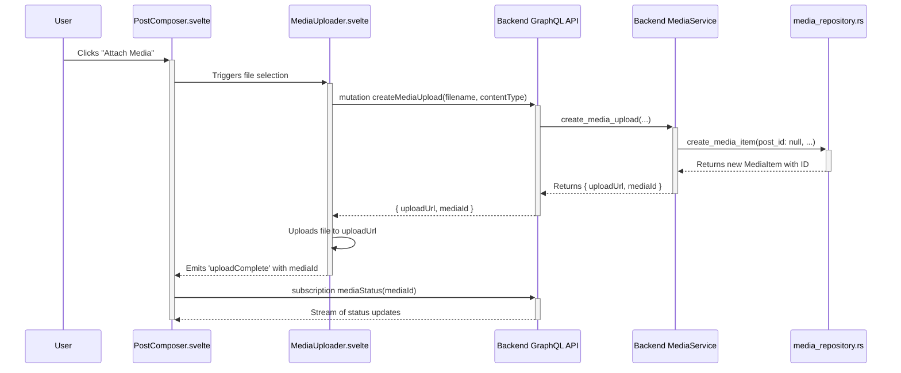
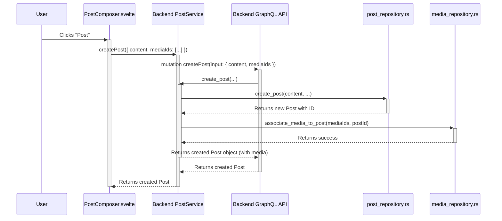

# Architectural Design: Media-Post Integration

This document outlines the architectural changes required to integrate the media processing system with the social posting features.

## 1. Overview

The goal is to allow users to upload media, see its processing status, and then attach it to a social post. The current implementation incorrectly ties a media item to a post at the moment of upload, which is before the post itself exists.

This redesign decouples media upload from post creation. Media items will be created independently and associated with a post upon the post's creation.

## 2. Architectural Principles

This design adheres to our established principles:

-   **Hexagonal Architecture:** The core domain logic for posts and media remains independent of the transport layer (GraphQL) and persistence layer (SQLx).
-   **Screaming Architecture:** The feature is organized around the "social posting" capability, with clear vertical slices for features like "creating a post with media".
-   **Vertical Slices:** The changes are scoped to the "post with media" feature, touching the UI, API, and data layers as a single unit.

## 3. High-Level Flow

1.  **Media Upload:**
    -   User clicks "Attach Media" in `PostComposer.svelte`.
    -   The frontend requests a secure upload URL from the backend via a `createMediaUpload` GraphQL mutation, but **without** a `postId`.
    -   The backend creates a `MediaItem` record with a `NULL` `postId`.
    -   The frontend uploads the file directly to the provided URL.
    -   The frontend subscribes to media processing updates for the new `mediaId` via a `mediaStatus` GraphQL subscription.
2.  **Post Composition:**
    -   The `PostComposer.svelte` component displays a preview of the uploaded media and its processing status (e.g., "processing", "ready", "failed").
    -   The user writes their post content.
3.  **Post Creation:**
    -   User clicks "Post".
    -   The frontend calls the `createPost` GraphQL mutation, providing the post content and a list of `mediaIds` for the successfully processed media.
    -   The backend's `createPost` resolver:
        -   Creates the `Post` record.
        -   Updates the `MediaItem` records for the given `mediaIds` to set their `postId`, associating them with the newly created post.
4.  **Feed Display:**
    -   When fetching a post, the GraphQL query will also retrieve the associated media.
    -   The UI will display the post with its media. If any media failed to process, a specific UI treatment will be applied.

## 4. Sequence Diagrams

### 4.1. Media Upload & Processing Status



### 4.2. Post Creation with Media



## 5. GraphQL Schema Changes

### 5.1. Mutations

The `createMediaUpload` mutation needs to change. `postId` will be removed from `CreateMediaUploadInput`.

The `createPost` mutation needs to be updated to accept `mediaIds`.

```graphql
# apps/backend/src/graphql/schema.graphql (conceptual)

# Remove postId from this input
input CreateMediaUploadInput {
  filename: String!
  contentType: String!
  fileSize: Int!
  # postId: ID! # REMOVED
}

# Add mediaIds to this input
input CreatePostInput {
  content: String!
  visibility: Visibility!
  cooperativeId: ID
  mediaIds: [ID!]
}

type Mutation {
  createMediaUpload(input: CreateMediaUploadInput!): MediaUpload!
  createPost(input: CreatePostInput!): Post!
  # ... other mutations
}
```

### 5.2. Types

The `Post` type needs to include a list of `MediaItem`s.

```graphql
type Post {
  id: ID!
  content: String!
  author: User!
  createdAt: DateTime!
  # ... other fields
  media: [MediaItem!]!
}

type MediaItem {
    id: ID!
    url: String!
    mediaType: MediaType!
    processingStatus: ProcessingStatus!
    # ... other fields
}
```

## 6. File-by-File Implementation Plan

### 6.1. Backend (`apps/backend/`)

**`src/repositories/media_repository.rs`**

1.  **Modify `media_items` table schema:**
    -   In `init_db`, change `post_id TEXT NOT NULL` to `post_id TEXT`. This makes the foreign key nullable.
2.  **Update `CreateMediaItem` struct:**
    -   The `post_id` field in `cpc_core::models::media::CreateMediaItem` should be changed to `Option<Uuid>`.
3.  **Update `create_media_item` function:**
    -   The function signature will now accept `Option<Uuid>` for `post_id`.
    -   The `INSERT` query needs to handle a `NULL` value for `post_id`.
4.  **Create `associate_media_to_post` function:**
    -   Add a new function: `async fn associate_media_to_post(&self, media_ids: Vec<Uuid>, post_id: Uuid) -> Result<(), sqlx::Error>`.
    -   This function will execute an `UPDATE media_items SET post_id = ? WHERE id IN (...)` query.

**`src/graphql/media_mutations.rs`**

1.  **Update `CreateMediaUploadInput`:**
    -   Remove the `post_id: Uuid` field.
2.  **Update `create_media_upload` resolver:**
    -   Remove the `post_id` from the input.
    -   When calling `media_service.repo.create_media_item`, pass `post_id: None`.

**`src/graphql/post_mutations.rs` (or equivalent)**

1.  **Update `CreatePostInput`:**
    -   Add `media_ids: Option<Vec<Uuid>>`.
2.  **Update `create_post` resolver:**
    -   After creating the post and getting the `new_post.id`, if `input.media_ids` is `Some`, call the new `media_repository.associate_media_to_post` function.

**`src/models/post.rs` (or equivalent)**

1.  **Update `Post` struct:**
    -   Add a field `media: Vec<MediaItem>`. This will be populated by the GraphQL resolver.

### 6.2. Frontend (`apps/cpc-platform/`)

**`src/lib/services/post-service.js`**

1.  **Update `createPost` function:**
    -   Ensure `mediaIds` are correctly passed in the `CREATE_POST` mutation's variables. The current implementation has a discrepancy (`mediaUrls` vs `mediaIds`), which needs to be fixed.

**`src/lib/graphql/mutations.js` (or equivalent)**

1.  **Update `CREATE_POST` mutation:**
    -   Modify the GraphQL string to include the `$mediaIds: [ID!]` variable in the `createPost` input.

**`src/lib/components/PostComposer.svelte`**

1.  **Media Upload Logic:**
    -   The `MediaUploader` should no longer be passed a `postId`.
2.  **State Management for Media:**
    -   The `media` array in the component's state should store objects that include `id`, `url`, `type`, and `processingStatus`.
3.  **GraphQL Subscription for Media Status:**
    -   When `handleMediaUpload` is called and a `mediaId` is received, initiate a GraphQL subscription for that `mediaId`.
    -   Update the `media` array in the state as status updates are received.
    -   The UI should reflect the `processingStatus` (e.g., show a spinner, an error icon, or a checkmark).
4.  **Submitting the Post:**
    -   In `handleSubmit`, filter the `media` array to only include items that have a `processingStatus` of `Completed` before extracting their IDs to send to `createPost`.

**`src/lib/components/FeedSkeleton.svelte`**

-   No changes are needed here. Error handling for failed media should be in the component that renders the actual post, not the skeleton.

**`src/lib/components/Post.svelte` (or equivalent, to be created/modified)**

1.  **Render Media:**
    -   Loop through `post.media` and render each item.
2.  **Handle Failed Media:**
    -   If a `mediaItem.processingStatus` is `Failed`, display a specific error state for that media item (e.g., a "processing failed" message).

## 7. Error Handling

-   **Media Processing Failure:** If media processing fails, the GraphQL subscription will notify the `PostComposer`. The UI will update to show the failed state. The user will not be able to attach this media to the post.
-   **Post Creation with Failed Media:** The `handleSubmit` function will filter out media that hasn't completed processing, preventing failed media from being associated with a post.
-   **Post-Creation Media Failure:** This scenario is less likely with the new flow but could happen in a distributed system. If a post is created and a linked media item later fails, the `Post` component in the feed will render the media with an error state based on its `processingStatus`.

This concludes the architectural design. The next step is to delegate the implementation to `ougcode`.