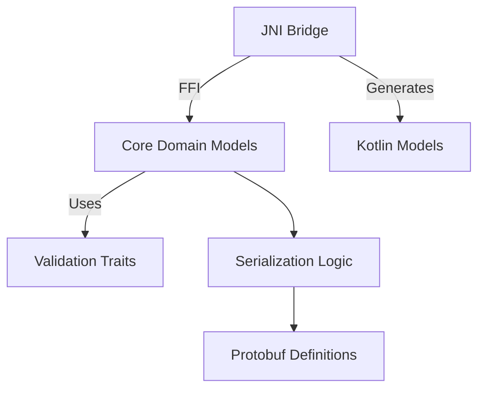

# Product Model Architecture

## Overview


## Key Components
1. **Core Models** (`cpc-core/src/product/model.rs`)
   - Product, Money, WarehouseLocation structs
   - Validation via `validator` crate
   
2. **Serialization** (`cpc-core/src/serialization.rs`)
   - Protobuf conversions
   - Android-specific transformations
   
3. **JNI Bridge** (`apps/cpc-platform/android/app/src/main/rust/jni_bridge.rs`)
   - FFI interface for Android
   - Memory management via boxing

## Critical Issues
```diff
! URGENT: Model Duplication
- models.rs contains conflicting Product definition (lines 53-114)
- This will cause runtime inconsistencies

! JNI Safety Gaps
- Null pointer dereferencing risk in createProduct()
- Unchecked unwrap() operations

! Error Handling
- No error propagation to Java layer
- Panic risks in deserialization
```

## Recommended Improvements
### Immediate Fixes (P0)
1. Remove duplicate model definitions from `models.rs`
2. Add null checks for JNI pointer dereferencing:
   ```rust
   if supply_chain == 0 {
       return ...;
   }
   let supply_chain_ref = unsafe { &*supply_chain };
   ```
3. Replace unwrap() with proper error handling:
   ```rust
   let bytes = env.convert_byte_array(bytes)
       .map_err(|e| jni_errors::convert_to_exception(env, e))?;
   ```

### Medium-term Improvements (P1)
1. Implement JNI error propagation:
   - Create custom JNI exceptions
   - Return `jthrowable` for error cases
2. Optimize memory management:
   - Use `jni-rs` safe pointers instead of raw pointers
3. Add validation tests:
   - Boundary tests for all validated fields
   - Fuzz testing for serialization

## Future Roadmap
1. **Shared Validation Logic**
   - Extract validation rules to shared module
   - Reuse in both Rust and Kotlin
   
2. **Code Generation**
   - Protobuf-driven model generation
   - Auto-generated JNI bindings

3. **Cross-platform Serialization**
   - Replace manual conversions with auto-mapping
   - Support multiple formats (CBOR, MessagePack)
```
<line_count>65</line_count>