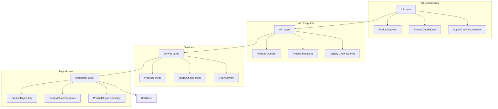

# Product Scanning Module Architecture

## Overview
This document outlines the architecture for the product scanning module, which enables users to scan product barcodes and access product information, supply chain data, and origin details. The module is designed following hexagonal architecture principles with vertical slices for separation of concerns.

## Module Structure


## Domain Models (cpc-core)

### Product
pub struct Product {
    pub id: Uuid,
    pub name: String,
    pub description: Option<String>,
    pub category: String,
    pub brand: Option<String>,
    pub sku: Option<String>,
    pub barcode: Option<String>,
    pub created_at: DateTime<Utc>,
    pub updated_at: DateTime<Utc>,
}

### ProductOrigin
```rust
pub struct ProductOrigin {
    pub id: Uuid,
    pub product_id: Uuid,
    pub country_of_origin: String,
    pub region: Option<String>,
    pub city: Option<String>,
    pub manufacturer: String,
    pub manufacturer_address: Option<String>,
    pub certification_info: Option<String>,
    pub verified: bool,
    pub verification_date: Option<DateTime<Utc>>,
    pub created_at: DateTime<Utc>,
    pub updated_at: DateTime<Utc>,
}
```

### SupplyChain
```rust
pub struct SupplyChain {
    pub id: Uuid,
    pub product_id: Uuid,
    pub stage: SupplyChainStage,
    pub location: String,
    pub organization: String,
    pub timestamp: DateTime<Utc>,
    pub description: Option<String>,
    pub verification_status: VerificationStatus,
    pub previous_stage_id: Option<Uuid>,
    pub next_stage_id: Option<Uuid>,
    pub created_at: DateTime<Utc>,
    pub updated_at: DateTime<Utc>,
}

#[derive(Debug, Clone, Serialize, Deserialize)]
pub enum SupplyChainStage {
    RawMaterial,
    Manufacturing,
    Processing,
    Packaging,
    Distribution,
    Wholesale,
    Retail,
    Consumer,
}

#[derive(Debug, Clone, Serialize, Deserialize)]
pub enum VerificationStatus {
    Unverified,
    Pending,
    Verified,
    Disputed,
    Rejected,
}
```
```

## Repository Traits (cpc-core)

### ProductRepository
```rust
#[async_trait]
pub trait ProductRepository {
    async fn get_by_barcode(&self, barcode: &str) -> Result<Option<Product>, Error>;
    async fn save_product(&self, product: &Product) -> Result<(), Error>;
    async fn update_product(&self, product: &Product) -> Result<(), Error>;
}

### SupplyChainRepository
```rust
#[async_trait]
pub trait SupplyChainRepository {
    async fn get_chain_for_product(&self, product_id: Uuid) -> Result<Vec<SupplyChain>, Error>;
    async fn add_node(&self, node: &SupplyChain) -> Result<(), Error>;
}
```

### ProductOriginRepository
```rust
#[async_trait]
pub trait ProductOriginRepository {
    async fn get_origin(&self, product_id: Uuid) -> Result<Option<ProductOrigin>, Error>;
    async fn save_origin(&self, origin: &ProductOrigin) -> Result<(), Error>;
    async fn verify_origin(&self, origin_id: Uuid) -> Result<(), Error>;
}
```

## Service Layer (backend)

### ProductService
```rust
pub struct ProductService {
    product_repo: Arc<dyn ProductRepository>,
    // ... other dependencies
}

impl ProductService {
    pub async fn process_scan(&self, barcode_data: BarcodeData) -> Result<Product, Error> {
        // 1. Lookup product by barcode
        // 2. If not found, create new product entry
        // 3. Return product details
    }
}
```

### SupplyChainService
```rust
pub struct SupplyChainService {
    chain_repo: Arc<dyn SupplyChainRepository>,
}

impl SupplyChainService {
    pub async fn visualize_chain(&self, product_id: Uuid) -> Result<SupplyChainGraph, Error> {
        // Build graph structure for visualization
    }
}
```

## GraphQL API (backend)

### Queries
```graphql
type Query {
    productByBarcode(barcode: String!): Product
    supplyChain(productId: ID!): [SupplyChainNode!]!
    productOrigin(productId: ID!): ProductOrigin
}
```

### Mutations
```graphql
type Mutation {
    createProduct(input: ProductInput!): Product!
    addSupplyChainNode(input: SupplyChainNodeInput!): SupplyChainNode!
    updateProductOrigin(input: ProductOriginInput!): ProductOrigin!
}
```

## UI Components (Yew)

### ProductScanner.rs
```rust
pub struct ProductScanner {
    barcode: Option<String>,
    // ...
}

impl Component for ProductScanner {
    // Uses device camera for scanning
    // Emits scanned barcode data
}
```

### ProductDetailsCard.rs
```rust
pub struct ProductDetailsCard {
    product: Option<Product>,
    // ...
}

// Displays product information after scanning
```

### SupplyChainVisualization.rs
```rust
pub struct SupplyChainVisualization {
    nodes: Vec<SupplyChainNode>,
    // ...
}

// Visualizes supply chain as interactive graph
```

## Mobile Compatibility
The design ensures mobile compatibility through:
1. Camera interface abstraction for barcode scanning
2. Responsive UI components
3. Shared Rust core logic between desktop and mobile
4. Thin platform wrappers for Android/iOS

## Workflow
1. User scans barcode using ProductScanner component
2. UI sends GraphQL query with barcode data
3. ProductService processes scan and returns product details
4. UI displays product information in ProductDetailsCard
5. User navigates to supply chain visualization
6. SupplyChainService builds chain graph
7. SupplyChainVisualization component renders the graph