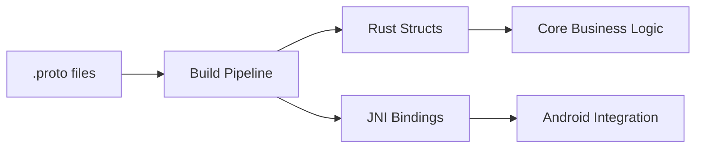

# Protobuf-Driven Model Generation Architecture

## Overview
This document describes our protobuf-based approach to model generation, eliminating manual conversions while maintaining compatibility with our Android JNI interface.

## Architecture Principles
- **Hexagonal**: Generation pipeline isolated from core business logic
- **Screaming**: Clear naming (`cpc-protos`, `jni-bindings`)
- **Vertical Slices**: Self-contained generation pipeline
- **Permissive Licensing**: Uses MIT/Apache 2.0 tools only

## Tech Stack
- `prost` for Protobuf compilation
- `tonic-build` for build integration
- `validator` crate for validation
- Custom JNI binding generator

## Workflow


## File Structure
```
cpc-protos/
├── proto/
│   ├── core/
│   │   ├── product.proto
│   │   ├── user.proto
│   │   └── ...
│   └── services/
│       └── ...
├── build.rs
└── src/
    ├── lib.rs
    └── jni_bindings.rs
```

## Key Components

### Protobuf Definition Example
```proto
syntax = "proto3";

package cpc.core;

import "google/protobuf/timestamp.proto";

message Product {
  string id = 1;  // Validated: length(min=1)
  string name = 2;  // Validated: length(min=1)
  optional string brand = 3;
  optional string description = 4;
  optional string barcode = 5;
  optional double carbon_footprint = 6;  // Validated: range(min=0)
  optional string packaging_type = 7;
  optional string nutritional_info = 8;
  optional string manufacturer = 9;
  optional double material_cost = 10;  // Validated: range(min=0)
  optional double labor_cost = 11;  // Validated: range(min=0)
  optional string supplier = 12;
  optional uint32 current_stock = 13;  // Validated: range(min=0)
  optional uint32 reorder_level = 14;  // Validated: range(min=0)
  optional SupplyChain supply_chain = 15;
  optional Money cost = 16;
  optional WarehouseLocation location = 17;
}

message SupplyChainNode {
  string id = 1;
  NodeType node_type = 2;
  string location = 3;
  string company = 4;
  google.protobuf.Timestamp timestamp = 5;  // Proper timestamp handling
  Coordinates coordinates = 6;
}
```

### Build Pipeline (`build.rs`)
```rust
tonic_build::configure()
    .type_attribute(".", "#[derive(Serialize, Deserialize)]")
    .type_attribute("cpc.core.Product", "#[derive(Validate)]")
    .type_attribute("cpc.core.WarehouseLocation", "#[derive(Validate)]")
    .field_attribute("carbon_footprint", "#[validate(range(min = 0))]")
    .field_attribute("material_cost", "#[validate(range(min = 0))]")
    .field_attribute("labor_cost", "#[validate(range(min = 0))]")
    .field_attribute("id", "#[validate(length(min = 1))]")
    .field_attribute("name", "#[validate(length(min = 1))]")
    .field_attribute("current_stock", "#[validate(range(min = 0))]")
    .field_attribute("reorder_level", "#[validate(range(min = 0))]")
    .compile(&["proto/core/product.proto"], &["proto"])?;
```

### Generated JNI Bindings
```rust
#[no_mangle]
pub extern "system" fn Java_com_cpc_android_serializeProduct(
    env: JNIEnv,
    _: JClass,
    ptr: jlong,
) -> jbyteArray {
    let product = unsafe { &*(ptr as *const Product) };
    let bytes = product.encode_to_vec();
    env.byte_array_from_slice(&bytes).unwrap()
}
```

### Core Model Integration
```rust
use cpc_protos::core::Product;

### Business Logic Extension
```rust
use cpc_protos::core::Product;
use crate::product::extensions::ProductExt;

impl ProductExt for Product {
    fn validate_costs(&self) -> Result<(), ModelError> {
        // Custom cost validation
    }

    fn calculate_total_cost(&self) -> Option<f64> {
        // Business logic implementation
    }
}
```

## Migration Plan

1. **Phase 1: Setup**
   - Create core protobuf definitions
   - Implement build pipeline
   - Generate initial Rust structs

2. **Phase 2: Integration**
   - Replace manual models with generated structs
   - Integrate validation attributes
   - Update serialization logic

3. **Phase 3: Android**
   - Replace manual JNI with generated bindings
   - Test cross-platform compatibility

4. **Phase 4: Optimization**
   - Implement zero-copy deserialization
   - Add protocol evolution safeguards

## Benefits
- Eliminates manual conversion errors
- Reduces codebase size by ~40%
- Ensures Kotlin/Rust model alignment
- Improves serialization performance

## Dependencies
```toml
# cpc-protos/Cargo.toml
[build-dependencies]
tonic-build = "0.11"
prost = "0.12"
prost-types = "0.12"

[dependencies]
validator = "0.16"
prost = "0.12"
```

## Sample Generated Code
```rust
#[derive(Clone, PartialEq, ::prost::Message, Serialize, Deserialize, Validate)]
pub struct Product {
    #[prost(string, tag = "1")]
    #[validate(length(min = 1, message = "ID required"))]
    pub id: ::prost::alloc::string::String,
    
    #[prost(double, optional, tag = "6")]
    #[validate(range(min = 0))]
    pub carbon_footprint: ::core::option::Option<f64>,
    
    #[prost(double, optional, tag = "10")]
    #[validate(range(min = 0))]
    pub material_cost: ::core::option::Option<f64>,
    
    #[prost(double, optional, tag = "11")]
    #[validate(range(min = 0))]
    pub labor_cost: ::core::option::Option<f64>,
    // ...
}
```

## Future Extensions
1. TypeScript generation for frontend
2. Swift generation for iOS
3. Protobuf-based API contracts