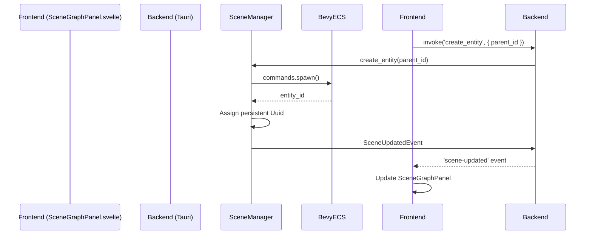
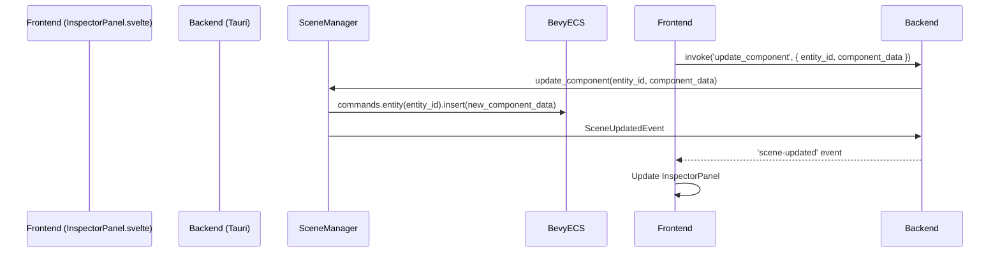
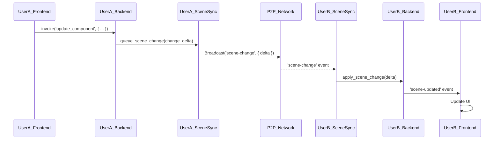

# Scene Editing System Architecture

This document outlines the architectural design for the scene editing features in CPC Studio. It covers the core data models, UI components, and system integrations required to build a collaborative, real-time scene editor.

## 1. Overview

The scene editing system will enable users to create, manipulate, and organize 3D scenes within CPC Studio. It will be built on top of the Bevy Engine and our existing P2P networking layer, ensuring a high-performance and collaborative experience. The system will be tightly integrated with the asset management system for seamless use of assets within scenes.

## 2. System Components

The scene editing system will be composed of the following key components:

### 2.1. Backend (Rust / Bevy)

*   **`SceneManager`**: A new resource responsible for managing the scene graph, entity and component lifecycle, and a transactional command buffer for undo/redo and collaborative sync.
*   **`TransformGizmo`**: A Bevy-based system for rendering and interacting with transformation gizmos (move, rotate, scale) in the editor viewport.
*   **`SceneSerializer`**: A module for serializing and deserializing the scene graph to and from a file format (e.g., JSON, RON).
*   **`ComponentRegistry`**: A registry for all available components, allowing for dynamic inspection and modification in the UI.
*   **`SceneSync`**: A new module, similar to `AssetSync`, responsible for synchronizing scene changes between peers.

### 2.2. Frontend (Yew)

*   **`SceneGraphPanel.svelte`**: A UI component for displaying the scene hierarchy in a tree view. It will allow for parenting, reordering, and selecting entities.
*   **`InspectorPanel.svelte`**: This existing component will be extended to display and edit the components of the selected entity.
*   **`Viewport.svelte`**: The main 3D view of the scene, rendered by Bevy. It will handle user input for camera navigation and interaction with the transformation gizmos.
*   **`Toolbar.svelte`**: A toolbar for accessing the transformation tools, grid settings, and other scene-related actions.

## 3. Data Flow and Sequence Diagrams

The following diagrams illustrate the data flow for key scene editing operations.

### 3.1. Entity Creation Workflow

This diagram shows the process of creating a new entity in the scene.

### 3.2. Component Editing Flow

This diagram illustrates how a component's properties are modified.

### 3.3. Collaborative Editing Sync

This diagram shows how scene changes are synchronized between two peers.

## 4. Scene Representation Model

The scene will be represented using a classic scene graph structure, where each node in the graph is an **Entity**. Entities can have a single parent and multiple children, forming a hierarchy. This hierarchy will be directly mapped to Bevy's parent/child relationship system.

### 4.1. Entity

An entity is a unique identifier for an object in the scene. In our case, this will be a `bevy::prelude::Entity`. We will also assign a persistent `Uuid` to each entity for serialization and network synchronization.

### 4.2. Component

Components are data-only structs that define the properties of an entity. We will leverage Bevy's ECS by attaching components to entities. We will define a set of core components and allow for custom components to be added via scripts.

## 5. Initial Component Types

The following component types will be supported initially:

*   **`Transform`**: Position, rotation, and scale of an entity. This will be Bevy's `Transform` component.
*   **`Mesh`**: A reference to a mesh asset.
*   **`Material`**: A reference to a material asset.
*   **`Light`**: A light source, with properties like color, intensity, and type (point, directional, spot).
*   **`Camera`**: A camera, with properties like projection type, field of view, and clipping planes.
*   **`Script`**: A reference to a Rust script asset for custom logic.

## 6. Integration Points

### 6.1. Asset System

The scene editor will be tightly integrated with the asset management system. When a user wants to add an asset to the scene (e.g., a mesh, material, or texture), they will be able to drag and drop it from the `AssetBrowser.svelte` component into the `Viewport.svelte` or the `SceneGraphPanel.svelte`.

This will trigger a Tauri command that will:
1.  Create a new entity in the scene.
2.  Add the appropriate component to the entity (e.g., `Mesh`, `Material`).
3.  Store a reference to the asset's `Uuid` in the component.

The `BevyAssetBridge` will be responsible for loading the asset data into the Bevy world, making it available for rendering.

### 6.2. Bevy ECS

The `SceneManager` will be the primary interface for interacting with the Bevy ECS. It will hold a reference to the Bevy `World` and will be responsible for:

*   Spawning and despawning entities.
*   Adding and removing components.
*   Querying for entities and components.

All scene modifications will be funneled through the `SceneManager` to ensure that changes are tracked for undo/redo and collaboration.

### 6.3. Networking Layer

The `SceneSync` module will be responsible for synchronizing scene state across all connected peers. It will use our existing `cpc-core` P2P networking layer to broadcast and receive scene changes.

When a change is made to the scene, the `SceneManager` will generate a "delta" representing the change. This delta will be passed to `SceneSync`, which will then broadcast it to all other peers. When a peer receives a delta, it will apply it to its local scene.

## 7. Key Systems

### 7.1. Undo/Redo System

We will implement an undo/redo system based on the command pattern. Each action that modifies the scene (e.g., creating an entity, changing a component's value) will be encapsulated in a `Command` object.

The `SceneManager` will maintain two stacks: an `undo_stack` and a `redo_stack`. When a command is executed, it will be pushed onto the `undo_stack`. When the user performs an "undo" action, the command will be popped from the `undo_stack`, its `undo()` method will be called, and it will be pushed onto the `redo_stack`.

### 7.2. Collaboration and Conflict Resolution

For real-time collaboration, we will use a delta-based synchronization approach. Each change to the scene will be represented as a small, self-contained delta. These deltas will be broadcast to all peers and applied to their local scenes.

For conflict resolution, we will initially use a "last-write-wins" strategy. Each delta will be timestamped, and if two peers make conflicting changes, the one with the later timestamp will be accepted. In the future, we may explore more advanced conflict resolution strategies, such as using CRDTs (Conflict-free Replicated Data Types).

### 7.3. Visual Scripting Foundations

The foundation for the visual scripting system will be laid by introducing a `Script` component. This component will hold a reference to a script asset, which will be a Rust source file.

Initially, these scripts will be compiled and hot-reloaded, allowing users to write custom logic for their entities. In the future, we will build a node-based visual scripting interface that will generate the Rust code automatically.