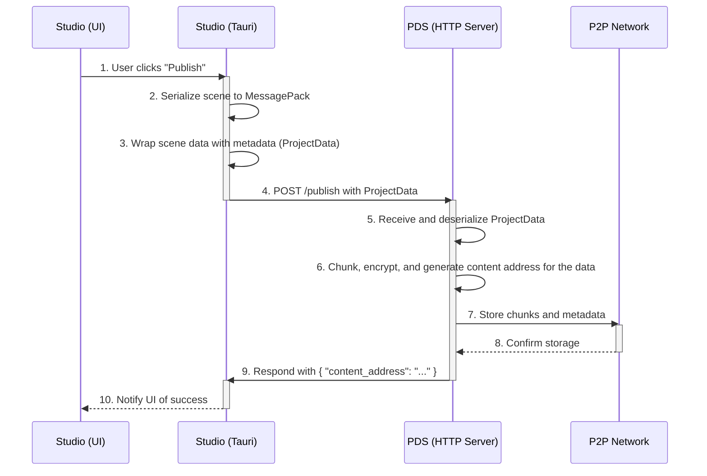

# Scene Serialization and Publishing Flow

**Objective**: This document outlines the architectural plan for saving and publishing projects from the `cpc-studio` editor to the Personal Data Store (PDS) and the broader P2P network.

## 1. Architecture & Data Flow

The "Create → Sync" process enables a user to publish their work from the editor. The flow is designed to be robust, secure, and efficient, leveraging local communication between the editor and the PDS.



## 2. Detailed Specifications

### 2.1. Shared Data Structure

To ensure type safety and consistency, a shared `ProjectData` struct will be defined in a common crate (e.g., `cpc-core`).

```rust
// In packages/cpc-core/src/project.rs
use serde::{Serialize, Deserialize};
use uuid::Uuid;
use chrono::{DateTime, Utc};
use crate::scene::SceneData; // Assumes SceneData is also in the shared crate

#[derive(Serialize, Deserialize, Debug)]
pub struct ProjectData {
    pub metadata: ProjectMetadata,
    pub scene: SceneData,
}

#[derive(Serialize, Deserialize, Debug)]
pub struct ProjectMetadata {
    pub project_id: Uuid,
    pub author_id: Uuid,
    pub title: String,
    pub version: u32,
    pub created_at: DateTime<Utc>,
    pub updated_at: DateTime<Utc>,
}
```

### 2.2. Tauri-PDS API Contract

Communication between `cpc-studio` and `pds` will occur over a local HTTP interface.

- **Endpoint**: `POST /publish`
- **Host**: `http://localhost:3030` (Port should be configurable)
- **Request `Content-Type`**: `application/msgpack`
- **Request Body**: MessagePack-serialized `ProjectData`.

- **Success Response (200 OK)**:
  ```json
  {
    "content_address": "zQm..."
  }
  ```

- **Error Responses**:
  - `400 Bad Request`: Invalid request body.
  - `500 Internal Server Error`: Failure during processing in the PDS.
  - **Body**:
    ```json
    {
      "error": "A descriptive error message."
    }
    ```

### 2.3. Implementation Details

#### `cpc-studio`
- **Dependencies**: Add `reqwest` for HTTP requests and `chrono` for timestamps.
- **`scene_commands.rs`**:
  - Create an `async` Tauri command `publish_project`.
  - This command will:
    1.  Get the current `SceneHierarchy` from the `SceneManager`.
    2.  Construct the `ProjectData` struct with scene data and new metadata.
    3.  Serialize `ProjectData` to `Vec<u8>` using `rmp_serde`.
    4.  Send the data to the PDS via a `POST` request.
    5.  Return the `content_address` from the PDS response to the frontend.

#### `pds`
- **Dependencies**: Add `axum` for the web server.
- **`main.rs`**:
  - Spawn a new `tokio` task to run an Axum server before starting the Tauri application.
  - The Axum router will be initialized with a shared `Arc<AppState>`.
- **`http_handlers.rs` (New File)**:
  - Create the `publish_handler` function for the `POST /publish` route.
  - The handler will:
    1.  Accept `Vec<u8>` as the request body.
    2.  Deserialize the bytes into `ProjectData` using `rmp_serde`.
    3.  Use a new `FileProcessor::chunk_and_encrypt_bytes` method to process the serialized data.
    4.  Use the `Network` and `MetadataStore` from the `AppState` to store the resulting chunks and metadata.
    5.  Return the final `content_address` or an error.
- **`file_utils.rs`**:
  - Add a new method `chunk_and_encrypt_bytes(&self, data: &[u8])` to the `FileProcessor` to handle in-memory data.

## 3. Error Handling
- The `publish_project` command in `cpc-studio` will use `Result` to propagate any errors from serialization, network requests, or non-successful PDS responses back to the UI.
- The PDS HTTP handler will use Axum's response system to return appropriate HTTP status codes and JSON error bodies, ensuring the client has clear information on what went wrong.