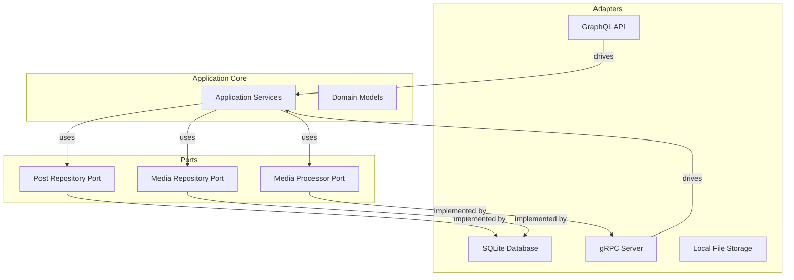
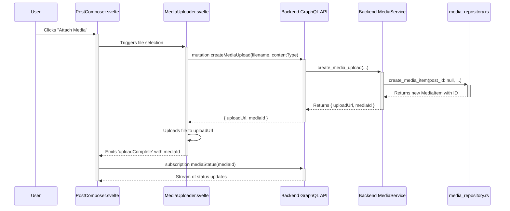
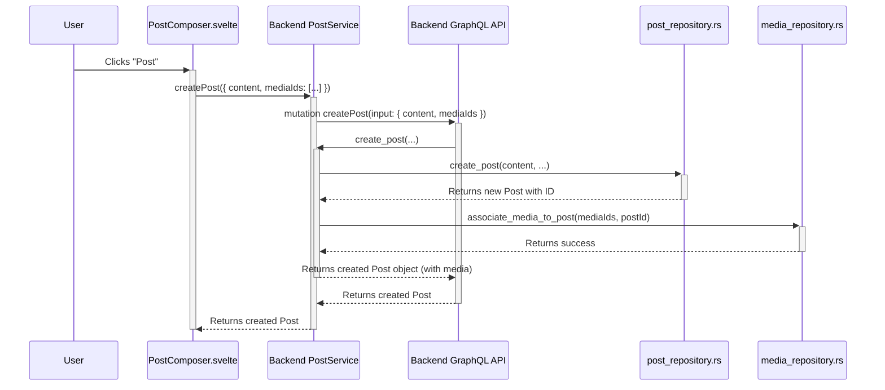

# Social Features Architecture

*Last updated: 2025-07-23*

## 1. Overview

This document outlines the architecture for the social features of the CPC platform. It is designed to be a living document that reflects the current state of the implementation and serves as a guide for new developers.

Our architecture is based on three key principles:
- **Hexagonal Architecture:** To separate the core domain logic from the infrastructure concerns.
- **Screaming Architecture:** To make the intended purpose of the system obvious from the project structure.
- **Vertical Slices:** To organize code by feature, promoting high cohesion and low coupling.

## 2. Hexagonal Architecture: Ports & Adapters

We use a Hexagonal (or Ports and Adapters) architecture to isolate the application's core logic from external services and tools.



### 2.1. Ports (Interfaces)

Ports are interfaces that define a contract for a specific interaction.

| Port | Location | Description |
|------|----------|-------------|
| `PostRepository` | `cpc-core/src/repositories/social/post_repository.rs` | Defines operations for storing and retrieving posts. |
| `MediaRepository` | `cpc-core/src/repositories/social/media_repository.rs` | Defines operations for storing and retrieving media items. |
| `MediaProcessor` | `cpc-core/src/services/media_processor.rs` | Defines the interface for processing media (transcoding, etc.). |

### 2.2. Adapters (Implementations)

Adapters are the concrete implementations of our ports.

| Adapter | Location | Description |
|---------|----------|-------------|
| `PostRepositoryImpl` | `apps/backend/src/repositories/social/post_repository.rs` | Implements `PostRepository` using SQLite. |
| `MediaRepositoryImpl` | `apps/backend/src/repositories/social/media_repository.rs` | Implements `MediaRepository` using SQLite. |
| `GrpcMediaProcessor` | `apps/backend/src/grpc/media_processor_adapter.rs` | Implements `MediaProcessor` by making gRPC calls to `cpc-node` workers. |
| `GraphQL API` | `apps/backend/src/graphql/` | Primary adapter for frontend interactions. |
| `Tauri Commands` | `apps/cpc-platform/src-tauri/src/` | Adapter for native desktop functionality. |


## 3. Vertical Slices: Feature Breakdown

We structure our codebase around features (vertical slices) rather than technical layers. This makes it easier to find all the code related to a specific piece of functionality.

### 3.1. Feature: Media Upload and Post Association

This feature allows users to upload media files independently, monitor their processing status, and then attach them to a social post upon creation. This decoupled approach is more robust and provides a better user experience.

#### High-Level Flow

1.  **Media Upload:** The user uploads a file. The backend creates a `MediaItem` record without a `postId` and returns an ID and a URL for the upload. The frontend subscribes to status updates for that `mediaId`.
2.  **Post Composition:** The UI shows a preview of the media and its processing status.
3.  **Post Creation:** The user submits the post. The `createPost` mutation is called with the post content and a list of `mediaIds` for successfully processed media. The backend then associates these `MediaItem` records with the new post.

#### Sequence Diagram: Media Upload & Processing



#### Sequence Diagram: Post Creation with Media



### 3.2. GraphQL API Changes

The following changes were made to the GraphQL schema to support the decoupled media workflow.

```graphql
# Decoupled media upload, no longer requires a post ID
input CreateMediaUploadInput {
  filename: String!
  contentType: String!
  fileSize: Int!
  # postId: ID! # REMOVED
}

# Post creation now accepts a list of media IDs to associate
input CreatePostInput {
  content: String!
  visibility: Visibility!
  cooperativeId: ID
  mediaIds: [ID!]
}

type Post {
  id: ID!
  content: String!
  author: User!
  createdAt: DateTime!
  # ... other fields
  media: [MediaItem!]! # Added field
}

type MediaItem {
    id: ID!
    url: String!
    mediaType: MediaType!
    processingStatus: ProcessingStatus! # Added field
    # ... other fields
}

type Mutation {
  createMediaUpload(input: CreateMediaUploadInput!): MediaUpload!
  createPost(input: CreatePostInput!): Post!
  # ... other mutations
}

# Subscription to monitor media processing
type Subscription {
    mediaStatus(mediaId: ID!): MediaProcessingUpdate!
}
```

### 3.3. Feature: Content Feed

This feature displays a feed of posts to the user.

**Components:**
| Layer | Component | Location |
|---|---|---|
| **UI** | `FeedView.svelte` | `apps/cpc-platform/src/lib/components/FeedView.svelte` |
| **API** | `feed_queries.rs` | `apps/backend/src/graphql/feed_queries.rs` |
| **Service** | `FeedService` | `apps/backend/src/services/feed_service.rs` |
| **Domain** | `Post`, `MediaItem` | `cpc-core/src/models/social/post.rs` |
| **Infrastructure** | `PostRepositoryImpl`, `MediaRepositoryImpl` | `apps/backend/` |


## 4. Implementation Status

- [x] Architectural design refactored.
- [x] Core models defined in `cpc-core`.
- [x] `MediaService` and `PostService` implemented.
- [ ] `FeedService` implementation pending.
- [x] `MediaUploader` and `PostComposer` components built.
- [ ] `FeedView` component pending.
- [x] GraphQL API for media and posts is functional.
- [ ] gRPC integration with `cpc-node` is in progress.