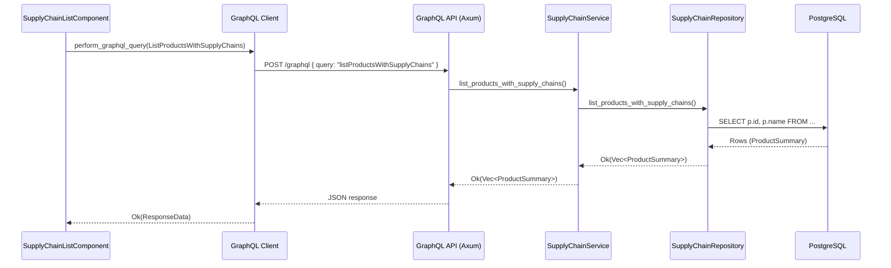
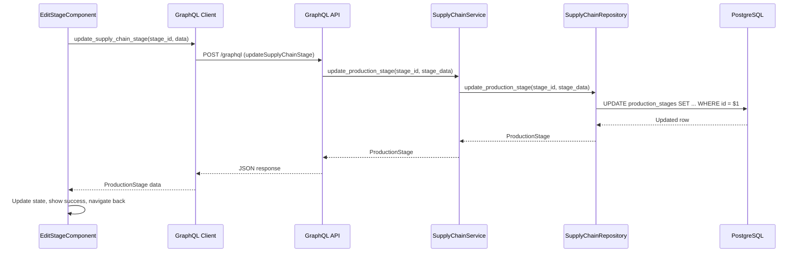
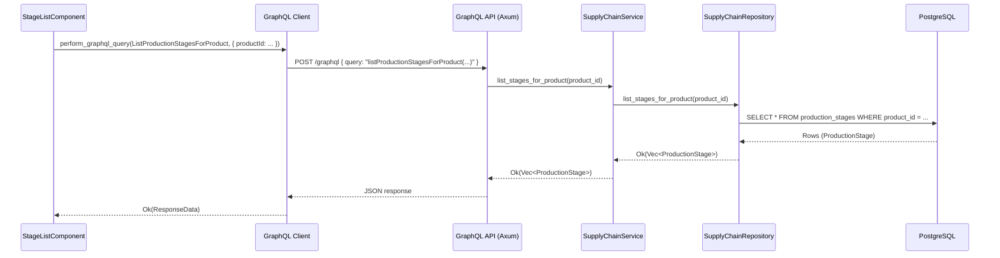

# Supply Chain Feature Architecture

This document outlines the architecture of the implemented supply chain feature, reflecting the current state of the code.

## 1. Overview

The supply chain feature allows users to view the complete production journey of a product. The current implementation supports fetching and displaying a detailed view of a product's supply chain, including production stages, connections between them, and a summary of the cooperative impact.

The core of the feature is a vertical slice that retrieves data from the database and exposes it through a GraphQL query to the frontend.

## 2. Architectural Principles

The design adheres to the established principles of the `cpc` ecosystem:

- **Hexagonal Architecture**: The core domain logic in `cpc-core` is isolated from external concerns. The `SupplyChainRepository` trait defines a port, and the `SupplyChainRepositoryImpl` in the `backend` is the adapter for PostgreSQL.
- **Screaming Architecture**: The project structure clearly communicates the feature's purpose, with dedicated `supply_chain` modules in both the backend and frontend applications.
- **Vertical Slices**: The feature is built as a self-contained vertical slice. A request flows from the Yew component down to the database and back, encapsulating all the logic for this piece of functionality.

## 3. Component and Data Flow Diagram

```mermaid
graph TD
    subgraph "cpc-platform (UI)"
        A[SupplyChainDetail Component] -- Renders --> V[View];
        A -- Uses hook --> B[GraphQL Client (graphql_client)];
        B -- Sends Query --> C{Backend API};
    end

    subgraph "backend (Server)"
        C -- GraphQL 'getSupplyChainByProduct' --> D[GraphQL Resolver];
        D -- Calls --> E[SupplyChain Service];
        E -- Calls --> F[SupplyChain Repository Impl];
        F -- SQLx --> G[(PostgreSQL DB)];
    end

    subgraph "cpc-core (Shared Logic)"
        E -- Uses Trait --> H[SupplyChain Repository Trait];
        F -- Implements --> H;
        H -- Defines contract for --> I[SupplyChain Domain Models];
    end

    style A fill:#f9f,stroke:#333,stroke-width:2px
    style B fill:#ccf,stroke:#333,stroke-width:2px
    style C fill:#9cf,stroke:#333,stroke-width:2px
    style D fill:#ccf,stroke:#333,stroke-width:2px
    style E fill:#ccf,stroke:#333,stroke-width:2px
    style F fill:#ccf,stroke:#333,stroke-width:2px
    style G fill:#cff,stroke:#333,stroke-width:2px
    style H fill:#cfc,stroke:#333,stroke-width:2px
    style I fill:#cfc,stroke:#333,stroke-width:2px
```

## 4. File Structure

The implementation spans across the `backend`, `cpc-platform`, and `cpc-core` packages, demonstrating a full vertical slice.

```
cpc/
├── apps/
│   ├── backend/
│   │   └── src/
│   │       ├── graphql/
│   │       │   └── supply_chain.rs  # GraphQL objects and resolvers
│   │       ├── repositories/
│   │       │   └── supply_chain_repository.rs # DB implementation of the repository
│   │       └── supply_chain/
│   │           └── service.rs       # Business logic service
│   └── cpc-platform/
│       └── src/
│           ├── api/
│           │   └── supply_chain.rs  # Typed GraphQL query using graphql_client
│           ├── graphql/
│           │   └── queries/
│           │       └── supply_chain.graphql # The GraphQL query document
│           └── supply_chain/
│               ├── components/
│               │   ├── detail.rs    # Displays the supply chain
│               │   ├── list.rs      # Lists products with supply chains
│               │   ├── edit.rs      # Placeholder for editing
│               │   └── visualization.rs # Placeholder for graph view
│               └── routing.rs       # Defines frontend routes
└── packages/
    └── cpc-core/
        └── src/
            └── supply_chain/
                ├── models.rs        # Core domain models
                └── repository.rs    # The repository trait (port)
```

## 5. Domain Models

**File**: `packages/cpc-core/src/supply_chain/models.rs`

The domain models are the heart of the feature, representing the supply chain's structure. The `SupplyChain` struct is the aggregate root.

```rust
pub struct SupplyChain {
    pub product_id: Uuid,
    pub stages: Vec<ProductionStage>,
    pub connections: Vec<StageConnection>,
    pub cooperative_impact: CooperativeImpactSummary,
    // The start and end of the entire supply chain timeline, calculated in the repo
    pub timeline_range: (DateTime<Utc>, DateTime<Utc>),
}

// Other structs (ProductionStage, StageConnection, etc.) remain as defined.
```

### Product Summary Model

To support the product list view, a lightweight `ProductSummary` struct is introduced. This model avoids fetching the full `SupplyChain` object for each item in the list, making the query much more efficient.

**File**: `packages/cpc-core/src/supply_chain/models.rs`

```rust
#[derive(Debug, Clone, Serialize, Deserialize)]
pub struct ProductSummary {
    pub id: Uuid,
    pub name: String,
}
```

## 6. Backend Layers

### Repository Layer
The repository defines the contract for data access via the `SupplyChainRepository` trait in `cpc-core`. The implementation in `backend` uses `sqlx` to interact with the PostgreSQL database.

**Trait Definition**: `packages/cpc-core/src/supply_chain/repository.rs`

The repository trait is updated with a new method to fetch the product list summary.

```rust
// The updated trait in cpc-core
#[async_trait]
pub trait SupplyChainRepository: Send + Sync {
    // ... existing get_full_supply_chain method ...

    /// Fetches a summary of all products that have a supply chain.
    async fn list_products_with_supply_chains(&self) -> Result<Vec<ProductSummary>, RepositoryError>;
}
```

**Implementation Example**: `apps/backend/src/repositories/supply_chain_repository.rs`

The implementation of `get_full_supply_chain` uses `sqlx` to fetch data within a single transaction to ensure data consistency. The new `list_products_with_supply_chains` method will query for a list of product summaries. An example of this query could be:

```rust
// Example of what the list_products_with_supply_chains implementation might look like.
async fn list_products_with_supply_chains(&self) -> Result<Vec<ProductSummary>, RepositoryError> {
    let products = sqlx::query_as!(
        ProductSummary,
        r#"
        SELECT p.id, p.name
        FROM products p
        WHERE EXISTS (SELECT 1 FROM production_stages ps WHERE ps.product_id = p.id)
        ORDER BY p.name
        "#
    )
    .fetch_all(&self.pool)
    .await?;
    Ok(products)
}
```

### Service Layer
**File**: `apps/backend/src/supply_chain/service.rs`

A thin service layer that contains business logic. It performs input validation and orchestrates calls to the repository, decoupling the GraphQL layer from the data access layer. It has been updated to include logic for listing products.

```rust
// In impl SupplyChainService

pub async fn get_full_supply_chain(
    &self,
    product_id: Uuid,
    timestamp: Option<i64>,
) -> Result<SupplyChain, ServiceError> {
    if product_id.is_nil() {
        return Err(ServiceError::InvalidInput("Product ID cannot be nil".to_string()));
    }

    match self.repository.get_full_supply_chain(product_id, timestamp).await {
        Ok(supply_chain) => Ok(supply_chain),
        Err(RepositoryError::NotFound) => Err(ServiceError::NotFound),
        Err(e) => Err(ServiceError::Repository(e)),
    }
}

pub async fn list_products_with_supply_chains(
    &self,
) -> Result<Vec<ProductSummary>, ServiceError> {
    // A simple pass-through to the repository for now.
    // Finding no products is a valid state, so it returns Ok(vec![]).
    self.repository.list_products_with_supply_chains().await
        .map_err(ServiceError::from)
}
```

### GraphQL API Layer
The public-facing API for the feature is exposed via GraphQL. It now supports both fetching a single detailed supply chain and listing all available products with supply chains.

#### Fetching a Single Supply Chain
This part remains as is, with the `getSupplyChainByProduct` query and its corresponding resolver.

#### Listing Products with Supply Chains
A new query, `listProductsWithSupplyChains`, is introduced to provide a lightweight list of products for discovery.

**New GraphQL Object (`ProductSummary`)**:
To support the new query, the `ProductSummary` core model is exposed as a GraphQL object.

**File**: `apps/backend/src/graphql/supply_chain.rs`
```rust
// New object for the list view
use cpc_core::supply_chain::models::ProductSummary;

#[Object]
impl ProductSummary {
    async fn id(&self) -> ID {
        ID(self.id.to_string())
    }

    async fn name(&self) -> &str {
        &self.name
    }
}
```

**New Query Definition**:
A corresponding query will be added to the frontend's `.graphql` files.
```graphql
query ListProductsWithSupplyChains {
  listProductsWithSupplyChains {
    id
    name
  }
}
```

**New Resolver**:
The `SupplyChainQueryRoot` is extended with a resolver for the new query.
```rust
// In SupplyChainQueryRoot impl...

#[Object]
impl SupplyChainQueryRoot {
    // ... existing getSupplyChainByProduct resolver

    #[graphql(name = "listProductsWithSupplyChains")]
    async fn list_products_with_supply_chains(
        &self,
        ctx: &Context<'_>,
    ) -> Result<Vec<ProductSummary>> {
        let service = ctx.data_unchecked::<Arc<SupplyChainService>>();
        service
            .list_products_with_supply_chains()
            .await
            .map_err(|e| e.to_string().into())
    }
}
```

## 7. Frontend Implementation

The frontend is built with Yew and uses a typed GraphQL client to communicate with the backend.

### Component Structure
- **`SupplyChainDetail`**: The main component for this feature. It owns the state management for fetching and displaying the data.
- **`SupplyChainList`**: A fully implemented component that fetches and displays a list of products with supply chains. It uses the `yew_hooks::use_async` hook to call a dedicated API function (`api::supply_chain::list_products_with_supply_chains`), which in turn executes the `listProductsWithSupplyChains` GraphQL query.
- **`SupplyChainEdit`**: A placeholder for a future form to edit supply chain data.
- **`SupplyChainVisualization`**: A placeholder for a future graphical representation of the supply chain.

### Data Fetching
Data fetching is handled by the `graphql_client` crate, which generates type-safe Rust code from the `.graphql` query file.

**API Client (`apps/cpc-platform/src/api/supply_chain.rs`)**
```rust
#[derive(GraphQLQuery)]
#[graphql(
    schema_path = "src/graphql/schema.json",
    query_path = "src/graphql/queries/supply_chain.graphql",
    response_derives = "Debug, Clone, PartialEq, serde::Serialize, serde::Deserialize"
)]
pub struct GetSupplyChainByProduct;
```

**Component Usage (`apps/cpc-platform/src/supply_chain/components/detail.rs`)**
The `SupplyChainDetail` component uses a `use_effect_with` hook to trigger the GraphQL query when the component mounts.
```rust
use_effect_with(product_id.clone(), move |_| {
    spawn_local(async move {
        let vars = get_supply_chain_by_product::Variables {
            product_id: product_id,
        };
        match perform_graphql_query::<GetSupplyChainByProduct>(vars).await {
            Ok(data) => {
                supply_chain.set(Some(data.get_supply_chain_by_product));
            }
            Err(e) => { /* handle error */ }
        }
        loading.set(false);
    });
});
```

## 8. Database Schema
The database schema remains as designed, with tables for stages, connections, and impact summaries.

- **`production_stages`**
- **`stage_connections`**
- **`cooperative_impact_summaries`**

## 9. Sequence Diagram (Query Flow)

```mermaid
sequenceDiagram
    participant Yew as SupplyChainDetail Component
    participant Client as GraphQL Client
    participant API as GraphQL API (Axum)
    participant SVC as SupplyChainService
    participant REPO as SupplyChainRepository
    participant DB as PostgreSQL

    Yew->>Client: perform_graphql_query(GetSupplyChainByProduct)
    Client->>API: POST /graphql { query: "getSupplyChainByProduct(...)" }
    API->>SVC: get_full_supply_chain(product_id)
    SVC->>REPO: get_full_supply_chain(product_id)
    REPO->>DB: BEGIN; SELECT ...; SELECT ...; COMMIT;
    DB-->>REPO: Rows
    REPO-->>SVC: Ok(SupplyChain)
    SVC-->>API: Ok(SupplyChain)
    API-->>Client: JSON response
    Client-->>Yew: Ok(ResponseData)
```

## 10. Sequence Diagram (Query Flow)

### Product List Query Flow



## 11. Implementation Notes

- **CRUD Operations**: The feature now supports full CRUD operations for production stages including creating, reading, updating, and deleting stages.
- **Timestamp Logic**: The `timestamp` parameter in the repository method is ignored. The implementation always returns the full, most recent supply chain history. Time-travel queries are a future enhancement.
- **Visualization**: The `SupplyChainVisualization` component is a placeholder and not fully implemented.
- **Error Handling**: Errors are propagated from the repository layer up to the GraphQL API, which then reports them to the client. The frontend components have error handling to display messages to users.
- **Authentication/Authorization**: The API endpoint is currently public. Future work will involve integrating authentication to secure the endpoint.

## 12. Edit Production Stage Implementation

We have implemented functionality to edit individual production stages in a product's supply chain. This follows the same vertical slice architecture as other features.

### GraphQL Mutation

We added a mutation to update production stages:

**File**: `apps/cpc-platform/src/graphql/mutations/supply_chain.graphql`
```graphql
mutation UpdateSupplyChainStage($id: ID!, $input: UpdateSupplyChainStageInput!) {
  updateSupplyChainStage(id: $id, input: $input) {
    id
    name
    description
    location
    startDate
    endDate
  }
}

input UpdateSupplyChainStageInput {
  name: String!
  description: String
  location: String!
  startDate: DateTime!
  endDate: DateTime!
}
```

### Backend Implementation

#### Repository Trait
**File**: `packages/cpc-core/src/supply_chain/repository.rs`
```rust
#[async_trait]
pub trait SupplyChainRepository: Send + Sync {
    // ... existing methods ...
    
    /// Updates an existing production stage
    async fn update_production_stage(
        &self,
        stage_id: Uuid,
        stage_data: &UpdateProductionStageData,
    ) -> Result<ProductionStage, RepositoryError>;
}

pub struct UpdateProductionStageData {
    pub name: String,
    pub description: Option<String>,
    pub location: String,
    pub start_date: DateTime<Utc>,
    pub end_date: DateTime<Utc>,
}
```

#### Repository Implementation
**File**: `apps/backend/src/repositories/supply_chain_repository.rs`
```rust
async fn update_production_stage(
    &self,
    stage_id: Uuid,
    stage_data: &UpdateProductionStageData,
) -> Result<ProductionStage, RepositoryError> {
    let mut tx = self.pool.begin().await?;
    
    let stage = sqlx::query!(
        r#"
        UPDATE production_stages
        SET name = $1, description = $2, location = $3, start_date = $4, end_date = $5
        WHERE id = $6
        RETURNING id, name, description, location, start_date, end_date
        "#,
        stage_data.name,
        stage_data.description,
        stage_data.location,
        stage_data.start_date,
        stage_data.end_date,
        stage_id
    )
    .fetch_one(&mut tx)
    .await?;
    
    tx.commit().await?;

    Ok(ProductionStage {
        id: stage.id,
        name: stage.name,
        description: stage.description,
        location: stage.location,
        start_date: stage.start_date,
        end_date: stage.end_date,
    })
}
```

#### Service Layer
**File**: `apps/backend/src/supply_chain/service.rs`
```rust
pub async fn update_production_stage(
    &self,
    stage_id: Uuid,
    stage_data: &UpdateProductionStageData,
) -> Result<ProductionStage, ServiceError> {
    self.repository
        .update_production_stage(stage_id, stage_data)
        .await
        .map_err(ServiceError::from)
}
```

#### GraphQL Resolver
**File**: `apps/backend/src/graphql/supply_chain.rs`
```rust
#[derive(InputObject)]
struct UpdateSupplyChainStageInput {
    name: String,
    description: Option<String>,
    location: String,
    start_date: DateTime<Utc>,
    end_date: DateTime<Utc>,
}

#[Object]
impl SupplyChainMutationRoot {
    // ... other mutations ...
    
    async fn update_supply_chain_stage(
        &self,
        ctx: &Context<'_>,
        id: Uuid,
        input: UpdateSupplyChainStageInput,
    ) -> Result<ProductionStage> {
        let service = ctx.data_unchecked::<Arc<SupplyChainService>>();
        let stage_data = UpdateProductionStageData {
            name: input.name,
            description: input.description,
            location: input.location,
            start_date: input.start_date,
            end_date: input.end_date,
        };
        service.update_production_stage(id, &stage_data)
            .await
            .map_err(|e| e.to_string().into())
    }
}
```

### Frontend Implementation

#### API Function
**File**: `apps/cpc-platform/src/api/supply_chain.rs`
```rust
pub async fn update_supply_chain_stage(
    stage_id: Uuid,
    data: UpdateStageData,
) -> Result<ProductionStage, String> {
    let query = UPDATE_SUPPLY_CHAIN_STAGE;
    let variables = update_supply_chain_stage::Variables {
        id: stage_id.to_string(),
        input: update_supply_chain_stage::UpdateSupplyChainStageInput {
            name: data.name,
            description: data.description,
            location: data.location,
            start_date: data.start_date.to_rfc3339(),
            end_date: data.end_date.to_rfc3339(),
        },
    };
    
    perform_graphql_query::<UpdateSupplyChainStage>(variables)
        .await
        .map(|response| response.update_supply_chain_stage)
}
```

#### Edit Stage Component
**File**: `apps/cpc-platform/src/supply_chain/components/edit_stage.rs`
- Fetches existing stage data on component mount
- Pre-populates form fields with existing values
- Handles form submission to update stage
- Shows loading states and error messages
- Navigates back to stage list on success

#### Routing
**File**: `apps/cpc-platform/src/supply_chain/routing.rs`
```rust
#[derive(Routable, PartialEq, Clone, Debug)]
pub enum SupplyChainRoute {
    // ... existing routes ...
    #[at("/supply-chain/products/:product_id/stages/:stage_id/edit")]
    EditStage { product_id: String, stage_id: String },
}

pub fn switch_supply_chain(route: SupplyChainRoute) -> Html {
    match route {
        // ... other routes ...
        SupplyChainRoute::EditStage { product_id, stage_id } => html! {
            <EditStageComponent product_id={product_id} stage_id={stage_id} />
        },
    }
}
```

#### Stage List Updates
**File**: `apps/cpc-platform/src/supply_chain/components/stage_list.rs`
Added "Edit" button for each stage:
```rust
html! {
    <tr>
        // ... other columns ...
        <td>
            <Link<SupplyChainRoute>
                to={SupplyChainRoute::EditStage {
                    product_id: props.product_id.clone(),
                    stage_id: stage.id.to_string()
                }}
                classes="text-blue-500 hover:text-blue-700"
            >
                { "Edit" }
            </Link<SupplyChainRoute>>
        </td>
    </tr>
}
```

### Sequence Diagram (Update Stage Flow)


## 13. Architecture for Listing Production Stages
(Existing content remains as it matches our implementation)

## 13. Architecture for Listing Production Stages

To provide a focused view of a product's production journey, we will implement a feature to list all production stages for a specific product. This will be exposed through a new GraphQL query and will follow our established vertical slice architecture.

### GraphQL Query Definition

A new query will be added to the public API to allow clients to fetch production stages for a given product ID.

**Schema Definition (`apps/backend/src/graphql/schema.graphql`)**

```graphql
# Add to the existing Query type
type Query {
  # ... existing queries
  listProductionStagesForProduct(productId: UUID!): [ProductionStage!]!
}
```

### Backend Layers

#### Core Repository (`cpc-core`)

The repository trait will be extended to include a method for fetching stages by product ID.

**Trait Definition (`packages/cpc-core/src/supply_chain/repository.rs`)**
```rust
#[async_trait]
pub trait SupplyChainRepository: Send + Sync {
    // ... existing methods
    
    /// Fetches all production stages for a specific product.
    async fn list_stages_for_product(&self, product_id: Uuid) -> Result<Vec<ProductionStage>, RepositoryError>;
}
```

#### Backend Repository Implementation

The repository implementation will execute a direct SQL query to retrieve the stages.

**Implementation (`apps/backend/src/repositories/supply_chain_repository.rs`)**
```rust
// In impl SupplyChainRepositoryImpl for SupplyChainRepository
async fn list_stages_for_product(&self, product_id: Uuid) -> Result<Vec<ProductionStage>, RepositoryError> {
    let stages = sqlx::query_as!(
        ProductionStage,
        r#"
        SELECT id, product_id, name, description, location, start_date, end_date, is_active
        FROM production_stages
        WHERE product_id = $1
        ORDER BY start_date
        "#,
        product_id
    )
    .fetch_all(&self.pool)
    .await?;

    Ok(stages)
}
```

#### Service Layer

The service layer will contain the business logic, which for now is a simple pass-through with validation.

**Service Method (`apps/backend/src/supply_chain/service.rs`)**
```rust
// In impl SupplyChainService
pub async fn list_stages_for_product(
    &self,
    product_id: Uuid,
) -> Result<Vec<ProductionStage>, ServiceError> {
    if product_id.is_nil() {
        return Err(ServiceError::InvalidInput("Product ID cannot be nil".to_string()));
    }
    self.repository.list_stages_for_product(product_id).await
        .map_err(ServiceError::from)
}
```

#### GraphQL API Layer

A resolver will be implemented for the new query.

**Resolver (`apps/backend/src/graphql/supply_chain.rs`)**
```rust
// In SupplyChainQueryRoot impl...

#[graphql(name = "listProductionStagesForProduct")]
async fn list_stages_for_product(
    &self,
    ctx: &Context<'_>,
    product_id: Uuid,
) -> Result<Vec<ProductionStage>> {
    let service = ctx.data_unchecked::<Arc<SupplyChainService>>();
    service
        .list_stages_for_product(product_id)
        .await
        .map_err(|e| e.to_string().into())
}
```
*Note: The `ProductionStage` model from `cpc-core` will need an `#[Object]` implementation to be exposed in GraphQL if it doesn't have one already.*

### Frontend Implementation

#### GraphQL Query Document

A new GraphQL query document will be created for the frontend to use.

**Query (`apps/cpc-platform/src/graphql/queries/supply_chain.graphql`)**
```graphql
# Add a new query to the file
query ListProductionStagesForProduct($productId: UUID!) {
  listProductionStagesForProduct(productId: $productId) {
    id
    name
    description
    location
    startDate
    endDate
  }
}
```

#### API Helper Function

A helper function will be created to call the new query.

**API Client (`apps/cpc-platform/src/api/supply_chain.rs`)**
```rust
// 1. Add a new struct for the query, similar to GetSupplyChainByProduct
#[derive(GraphQLQuery)]
#[graphql(
    ...,
    query_path = "src/graphql/queries/supply_chain.graphql",
    ...
)]
pub struct ListProductionStagesForProduct;

// 2. Add a new helper function
pub async fn list_stages_for_product(product_id: Uuid) -> Result<Vec<list_production_stages_for_product::ListProductionStagesForProductListProductionStagesForProduct>, String> {
    let vars = list_production_stages_for_product::Variables { product_id };
    let response = perform_graphql_query::<ListProductionStagesForProduct>(vars).await?;
    Ok(response.list_production_stages_for_product)
}
```

#### New Yew Component

A new component will be responsible for displaying the list of stages.

**Component Proposal (`apps/cpc-platform/src/supply_chain/components/stage_list.rs`)**

The `StageListComponent` will:
1.  Accept a `product_id: Uuid` as a `yew::Properties`.
2.  Use the `yew_hooks::use_async` hook to call the `api::supply_chain::list_stages_for_product` function with the given `product_id`.
3.  Store the fetched `Vec<ProductionStage>` in its state.
4.  Render the list of stages, displaying key information like name, description, and dates. It will handle loading and error states.

#### Routing

A new route will be added to navigate to the stage list view.

**Route (`apps/cpc-platform/src/supply_chain/routing.rs`)**
```rust
// In the Route enum for the supply chain feature
#[at("/products/:id/stages")]
ProductStages { id: Uuid },
```
The router will then map the `ProductStages` variant to the new `StageListComponent`.

### Sequence Diagram (List Stages Flow)

