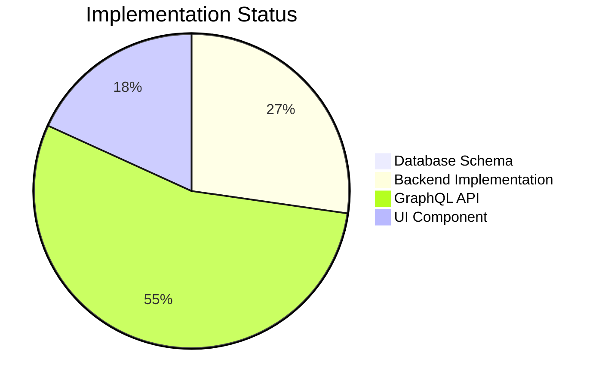

# Supply Chain Visualization Feature - Paused Development

## Current State
The supply chain visualization feature is currently **paused** with the following implementation status:

### Implementation Progress


### Components
1. **GraphQL Schema** - Partially implemented (queries defined but commented)
2. **Rust Types** - Complete (in `types.rs`)
3. **UI Component** - Placeholder implementation (commented)
4. **Backend Logic** - Mock implementation only (commented)
5. **Database Schema** - Not implemented

## Pause Justification
Development paused due to:
- Not part of current Android app porting priorities
- Requires significant database schema changes
- Needs complex map integration (Leaflet/OpenLayers)
- Conflicts with focus on core business intelligence features

## Future Implementation Plan

### Database Migration
```sql
-- Add products table
CREATE TABLE products (
    id UUID PRIMARY KEY DEFAULT gen_random_uuid(),
    name VARCHAR(255) NOT NULL,
    brand VARCHAR(255),
    description TEXT,
    barcode VARCHAR(255) UNIQUE,
    carbon_footprint FLOAT,
    -- ... other product fields
);

-- Supply chain nodes
CREATE TABLE supply_chain_nodes (
    id UUID PRIMARY KEY DEFAULT gen_random_uuid(),
    product_id UUID NOT NULL REFERENCES products(id),
    node_type VARCHAR(20) NOT NULL CHECK (node_type IN ('RawMaterial', 'Manufacturer', 'Distributor', 'Retailer')),
    location VARCHAR(255) NOT NULL,
    company VARCHAR(255) NOT NULL,
    timestamp TIMESTAMP WITH TIME ZONE NOT NULL,
    latitude FLOAT NOT NULL,
    longitude FLOAT NOT NULL
);

-- Transportation segments
CREATE TABLE transportation_segments (
    id UUID PRIMARY KEY DEFAULT gen_random_uuid(),
    product_id UUID NOT NULL REFERENCES products(id),
    from_node_id UUID NOT NULL REFERENCES supply_chain_nodes(id),
    to_node_id UUID NOT NULL REFERENCES supply_chain_nodes(id),
    method VARCHAR(10) NOT NULL CHECK (method IN ('Ship', 'Truck', 'Plane', 'Train')),
    duration_hours INT NOT NULL,
    carbon_footprint FLOAT NOT NULL
);
```

### Required Dependencies
```toml
# Cargo.toml additions
[dependencies]
leaflet = "0.3"  # For map visualization
geo-types = "0.7" # For geospatial data
```

### Resumption Steps
1. Uncomment GraphQL definitions in `product_by_id.graphql`
2. Implement database migrations
3. Complete backend implementation in `product.rs`
4. Integrate Leaflet map in `SupplyChainMap.rs`
5. Add carbon footprint calculation utilities

## Preserved Implementation Details

### GraphQL Query
```graphql
query ProductById($id: ID!) {
  product(id: $id) {
    # ... existing fields
    supply_chain {
      nodes {
        id
        type
        location
        company
        timestamp
        coordinates {
          latitude
          longitude
        }
      }
      segments {
        from_node_id
        to_node_id
        method
        duration_hours
        carbon_footprint
      }
    }
  }
}
```

### UI Component Structure
```rust
use yew::prelude::*;
use crate::types::SupplyChain;

#[derive(Properties, PartialEq)]
pub struct SupplyChainMapProps {
    pub supply_chain: SupplyChain,
}

#[function_component(SupplyChainMap)]
pub fn supply_chain_map(props: &SupplyChainMapProps) -> Html {
    // Map implementation using Leaflet would go here
    // Timeline display for supply chain events
}
```

### Backend Implementation Notes
```rust
// In product.rs
// TODO: Implement actual database lookup
// TODO: Join with supply_chain_nodes and transportation_segments
// TODO: Calculate carbon footprint aggregates
```

## Estimated Completion Effort
```mermaid
gantt
    title Development Timeline
    dateFormat  YYYY-MM-DD
    section Database
    Schema Migration      :active,  db_migration, 2025-09-01, 5d
    Backend Integration   :         backend, after db_migration, 10d
    section Frontend
    Map Integration       :         map, 2025-09-10, 8d
    Timeline Component    :         timeline, after map, 5d
    Testing               :         testing, after timeline, 5d