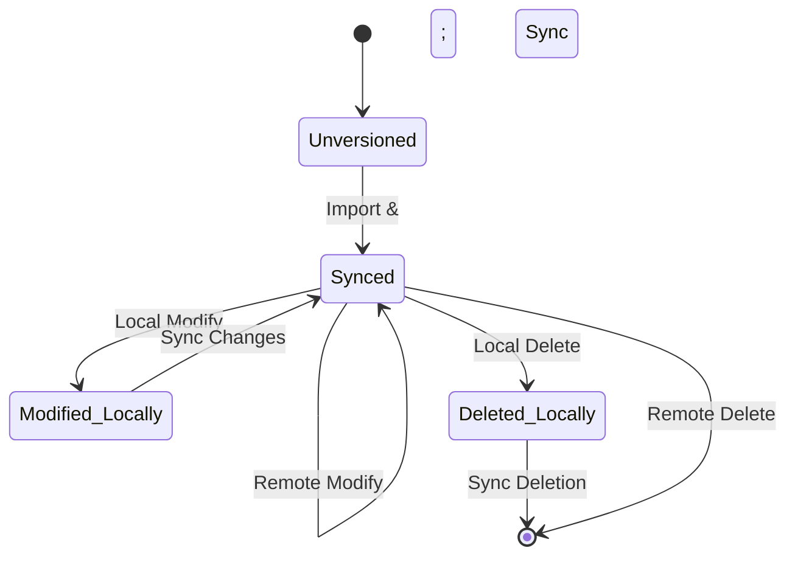

# Asset Lifecycle and Collaborative Workflow

## 1. Introduction

This document details the lifecycle of an asset within `cpc-studio`, from the moment it is introduced into a project to its modification and eventual deletion. It also describes the workflow for handling these asset lifecycle events in a real-time, collaborative P2P environment, ensuring state consistency across all peers.

## 2. Asset State Diagram

The following diagram illustrates the primary states and transitions for any given asset in the system.

-   **Unversioned:** A file that exists on a user's local filesystem but has not yet been imported into the `cpc-studio` project. It is not tracked by the system.
-   **Synced:** The asset has been imported, its metadata is tracked in the `AssetMetadataStore`, and its state is consistent with the network. All peers have the same version of this asset's metadata.
-   **Modified Locally:** The asset's file or metadata has been changed on the local peer, but these changes have not yet been propagated to the network.
-   **Deleted Locally:** The asset has been marked for deletion on the local peer, but this action has not yet been propagated.

## 3. Lifecycle Stages

### 3.1. Stage 1: Asset Import

This is the entry point for any new asset.

1.  **Initiation:** The user initiates an import, typically by dragging and dropping a file onto the Asset Browser UI or using an "Import" button.
2.  **File Transfer:** The frontend, via Tauri, provides the backend with access to the file's content.
3.  **Copy to Project:** The `Asset Importer` copies the source file into the project's `assets/` directory. A standardized sub-folder structure may be used (e.g., `assets/textures/`, `assets/models/`).
4.  **Metadata Generation:**
    *   A new `asset_id` (UUID) is generated.
    *   An initial `vector_clock` is created, with the current peer's logical time set to 1.
    *   Default metadata properties are assigned based on the asset type (as defined in `asset_types_spec.md`).
5.  **Event Creation:** An `AssetCreated` `P2PEvent` is generated. The payload contains the full metadata for the new asset.
6.  **Local Reconciliation:** The event is immediately processed by the local `ReconciliationEngine`, adding the asset's metadata to the `AssetMetadataStore`.
7.  **Network Propagation:** The `P2PEvent` is gossiped to all connected peers.

### 3.2. Stage 2: Asset Modification

An asset can be modified either by changing its file content or by editing its metadata.

#### 3.2.1. Metadata Modification

1.  **Initiation:** A user changes a property in the Inspector Panel (e.g., renames the asset, changes the texture wrap mode).
2.  **Event Creation:** An `AssetMetadataUpdated` `P2PEvent` is generated.
    *   The payload includes the `asset_id` and a delta of the changed properties.
    *   The local peer's timestamp in the asset's `vector_clock` is incremented.
3.  **Local Reconciliation & Propagation:** The process follows the same steps as import (local reconciliation, then network propagation).

#### 3.2.2. Content Modification (Re-import)

1.  **Initiation:** A user re-imports an asset by dropping a new file with the same name or using a "Re-import" context menu option.
2.  **File Overwrite:** The new file content overwrites the existing file in the `assets/` directory.
3.  **Event Creation:** An `AssetContentUpdated` `P2PEvent` is generated.
    *   The payload includes the `asset_id`. A hash of the new file content could also be included for verification.
    *   The `vector_clock` is incremented.
4.  **Local Reconciliation & Propagation:** The event is processed locally and then sent to peers. Peers receiving this event will know they need to fetch the updated binary data.

### 3.3. Stage 3: Asset Deletion

1.  **Initiation:** A user deletes an asset from the Asset Browser.
2.  **Event Creation:** An `AssetDeleted` `P2PEvent` is generated, containing only the `asset_id` of the asset to be removed. The `vector_clock` is incremented.
3.  **Local Reconciliation & Propagation:** The local `ReconciliationEngine` processes the event, removing the asset's metadata from the store. The event is then propagated.
4.  **File Cleanup:** The actual file in the `assets/` directory is removed from the local filesystem. This is a local action performed by each peer upon processing the deletion event.

## 4. Collaborative Editing and Conflict Resolution

The `ReconciliationEngine` and vector clocks are central to the collaborative workflow.

-   **Receiving Events:** When a peer receives an `Asset...` event, it uses the event's `vector_clock` to determine its relationship to the local version.
-   **No Conflict:** If the incoming event is a direct descendant of the local version, it is applied cleanly.
-   **Conflict:** If the clocks have diverged (e.g., two peers modified the same asset's metadata simultaneously), a conflict is detected.
    -   **Resolution Strategy:**
        1.  **Automated Merge:** For simple property changes, a "last-write-wins" policy based on the highest peer timestamp in the vector clock can be.
        2.  **CRDTs:** For more complex data like a list of tags, a CRDT merge procedure is applied.
        3.  **User Intervention:** For conflicting file content updates, the system cannot automatically merge. The UI will need to present a conflict resolution interface, showing both versions and asking the user to choose which one to keep. The chosen version is then propagated as a new "resolving" update.

## 5. Asset Data Synchronization

-   **Metadata Sync:** The `P2PEvent` system handles the synchronization of all asset *metadata*. This is lightweight and happens in near real-time.
-   **Binary Data Sync:** The large binary files (images, models) are **not** sent via the primary event gossip channel. When a peer receives an `AssetCreated` or `AssetContentUpdated` event for an asset it doesn't have, it will initiate a separate, direct request to the network (e.g., to the event originator or any peer known to have the content) to download the binary data. This prevents bloating the event system with large payloads.
