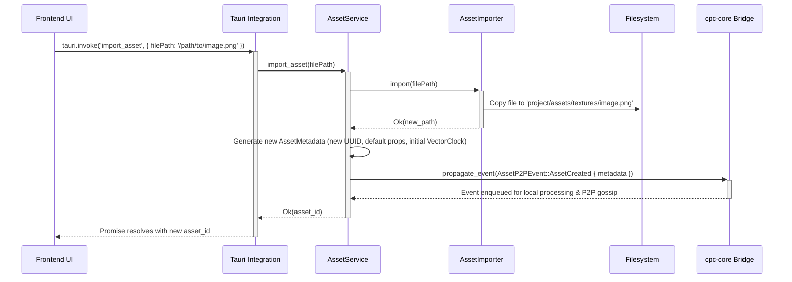
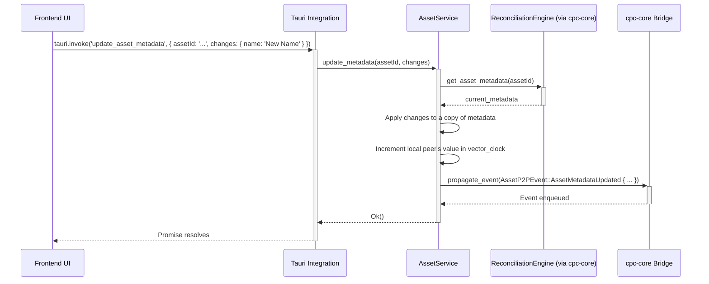
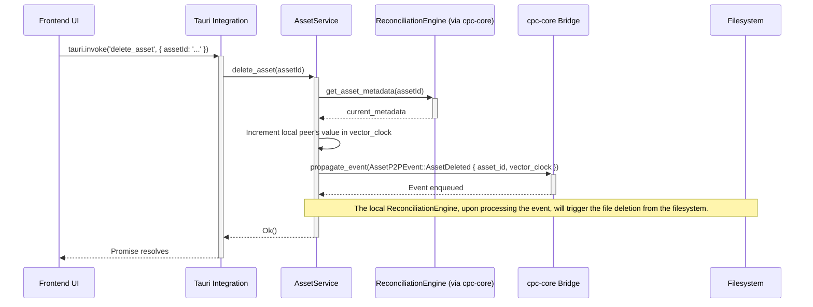

# Asset Management System Architecture

## 1. Overview

This document outlines the architecture for the Asset Management System within `cpc-studio`. The system is designed to be robust, support offline-first collaborative workflows, and integrate seamlessly with our P2P network and the Bevy engine. It handles the lifecycle of various asset types, from import to real-time use in the editor.

## 2. Architecture Diagram

The following Mermaid diagram illustrates the key components and data flows of the asset management system.

```mermaid
graph TD
    subgraph "cpc-studio Frontend (SvelteKit)"
        A[Asset Browser UI]
        B[Inspector Panel]
        C[Viewport (Bevy Render)]
    end

    subgraph "cpc-studio Backend (Tauri/Rust)"
        D[Tauri Commands]
        E[Asset Service]
        F[Asset Importer]
        G[Asset Processor]
        H[Bevy Asset Server Integration]
        I[cpc-core Integration]
    end

    subgraph "cpc-core"
        J[ReconciliationEngine]
        K[P2P NetworkHandler]
        L[EventSystem]
    end

    subgraph "Data & Storage"
        M[Local Filesystem (e.g., assets/)]
        N[Asset Metadata Store (Managed by ReconciliationEngine)]
    end

    subgraph "External"
        O[Other Peers]
    end

    %% Frontend to Backend
    A -- "Drag & Drop Import / Create Asset" --> D
    B -- "Edit Asset Metadata" --> D

    %% Backend Core Logic
    D -- "Asset Operations" --> E
    E -- "Import Request" --> F
    F -- "Reads File" --> M
    F -- "Creates Metadata" --> E
    E -- "Process Request (e.g., Thumbnail)" --> G
    G -- "Writes Derived Data" --> M
    E -- "Update Bevy" --> H
    E -- "Propagate Change" --> I

    %% cpc-core Integration
    I -- "Generates P2PEvent" --> L
    L -- "Sends Event" --> K
    I -- "Updates Local State" --> J

    %% State Management
    J -- "Manages" --> N
    H -- "Loads Asset For Bevy" --> M

    %% P2P Communication
    K -- "Syncs Asset Metadata Events" --> O
    O -- "Receives Events" --> K

    %% Data Flow Back to UI
    J -- "State Change Notification" --> D
    D -- "Update UI" --> A
    D -- "Update UI" --> B
    H -- "Updates Render" --> C

```

## 3. Component Descriptions

*   **Asset Browser UI (SvelteKit):** The primary interface for users to view, organize, and manage project assets. It supports operations like import, delete, rename, and folder creation.
*   **Inspector Panel (SvelteKit):** Displays and allows editing of metadata for the selected asset (e.g., texture import settings, model properties).
*   **Tauri Commands:** The API layer between the frontend and the Rust backend. Asset-related UI actions are translated into calls to these commands.
*   **Asset Service (Rust):** A central service in the backend that orchestrates all asset-related operations. It acts as a facade, coordinating the importer, processor, and `cpc-core` integration.
*   **Asset Importer (Rust):** Responsible for handling the initial import of a file from the user's filesystem into the project's asset directory. It creates the initial asset metadata record.
*   **Asset Processor (Rust):** Performs background tasks on assets, such as converting files to engine-friendly formats. It is notably responsible for generating thumbnails for 3D models and textures. For a detailed breakdown of this process, see the [Model Thumbnail System Documentation](./thumbnail_system.md). It operates on assets that are already part of the project.
*   **Bevy Asset Server Integration (Rust):** A bridge that informs the Bevy `AssetServer` to load, reload, or unload assets based on changes in the `AssetMetadataStore`. This ensures the editor's viewport reflects the current state of the assets.
*   **cpc-core Integration:** The component that connects the `Asset Service` to the underlying P2P and state management systems. It translates asset changes into `P2PEvent`s for synchronization.
*   **ReconciliationEngine:** Manages the `AssetMetadataStore`, ensuring that changes from local and remote peers are merged consistently using vector clocks and CRDTs.
*   **Local Filesystem:** The physical storage location for the asset files (e.g., PNGs, GLBs) within the project directory.
*   **Asset Metadata Store:** A data structure (likely a CRDT-based map) that holds the metadata for every asset in the project. This store is the "source of truth" and is what gets synchronized between peers. The actual asset binary data is not stored here, only the reference to it.

## 4. Data Flow for Asset Import

1.  **User Action:** A user drags a file (e.g., `player.png`) into the `Asset Browser UI`.
2.  **Frontend IPC:** The UI calls a Tauri command (`import_asset`) with the file's path.
3.  **Backend Orchestration:** The `Asset Service` receives the request. It invokes the `Asset Importer`.
4.  **File Copy & Metadata Creation:** The `Asset Importer` copies the file into the project's `assets/` directory and creates a new metadata entry (e.g., new UUID, path, type, default settings).
5.  **State Update:** The `Asset Service` sends this new metadata to the `cpc-core Integration` layer.
6.  **P2P Event Generation:** An `AssetCreated` `P2PEvent` is created, containing the new asset's metadata and a vector clock.
7.  **Local Reconciliation:** The event is processed by the local `ReconciliationEngine`, which adds the new asset to the `Asset Metadata Store`.
8.  **P2P Broadcast:** The `P2P NetworkHandler` gossips the `AssetCreated` event to all connected peers.
9.  **UI Update:** The `Asset Service` notifies the frontend of the new asset, causing the `Asset Browser UI` to refresh and display `player.png`.
10. **Bevy Update:** The `Bevy Asset Server Integration` component is notified, but may not load the asset until it's actually needed for rendering.

## 5. Implementation Details

This section provides a more concrete implementation plan for the components and data flows described above.

### 5.1. Code Structure (Rust Modules)

The asset management logic will be organized within the `cpc-studio` backend crate, likely under a new `asset_management` module.

```
apps/cpc-studio/src-tauri/src/
|-- editor_core/
|   |-- collaboration.rs
|   |-- events.rs
|   |-- state.rs
|   +-- tauri_integration.rs
|-- asset_management/
|   |-- mod.rs           # Module entry, defines AssetService
|   |-- asset_importer.rs  # Logic for importing files
|   |-- asset_processor.rs # Logic for background processing (thumbnails, etc.)
|   |-- bevy_bridge.rs   # Integration with the Bevy AssetServer
|   |-- cpc_core_bridge.rs # Integration with cpc-core (ReconciliationEngine, P2P)
|   +-- data_structures.rs # All asset-related structs and enums
|-- main.rs
```

### 5.2. Concrete Data Structures

These Rust structs are based on `asset_types_spec.md` and will be defined in `asset_management/data_structures.rs`. We will use `serde` for serialization and `uuid` for unique IDs.

#### 5.2.1. Core Metadata Structure

```rust
use uuid::Uuid;
use std::collections::HashMap;
use std::path::PathBuf;
use crate::cpc_core::PeerId; // Assuming PeerId is defined in cpc-core

// The vector clock for CRDT-based conflict resolution.
#[derive(Serialize, Deserialize, Debug, Clone, PartialEq)]
pub struct VectorClock(HashMap<PeerId, u64>);

// The central metadata structure for any asset.
#[derive(Serialize, Deserialize, Debug, Clone, PartialEq)]
pub struct AssetMetadata {
    pub asset_id: Uuid,
    pub name: String,
    pub path: PathBuf, // Relative to the project's assets/ directory
    pub vector_clock: VectorClock,
    #[serde(flatten)] // Flattens the enum into the parent struct
    pub asset_type_properties: AssetTypeProperties,
}

// Enum to hold properties specific to each asset type.
#[derive(Serialize, Deserialize, Debug, Clone, PartialEq)]
#[serde(tag = "asset_type", content = "properties")] // e.g., { "asset_type": "Texture", "properties": { ... } }
pub enum AssetTypeProperties {
    Texture(TextureProperties),
    Model(ModelProperties),
    Audio(AudioProperties),
    Script(ScriptProperties),
    Prefab(PrefabProperties),
}
```

#### 5.2.2. Asset-Specific Properties

```rust
// In asset_management/data_structures.rs

#[derive(Serialize, Deserialize, Debug, Clone, PartialEq)]
pub struct TextureProperties {
    pub srgb: bool,
    pub generate_mips: bool,
    // Enums would be defined here, e.g., TextureFilterMode, TextureWrapMode
}

#[derive(Serialize, Deserialize, Debug, Clone, PartialEq)]
pub struct ModelProperties {
    pub import_materials: bool,
    pub import_animations: bool,
    pub scale_factor: f32,
}

#[derive(Serialize, Deserialize, Debug, Clone, PartialEq)]
pub struct AudioProperties {
    pub looping: bool,
    pub stream: bool,
    pub volume: f32,
}

#[derive(Serialize, Deserialize, Debug, Clone, PartialEq)]
pub struct ScriptProperties {
    // Currently no specific properties
}

#[derive(Serialize, Deserialize, Debug, Clone, PartialEq)]
pub struct PrefabProperties {
    // Defined by its content, no extra import settings.
}
```

#### 5.2.3. P2P Asset Events

These events are the commands that will be sent through the `cpc-core` event system to ensure state synchronization.

```rust
// In asset_management/data_structures.rs

#[derive(Serialize, Deserialize, Debug, Clone)]
pub enum AssetP2PEvent {
    AssetCreated {
        metadata: AssetMetadata,
    },
    AssetMetadataUpdated {
        asset_id: Uuid,
        // We send the full new metadata to simplify conflict resolution.
        // The ReconciliationEngine can diff if needed, but "state replacement" is safer.
        updated_metadata: AssetMetadata,
    },
    AssetContentUpdated {
        asset_id: Uuid,
        new_content_hash: String, // SHA-256 hash of the new file content
        vector_clock: VectorClock,
    },
    AssetDeleted {
        asset_id: Uuid,
        vector_clock: VectorClock,
    },
}
```

### 5.3. Workflow Sequence Diagrams

The `AssetService` will be the primary orchestrator.

#### 5.3.1. Import Operation



#### 5.3.2. Metadata Update Operation



#### 5.3.3. Asset Deletion Operation



### 5.4. Asset Processor API

The `AssetProcessor` will operate in the background. A simple API can be defined in `asset_processor.rs`.

```rust
// In asset_management/asset_processor.rs

use crate::asset_management::data_structures::AssetMetadata;
use anyhow::Result;

// A trait for any task that processes an asset.
pub trait AssetProcessorTask {
    // Returns true if this processor should run for the given asset.
    fn can_process(&self, metadata: &AssetMetadata) -> bool;

    // Executes the processing task.
    fn process(&self, metadata: &AssetMetadata) -> Result<()>;
}

// Example Implementation: Thumbnail Generator
pub struct ThumbnailGenerator;

impl AssetProcessorTask for ThumbnailGenerator {
    fn can_process(&self, metadata: &AssetMetadata) -> bool {
        matches!(metadata.asset_type_properties, AssetTypeProperties::Texture(_))
    }

    fn process(&self, metadata: &AssetMetadata) -> Result<()> {
        // 1. Load the image from metadata.path
        // 2. Resize it to a thumbnail (e.g., 128x128)
        // 3. Save it to a known location, e.g., `[PROJECT_ROOT]/.cache/thumbnails/{asset_id}.png`
        // This path is NOT part of the synced metadata. It's generated locally by each client.
        Ok(())
    }
}
```

### 5.5. Conflict Resolution Strategy (CRDT)

The `ReconciliationEngine` is the heart of the conflict resolution system.

-   **State:** It maintains the "source of truth" `HashMap<Uuid, AssetMetadata>`.
-   **Input:** It processes `AssetP2PEvent`s one by one.
-   **Logic for `AssetMetadataUpdated`:**
    1.  Receive `incoming_event` with `incoming_metadata`.
    2.  Look up `local_metadata` for the same `asset_id`.
    3.  Compare `incoming_metadata.vector_clock` with `local_metadata.vector_clock`.
        -   **Case 1: No Conflict.** If the incoming clock is a direct descendant of the local one, the `local_metadata` is simply replaced with `incoming_metadata`.
        -   **Case 2: Conflict (Concurrent Edit).** If the clocks have diverged, a deterministic merge is required.
            -   **Merge Rule:** "Last Write Wins". The winner is the peer whose `(timestamp, peer_id)` tuple is greater. We compare the highest timestamp across both clocks. If timestamps are equal, we use the `PeerId` as a tie-breaker (e.g., the higher `PeerId` wins). This ensures all peers resolve the conflict to the exact same state.
            -   The merged metadata's vector clock will be the union of both clocks (taking the max value for each peer).
    4.  After merging, the new state is saved, and a `LocalAssetStoreChanged` event is emitted for other services like the `bevy_bridge`.

-   **Logic for `AssetContentUpdated`:** The event itself doesn't contain the data. It's a notification. The conflict resolution is simpler: the version with the "winning" vector clock (as determined above) is the one whose content hash is considered canonical. The peer will then ensure it has the binary data corresponding to that hash, fetching it from the network if necessary.