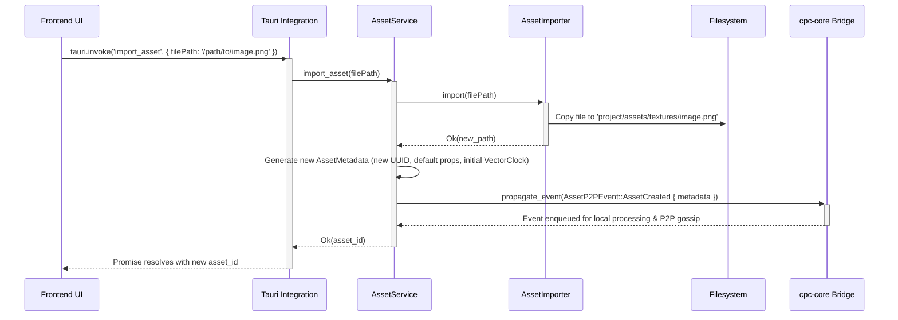
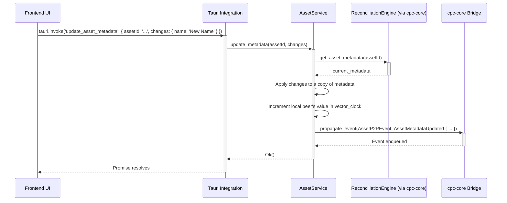
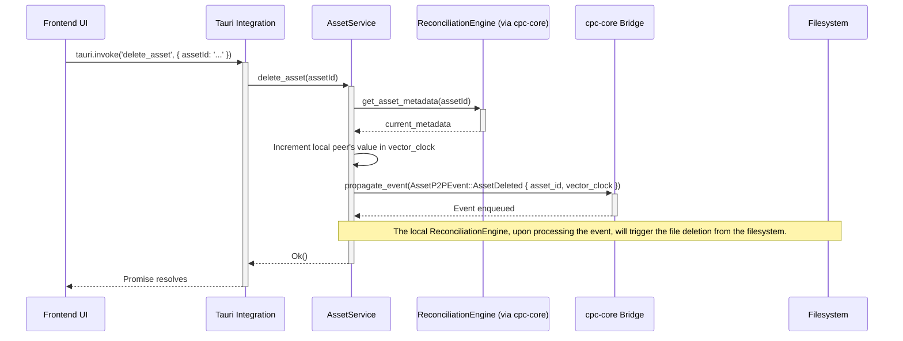

# [ARCHIVED] Asset Management Backend Implementation Plan

**Note: The contents of this document have been merged into `docs/asset_management_architecture.md` as of 2025-07-21. This file is kept for historical purposes.**

## 1. Introduction

This document provides a detailed, actionable implementation plan for the asset management backend. It builds upon the concepts outlined in `asset_management_architecture.md`, `asset_types_spec.md`, and `asset_lifecycle.md`. The goal is to define the specific data structures, code organization, and logic required to build the system.

## 2. Code Structure (Rust Modules)

The asset management logic will be organized within the `cpc-studio` backend crate, likely under a new `asset_management` module.

```
apps/cpc-studio/src-tauri/src/
|-- editor_core/
|   |-- collaboration.rs
|   |-- events.rs
|   |-- state.rs
|   +-- tauri_integration.rs
|-- asset_management/
|   |-- mod.rs           # Module entry, defines AssetService
|   |-- asset_importer.rs  # Logic for importing files
|   |-- asset_processor.rs # Logic for background processing (thumbnails, etc.)
|   |-- bevy_bridge.rs   # Integration with the Bevy AssetServer
|   |-- cpc_core_bridge.rs # Integration with cpc-core (ReconciliationEngine, P2P)
|   +-- data_structures.rs # All asset-related structs and enums
|-- main.rs
```

## 3. Concrete Data Structures

These Rust structs are based on `asset_types_spec.md` and will be defined in `asset_management/data_structures.rs`. We will use `serde` for serialization and `uuid` for unique IDs.

### 3.1. Core Metadata Structure

```rust
use uuid::Uuid;
use std::collections::HashMap;
use std::path::PathBuf;
use crate::cpc_core::PeerId; // Assuming PeerId is defined in cpc-core

// The vector clock for CRDT-based conflict resolution.
#[derive(Serialize, Deserialize, Debug, Clone, PartialEq)]
pub struct VectorClock(HashMap<PeerId, u64>);

// The central metadata structure for any asset.
#[derive(Serialize, Deserialize, Debug, Clone, PartialEq)]
pub struct AssetMetadata {
    pub asset_id: Uuid,
    pub name: String,
    pub path: PathBuf, // Relative to the project's assets/ directory
    pub vector_clock: VectorClock,
    #[serde(flatten)] // Flattens the enum into the parent struct
    pub asset_type_properties: AssetTypeProperties,
}

// Enum to hold properties specific to each asset type.
#[derive(Serialize, Deserialize, Debug, Clone, PartialEq)]
#[serde(tag = "asset_type", content = "properties")] // e.g., { "asset_type": "Texture", "properties": { ... } }
pub enum AssetTypeProperties {
    Texture(TextureProperties),
    Model(ModelProperties),
    Audio(AudioProperties),
    Script(ScriptProperties),
    Prefab(PrefabProperties),
}
```

### 3.2. Asset-Specific Properties

```rust
// In asset_management/data_structures.rs

#[derive(Serialize, Deserialize, Debug, Clone, PartialEq)]
pub struct TextureProperties {
    pub srgb: bool,
    pub generate_mips: bool,
    // Enums would be defined here, e.g., TextureFilterMode, TextureWrapMode
}

#[derive(Serialize, Deserialize, Debug, Clone, PartialEq)]
pub struct ModelProperties {
    pub import_materials: bool,
    pub import_animations: bool,
    pub scale_factor: f32,
}

#[derive(Serialize, Deserialize, Debug, Clone, PartialEq)]
pub struct AudioProperties {
    pub looping: bool,
    pub stream: bool,
    pub volume: f32,
}

#[derive(Serialize, Deserialize, Debug, Clone, PartialEq)]
pub struct ScriptProperties {
    // Currently no specific properties
}

#[derive(Serialize, Deserialize, Debug, Clone, PartialEq)]
pub struct PrefabProperties {
    // Defined by its content, no extra import settings.
}
```

### 3.3. P2P Asset Events

These events are the commands that will be sent through the `cpc-core` event system to ensure state synchronization.

```rust
// In asset_management/data_structures.rs

#[derive(Serialize, Deserialize, Debug, Clone)]
pub enum AssetP2PEvent {
    AssetCreated {
        metadata: AssetMetadata,
    },
    AssetMetadataUpdated {
        asset_id: Uuid,
        // We send the full new metadata to simplify conflict resolution.
        // The ReconciliationEngine can diff if needed, but "state replacement" is safer.
        updated_metadata: AssetMetadata,
    },
    AssetContentUpdated {
        asset_id: Uuid,
        new_content_hash: String, // SHA-256 hash of the new file content
        vector_clock: VectorClock,
    },
    AssetDeleted {
        asset_id: Uuid,
        vector_clock: VectorClock,
    },
}
```

## 4. AssetService Workflow & Sequence Diagrams

The `AssetService` will be the primary orchestrator.

### 4.1. Import Operation



### 4.2. Metadata Update Operation



### 4.3. Asset Deletion Operation



## 5. Integration Points

### 5.1. Filesystem Integration

-   **Asset Storage:** All asset binary data will be stored in a well-defined folder structure within the project directory, e.g., `[PROJECT_ROOT]/assets/`. The `AssetMetadata.path` field will store the path relative to this directory.
-   **File Operations:** The `AssetImporter` will handle copying files into this directory. The `ReconciliationEngine`, upon processing a local or remote `AssetDeleted` event, will be responsible for deleting the corresponding file from the filesystem.

### 5.2. P2P Network Integration (`cpc-core`)

-   The `cpc_core_bridge` module will be the sole interface between asset management and `cpc-core`.
-   It will provide a function like `propagate_event(event: AssetP2PEvent)` which wraps the event in a generic `P2PEvent` and hands it off to the `cpc-core` `EventSystem`.
-   It will also subscribe to incoming `P2PEvent`s from `cpc-core`. When an `AssetP2PEvent` is received from a remote peer, it will be forwarded to the `ReconciliationEngine` for processing.

### 5.3. Bevy Asset Server Integration

-   The `bevy_bridge` module will listen for notifications from the `ReconciliationEngine`.
-   When the `ReconciliationEngine` successfully applies a change (e.g., `AssetCreated`, `AssetContentUpdated`), it will emit a local event (e.g., `LocalAssetStoreChanged(asset_id)`).
-   The `bevy_bridge` will listen for these local events. Upon receiving one, it will interact with the Bevy `AssetServer` to trigger a load or reload of the asset, ensuring the viewport is updated.
-   `AssetDeleted` events will trigger an `AssetServer::free` call.

## 6. Asset Processor API

The `AssetProcessor` will operate in the background. A simple API can be defined in `asset_processor.rs`.

```rust
// In asset_management/asset_processor.rs

use crate::asset_management::data_structures::AssetMetadata;
use anyhow::Result;

// A trait for any task that processes an asset.
pub trait AssetProcessorTask {
    // Returns true if this processor should run for the given asset.
    fn can_process(&self, metadata: &AssetMetadata) -> bool;

    // Executes the processing task.
    fn process(&self, metadata: &AssetMetadata) -> Result<()>;
}

// Example Implementation: Thumbnail Generator
pub struct ThumbnailGenerator;

impl AssetProcessorTask for ThumbnailGenerator {
    fn can_process(&self, metadata: &AssetMetadata) -> bool {
        matches!(metadata.asset_type_properties, AssetTypeProperties::Texture(_))
    }

    fn process(&self, metadata: &AssetMetadata) -> Result<()> {
        // 1. Load the image from metadata.path
        // 2. Resize it to a thumbnail (e.g., 128x128)
        // 3. Save it to a known location, e.g., `[PROJECT_ROOT]/.cache/thumbnails/{asset_id}.png`
        // This path is NOT part of the synced metadata. It's generated locally by each client.
        Ok(())
    }
}
```
The `AssetService` will be responsible for invoking the correct processors after an asset is created or updated.

## 7. Conflict Resolution Strategy (CRDT)

The `ReconciliationEngine` is the heart of the conflict resolution system.

-   **State:** It maintains the "source of truth" `HashMap<Uuid, AssetMetadata>`.
-   **Input:** It processes `AssetP2PEvent`s one by one.
-   **Logic for `AssetMetadataUpdated`:**
    1.  Receive `incoming_event` with `incoming_metadata`.
    2.  Look up `local_metadata` for the same `asset_id`.
    3.  Compare `incoming_metadata.vector_clock` with `local_metadata.vector_clock`.
        -   **Case 1: No Conflict.** If the incoming clock is a direct descendant of the local one, the `local_metadata` is simply replaced with `incoming_metadata`.
        -   **Case 2: Conflict (Concurrent Edit).** If the clocks have diverged, a deterministic merge is required.
            -   **Merge Rule:** "Last Write Wins". The winner is the peer whose `(timestamp, peer_id)` tuple is greater. We compare the highest timestamp across both clocks. If timestamps are equal, we use the `PeerId` as a tie-breaker (e.g., the higher `PeerId` wins). This ensures all peers resolve the conflict to the exact same state.
            -   The merged metadata's vector clock will be the union of both clocks (taking the max value for each peer).
    4.  After merging, the new state is saved, and a `LocalAssetStoreChanged` event is emitted for other services like the `bevy_bridge`.

-   **Logic for `AssetContentUpdated`:** The event itself doesn't contain the data. It's a notification. The conflict resolution is simpler: the version with the "winning" vector clock (as determined above) is the one whose content hash is considered canonical. The peer will then ensure it has the binary data corresponding to that hash, fetching it from the network if necessary.
## Thumbnail Generation Test Procedure

To test thumbnail generation workflow:

1. Place a sample PNG texture in `apps/cpc-studio/assets/test/texture.png`
2. Run the import process
3. Verify:
   - Thumbnail is generated at `assets/thumbnails/{asset_id}.png`
   - AssetMetadata contains correct thumbnail_path
   - AssetBrowser displays the thumbnail in both grid and list views
4. For non-texture assets:
   - Repeat with a dummy script file (test_script.lua)
   - Verify no thumbnail is generated
   - Placeholder is shown in UI
5. After testing:
   - Revert temporary test texture code in tauri_integration.rs
   - Add proper asset type detection in import_asset
   - Add error handling for unsupported formats