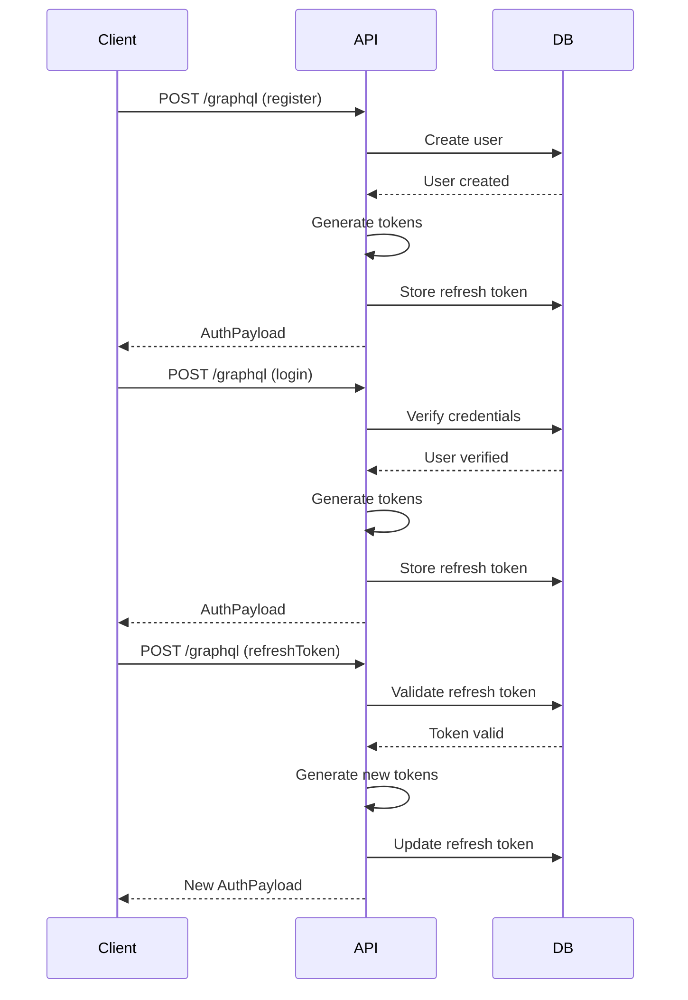

# Authentication & Authorization System Design

## Database Schema

### Users Table (`users`)
```sql
CREATE TABLE users (
    id UUID PRIMARY KEY DEFAULT gen_random_uuid(),
    username VARCHAR(255) UNIQUE NOT NULL,
    email VARCHAR(255) UNIQUE NOT NULL,
    password_hash TEXT NOT NULL,
    created_at TIMESTAMPTZ NOT NULL DEFAULT NOW(),
    updated_at TIMESTAMPTZ NOT NULL DEFAULT NOW()
);
```

### Tokens Table (`tokens`)
```sql
CREATE TABLE tokens (
    user_id UUID REFERENCES users(id) ON DELETE CASCADE,
    refresh_token TEXT NOT NULL UNIQUE,
    device_info TEXT,
    created_at TIMESTAMPTZ NOT NULL DEFAULT NOW(),
    expires_at TIMESTAMPTZ NOT NULL
);
```

## GraphQL Schema

```graphql
type Mutation {
  register(input: RegisterInput!): AuthPayload!
  login(input: LoginInput!): AuthPayload!
  refreshToken(input: RefreshTokenInput!): AuthPayload!
  logout: Boolean!
}

input RegisterInput {
  username: String!
  email: String!
  password: String!
}

input LoginInput {
  email: String!
  password: String!
}

input RefreshTokenInput {
  refreshToken: String!
}

type AuthPayload {
  accessToken: String!
  refreshToken: String!
  expiresAt: String!
  user: User!
}

type User {
  id: ID!
  username: String!
  email: String!
  createdAt: String!
}
```

## Axum Middleware for Authentication

```rust
use axum::{
    async_trait,
    extract::{FromRequest, RequestParts},
    headers::{authorization::Bearer, Authorization},
    TypedHeader,
};
use cpc_core::models::user::User;
use jsonwebtoken::{decode, Validation};

pub struct AuthUser(pub User);

#[async_trait]
impl<B> FromRequest<B> for AuthUser
where
    B: Send,
{
    type Rejection = AuthError;

    async fn from_request(req: &mut RequestParts<B>) -> Result<Self, Self::Rejection> {
        let TypedHeader(Authorization(bearer)) =
            TypedHeader::<Authorization<Bearer>>::from_request(req)
                .await
                .map_err(|_| AuthError::InvalidToken)?;

        let token_data = decode::<UserClaims>(
            bearer.token(),
            &KEYS.decoding,
            &Validation::default(),
        )
        .map_err(|_| AuthError::InvalidToken)?;

        // Verify user exists in DB
        let user = get_user_by_id(token_data.claims.sub)
            .await
            .map_err(|_| AuthError::UserNotFound)?;

        Ok(AuthUser(user))
    }
}
```

## Security Considerations

1. **Token Expiration**:
   - Access tokens: 15 minutes
   - Refresh tokens: 7 days
   
2. **Secure Cookie Handling**:
   - Use `HttpOnly`, `Secure`, and `SameSite=Strict` flags for web clients
   - Use secure storage (Keychain on iOS, Keystore on Android) for mobile

3. **Rate Limiting**:
   - Implement 5 requests/min limit on auth endpoints
   - Use Valkey (Redis-compatible) for distributed rate limiting

4. **Password Security**:
   - Argon2id with 64MB memory, 3 iterations, 4 parallelism
   - Minimum password length: 12 characters

## Implementation Plan

### Backend Files
1. `apps/orchestrator/src/auth/middleware.rs` - Auth middleware
2. `apps/orchestrator/src/auth/service.rs` - Auth business logic
3. `apps/orchestrator/src/auth/schema.rs` - GraphQL schema definitions
4. `apps/orchestrator/src/auth/errors.rs` - Custom error types

### Dependencies
Add to `apps/orchestrator/Cargo.toml`:
```toml
jsonwebtoken = "8.3"
argon2 = "0.5"
async-graphql = "4.0"
async-graphql-axum = "4.0"
```

### Shared Core Updates
1. Extend `cpc-core/src/models/user.rs`:
```rust
pub struct NewUser {
    pub username: String,
    pub email: String,
    pub password_hash: String,
}
```

2. Update `cpc-core/src/models/token.rs`:
```rust
pub struct NewToken {
    pub user_id: Uuid,
    pub refresh_token: String,
    pub device_info: Option<String>,
    pub expires_at: DateTime<Utc>,
}
```

## Sequence Diagram



## Next Steps
1. Implement database migrations
2. Create Axum router with auth routes
3. Implement password hashing service
4. Add rate limiting middleware
5. Create token generation/validation utilities