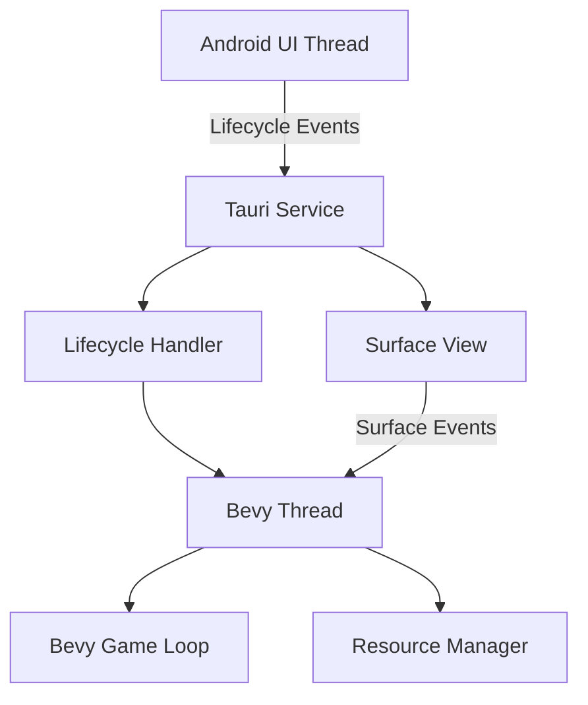
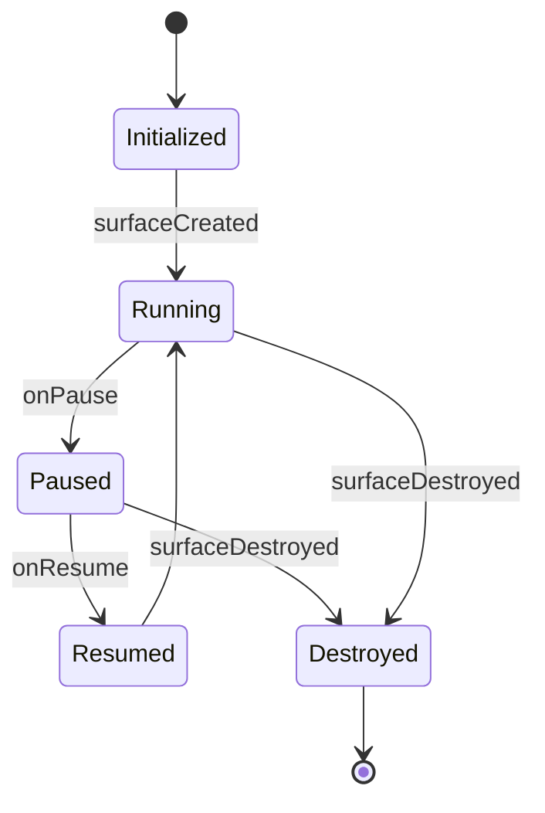

# Bevy Android Threading and Lifecycle Architecture

## Overview
This document outlines the threading model and lifecycle management system for running Bevy within Tauri on Android. The solution separates Bevy into its own thread, manages GPU resources during pause/resume, handles surface recreation, and integrates with Android lifecycle events.

## Threading Model


### Components:
1. **Android UI Thread**: Main Android thread handling UI and lifecycle events
2. **Tauri Service**: Entry point for Android, forwards lifecycle events
3. **Lifecycle Handler**: (`cpc-core`) Processes pause/resume events
4. **Bevy Thread**: Dedicated thread for Bevy game loop
5. **Resource Manager**: Handles GPU resource lifecycle
6. **Surface View**: Android surface for rendering

## Lifecycle Management

### States:
1. **Initialized**: Bevy thread created but not running
2. **Running**: Game loop active
3. **Paused**: Game loop suspended, GPU resources released
4. **Resumed**: Game loop restarted, surface recreated
5. **Destroyed**: Thread terminated, all resources released

### State Transitions:


## Key Implementation Details

### 1. Thread Separation
- Bevy runs in dedicated std::thread
- Uses crossbeam_channel for message passing
- Tauri communicates via thread-safe events

### 2. Pause/Resume Handling
- **OnPause**: 
  - Send pause signal to Bevy thread
  - Release GPU resources (textures, buffers)
  - Suspend game loop
- **OnResume**:
  - Recreate surface via JNI
  - Reload essential resources
  - Resume game loop

### 3. Surface Recreation
- Surface handle stored in Bevy resource
- Recreated in onResume
- Passed to Bevy via JNI call

### 4. Lifecycle Integration
- Extend cpc-core to manage Bevy state
- Add pause/resume callbacks to Bevy thread
- Synchronize with Android lifecycle events

### 5. Resource Management
- Implement LRU cache for GPU resources
- Release non-essential resources on pause
- Reload on resume using manifest

## Code Structure Changes
```plaintext
cpc/
├── apps/
│   ├── cpc-platform/
│   │   ├── src-tauri/
│   │   │   ├── src/
│   │   │   │   ├── bevy_jni.rs (updated)
│   │   │   │   ├── bevy_thread.rs (new)
│   │   ├── android/
│   │   │   ├── app/src/main/kotlin/com/wtf/BevyView.kt (updated)
│
├── packages/
│   ├── cpc-core/
│   │   ├── src/
│   │   │   ├── android_lifecycle.rs (updated)
```

## Testing Plan
1. Verify pause/resume behavior
2. Test surface recreation
3. Measure memory usage during backgrounding
4. Validate cross-thread communication
5. Stress test with frequent lifecycle changes