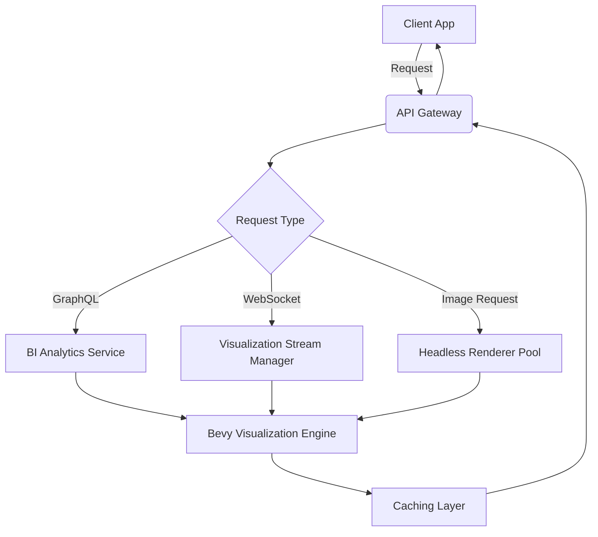
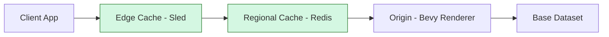

# BI Visualization Integration Strategy

## 1. Unified API Gateway Architecture

### Core Design Principles
- **Single Entry Point**: All visualization requests flow through the API gateway (`api_integration` module)
- **Protocol Agnosticism**: Supports GraphQL, REST, and WebSocket through consistent routing
- **Federation-Aware**: Respects CPC's cooperative principles in access control decisions

### Gateway Implementation Plan



### Standardized Request/Response Format

**Request Structure**:
```json
{
  "visualization_id": "uuid",
  "parameters": {
    "width": 800,
    "height": 600,
    "lod_level": 2,
    "accessibility_mode": "screen_reader"
  },
  "context": {
    "app_id": "dashboard",
    "user_id": "uuid",
    "session_token": "jwt"
  }
}
```

**Response Structure**:
```json
{
  "visualization_data": {
    "type": "3d_scene|image|stream",
    "payload": "glTF JSON|base64|stream_id",
    "accessibility": {
      "alt_text": "string",
      "navigation_map": {"key": "position"},
      "live_region": "polite|assertive"
    }
  },
  "metadata": {
    "cache_ttl": 300,
    "lod_config": {"level": 2, "max_points": 1000},
    "compliance_flags": ["pii_redacted"]
  }
}
```

### Authentication & Rate Limiting

1. **Unified Authentication Flow**:
   - JWT validation with CPC-specific claims
   - Per-app service accounts for server-to-server communication
   - Short-lived tokens for WebSocket connections (15-minute TTL)

2. **Rate Limiting Strategy**:
   | Resource Type | Baseline Limit | Burst Capacity | Special Cases |
   |--------------|----------------|----------------|---------------|
   | Static Images | 100/min | 200/min | Dashboard: +50% |
   | 3D Scene Data | 20/min | 50/min | Reporting: +30% |
   | WebSocket | 5 connections | 10 connections | Collaborative: +200% |

## 2. Cross-App Integration Framework

### Embedding Patterns

| App Type | Implementation Pattern | Data Flow |
|----------|------------------------|-----------|
| **Dashboard** | Progressive iframe loading | 1. Low-res image<br>2. 3D scene<br>3. WebSocket stream |
| **Reporting** | Direct GraphQL composition | Report → Visualization → Annotation Layer |
| **Collaborative Workspaces** | Shared visualization context | Real-time co-editing of visualization parameters |

### Data Sharing Protocol

**Visualization Context Propagation**:
```rust
// In shared packages/visualization_context
pub struct VisualizationContext {
    pub originating_app: String,
    pub user_preferences: UserVisualizationPrefs,
    pub sharing_scope: SharingScope, // Public, Team, Private
    pub compliance_metadata: ComplianceMetadata,
}

pub enum SharingScope {
    Public,
    Team(Uuid),
    Private(Uuid),
}
```

**Required Implementation in Apps**:
1. All apps must include `VisualizationContext` when requesting visualizations
2. Apps must respect `sharing_scope` when displaying visualizations
3. Compliance metadata must be preserved through all transformations

## 3. Performance Optimization Strategy

### Caching Hierarchy



**Caching Rules**:
- **Static Images**: 
  - Cache key: `sha256(report_id + width + height + lod_level)`
  - TTL: 5 minutes (configurable per app)
  - Cache warming during off-peak hours

- **3D Scene Data**:
  - Cache key: `sha256(report_id + accessibility_mode)`
  - TTL: 1 hour (with sliding expiration)
  - Incremental updates via WebSocket

- **LOD Configuration**:
  ```toml
  # Example per-app configuration
  [dashboard]
  default_lod = 2
  max_points = 500
  
  [reporting]
  default_lod = 3
  max_points = 2000
  
  [collaboration]
  default_lod = 1
  max_points = 100
  ```

### Progressive Loading Implementation

1. **Phase 1 (0-500ms)**:
   - Display skeleton UI with app-specific branding
   - Load low-resolution preview image (20% quality)

2. **Phase 2 (500-2000ms)**:
   - Stream 3D scene data in background
   - Render accessibility metadata for screen readers

3. **Phase 3 (2000ms+)**:
   - Activate full interactive visualization
   - Establish WebSocket connection for updates

## 4. Accessibility Extension Guidelines

### Metadata Propagation Rules

| Layer | Required Action | Example |
|-------|-----------------|---------|
| **Gateway** | Normalize metadata format | Convert Bevy-specific hints to standard JSON |
| **App Integration** | Enhance with app context | Dashboard adds "section: sales_performance" |
| **Client Rendering** | Apply platform-specific adaptations | Mobile: larger touch targets |

**Standardized Accessibility Metadata**:
```json
{
  "alt_text": "Bar chart showing Q3 sales: $120k (up 15% from Q2)",
  "navigation_map": {
    "T": {"label": "Title", "position": [0,3,0]},
    "L": {"label": "Legend", "position": [-3,0,0]},
    "B": {"label": "Data bars", "position": [0,0,0]}
  },
  "aria_properties": {
    "role": "application",
    "live_region": "polite",
    "keyboard_shortcuts": ["T: title", "L: legend"]
  }
}
```

### App-Specific Enhancement Guidelines

**Dashboard App**:
- Add section context to alt text: "Dashboard section: Sales Performance - [original alt text]"
- Implement keyboard navigation between visualization zones

**Reporting App**:
- Link visualization elements to source data points
- Generate dynamic alt text based on report filters

**Collaborative Workspaces**:
- Announce co-editors' interactions
- Provide spatial audio cues for multi-user navigation

## 5. Monitoring Framework

### Standardized Metrics

| Metric Category | Key Metrics | Collection Method |
|-----------------|-------------|-------------------|
| **Usage** | Requests by app, Visualization types, LOD levels | Gateway logs |
| **Performance** | Render time, Cache hit ratio, Stream latency | Client-side instrumentation |
| **Accessibility** | Screen reader usage, Keyboard navigation rate | Accessibility API hooks |
| **Compliance** | PII detection rate, Redaction frequency | Compliance service integration |

### Alerting Configuration

```yaml
# apps/api_integration/config/monitoring_rules.yml
visualization:
  critical:
    - metric: "stream_latency"
      threshold: "500ms"
      duration: "5m"
      apps: ["dashboard", "collaboration"]
    - metric: "accessibility_failure_rate"
      threshold: "5%"
      duration: "1h"
      apps: ["all"]
  warning:
    - metric: "cache_miss_rate"
      threshold: "30%"
      duration: "15m"
      apps: ["reporting"]
```

## Implementation Roadmap

1. **Phase 1 (2 weeks)**:
   - Extend API gateway with visualization routing
   - Implement standard request/response formats
   - Setup basic caching with Sled

2. **Phase 2 (3 weeks)**:
   - Integrate with Dashboard and Reporting apps
   - Implement progressive loading framework
   - Configure monitoring metrics

3. **Phase 3 (2 weeks)**:
   - Full accessibility compliance testing
   - Collaborative workspace integration
   - Documentation and training materials

## Compliance Considerations

- All visualization sharing respects CPC's cooperative principles
- Data sovereignty maintained through metadata tagging
- User-controlled data sharing preferences respected at all layers
- Accessibility compliance validated through automated testing