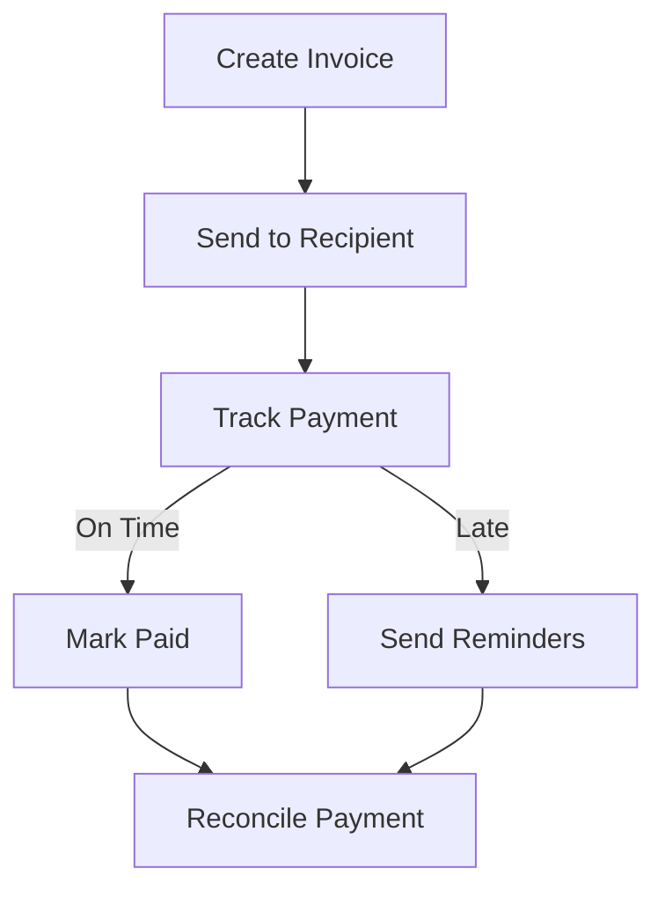

# Invoice Management System Architecture

## Overview
The Invoice Management System enables users to create, track, and manage invoices with features like customizable templates, payment reminders, and financial reporting. Built using Hexagonal Architecture principles with vertical slices for maintainability.

## Key Features
- Customizable invoice templates
- Automated payment reminders (3-day, 1-day, overdue)
- Multi-currency support with real-time exchange rates
- PDF generation and email delivery
- Payment reconciliation tracking
- Supplier performance analytics

## Core Components
### Invoice Model (Proto Definition)
```proto
message Invoice {
  string id = 1;
  string issuer_id = 2;  // User or cooperative ID
  string recipient_id = 3;
  repeated InvoiceItem items = 4;
  InvoiceStatus status = 5;
  google.protobuf.Timestamp issue_date = 6;
  google.protobuf.Timestamp due_date = 7;
  google.protobuf.Timestamp payment_date = 8;
  PaymentMethod payment_method = 9;
  map<string, string> metadata = 10;
}

message InvoiceItem {
  string description = 1;
  double quantity = 2;
  double unit_price = 3;
  string currency = 4;
  string tax_rate = 5;
}
```

## System Architecture
```
Frontend (Yew) → GraphQL API → Invoice Service → Database
                              │
                              ├→ Notification Service
                              └→ Payment Processing
```

## Integration Points
1. **Expense Tracking**: Import line items from expenses
2. **Financial Forecasting**: Project cash flow based on invoice due dates
3. **Notification System**: Send payment reminders
4. **User Preferences**: Store default invoice templates and payment terms

## Component Structure
```
src/components/invoicing/
├── InvoiceCreator.rs
├── InvoiceTracker.rs
├── templates/
│   ├── CustomTemplateEditor.rs
│   └── TemplateGallery.rs
└── reports/
    ├── AgingReport.rs
    └── SupplierPerformance.rs
```

## Implementation Details

### Backend Services
- **InvoiceService**: Core business logic for invoice management
- **ReminderScheduler**: Cron job for payment reminders
- **PDFGenerator**: Service for invoice PDF creation

### Database Schema
```sql
CREATE TABLE invoices (
    id UUID PRIMARY KEY,
    issuer_id UUID NOT NULL REFERENCES users(id),
    recipient_id UUID NOT NULL,
    status VARCHAR(20) NOT NULL,
    issue_date TIMESTAMPTZ NOT NULL,
    due_date TIMESTAMPTZ NOT NULL,
    payment_date TIMESTAMPTZ,
    payment_method VARCHAR(20),
    metadata JSONB
);
```

### Notification Events
```rust
pub enum NotificationType {
    InvoiceIssued {
        invoice_id: Uuid,
        due_date: DateTime<Utc>,
    },
    PaymentReminder {
        invoice_id: Uuid,
        days_until_due: i32,
    },
    InvoicePaid {
        invoice_id: Uuid,
        payment_method: String,
    },
}
```

## Workflow Diagram


## Future Enhancements
- Blockchain-based invoice verification
- Automated tax calculation
- International payment gateway integration