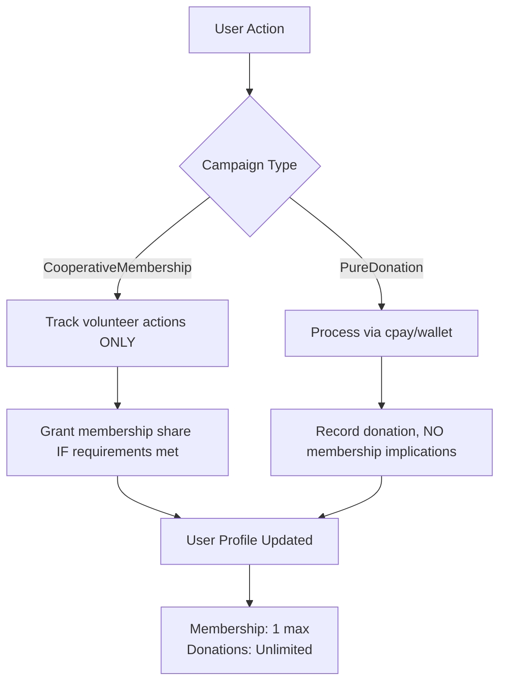

# Edge Cases: Cooperative Fundraising System

## Handling Critical Scenarios While Preserving Cooperative Principles

### 1. Mixed Contribution Attempts for Membership
**Scenario**: User tries to combine volunteer hours with monetary donation for cooperative_membership campaign  
**Business Rule**: Membership is strictly participation-based - money has no bearing on membership  
**System Response**:  
```rust
// In contribution validation
fn validate_contribution(
    contribution: &Contribution,
    campaign: &Campaign
) -> Result<(), ValidationError> {
    match campaign.type {
        CampaignType::CooperativeMembership => {
            // ONLY volunteer actions allowed
            if contribution.is_monetary() {
                return Err(ValidationError::MonetaryNotAllowed);
            }
            // Verify required actions completed
            if !has_completed_required_actions(user_id, campaign_id) {
                return Err(ValidationError::RequirementsNotMet);
            }
        }
        _ => {
            // For donation campaigns - monetary required, volunteer optional
            if contribution.is_volunteer() && !campaign.supports_volunteer() {
                return Err(ValidationError::VolunteerNotAllowed);
            }
        }
    }
    Ok(())
}
```
**Preserved Principle**: Membership cannot be purchased - it's earned through community participation

### 2. Multiple Membership Campaign Attempts
**Scenario**: User tries to join multiple cooperative_membership campaigns  
**Business Rule**: Strict 1 membership share per person globally  
**System Response**:  
- Database-level exclusion constraint blocks second membership
- UI shows clear message: "You already hold your single membership share in our cooperative"
- All membership campaigns share the same global user_shares table

**Preserved Principle**: One person = one vote, regardless of participation in multiple initiatives

### 3. Volunteer Hours Verification Disputes
**Scenario**: Cooperative disputes whether volunteer work was completed as described  
**Resolution Workflow**:  
1. Contribution status changes to `verification_status = 'disputed'`
2. System triggers 3-party resolution:
   - Volunteer provides evidence (screenshots, artifacts)
   - Cooperative provides counter-evidence
   - Neutral community members mediate
3. After 7 days without resolution, status auto-sets to `rejected`

**Critical Note**: Volunteer hours NEVER converted to monetary value at any stage - dispute is purely about participation verification

### 4. Overfunding in Donation Campaigns
**Scenario**: PureDonation campaign exceeds funding goal  
**System Response**:  
```sql
-- Funds automatically allocated to campaign's designated use case
INSERT INTO fund_allocations (campaign_id, amount, purpose)
VALUES ($1, $2, (SELECT external_use_case FROM donation_campaigns WHERE campaign_id = $1));

-- Excess funds handled per campaign rules
UPDATE fund_allocations
SET amount = LEAST(amount, (SELECT funding_goal FROM donation_campaigns WHERE campaign_id = $1))
WHERE campaign_id = $1;

-- Remaining funds can be:
-- 1) Refunded via cpay (for RegCF/RegA)
-- 2) Rolled into general cooperative fund (for PureDonation)
```
**Preserved Principle**: Money serves community needs - excess funds never create additional membership rights

### 5. Campaign Failure: Membership Drives
**Scenario**: CooperativeMembership campaign doesn't reach minimum participants  
**System Response**:  
1. All verified volunteer actions preserved in user profiles (as community participation)
2. NO membership shares issued
3. System prompts: "This initiative needs more community participation to launch"
4. Volunteer hours NOT converted to monetary value for refund

**Why This Matters**: Membership requires critical mass - you can't have a cooperative with just one member

### 6. Regulatory Campaigns with Volunteer Components
**Scenario**: User tries to include volunteer hours as part of RegCF campaign funding  
**System Response**:  
```rust
// Regulatory validation
fn validate_regulatory_campaign(
    campaign: &Campaign
) -> Result<(), RegulatoryError> {
    match campaign.type {
        CampaignType::RegCF | CampaignType::RegA => {
            // Volunteer hours cannot count toward funding goal
            if campaign.has_volunteer_component() {
                return Err(RegulatoryError::VolunteerNotAllowed);
            }
            // All funds must have documented external use case
            if campaign.external_use_case.is_empty() {
                return Err(RegulatoryError::MissingUseCase);
            }
        }
        _ => {}
    }
    Ok(())
}
```
**Regulatory Reality Check**: SEC regulations don't recognize volunteer hours as investment - keeping these separate maintains compliance

### 7. Wallet Fund Misallocation Attempts
**Scenario**: Admin tries to allocate donation funds to non-approved purpose  
**System Response**:  
- wallet service rejects allocation where purpose ≠ external_use_case
- Requires multi-sig approval from cooperative members for use case changes
- Full audit trail maintained linking:
  - cpay transaction → donation campaign → wallet allocation → external payment

**Transparency Safeguard**: Community members can always verify fund usage matches stated purpose

### 8. Cross-Campaign Confusion
**Scenario**: User participates in both membership and donation campaigns simultaneously  
**System Response**:  

**Clear Separation**: UI explicitly labels campaign types to prevent confusion:
- "Join Our Cooperative" (membership)
- "Support This Initiative" (donation)

### 9. Abandoned Campaigns
**Scenario**: Admin creates campaign but never activates it  
**System Response**:  
- Draft campaigns auto-expire after 90 days
- Funds in draft donation campaigns automatically refunded
- Volunteer actions in draft membership campaigns discarded (never counted toward requirements)

**Prevents**: Zombie campaigns that could confuse community members

### 10. External System Failures
**Scenario**: cpay or wallet services unavailable during contribution  
**System Response**:  
1. **Monetary Contributions**:
   - Contribution status = `pending_external`
   - Retry mechanism with exponential backoff
   - Clear user message: "Your donation is processing - we'll confirm soon"

2. **Volunteer Actions**:
   - Immediately recorded as `pending_verification`
   - Skill_volunteering system handles verification independently
   - No dependency on external financial systems

**Resilience Design**: Volunteer participation continues uninterrupted regardless of financial system status

## Philosophical Edge Cases

### "But I Donated More - Shouldn't I Get More Say?"
**Response**: Our cooperative principles are clear - governance is based on community participation, not financial contribution. Your donation supports our external needs, but decision-making power comes from your active involvement in the community.

### "Can I Transfer My Membership Share?"
**Response**: Membership shares are non-transferable by design. They represent your personal commitment to the community, not a financial asset. If you're no longer participating, your membership naturally becomes inactive.

### "What If I Do 1000 Volunteer Hours?"
**Response**: Your community participation is valued, but membership remains singular. Extra participation might:
- Earn recognition in the community
- Qualify you for leadership roles
- Be highlighted in your skill profile
But never converts to additional voting rights or financial benefits.