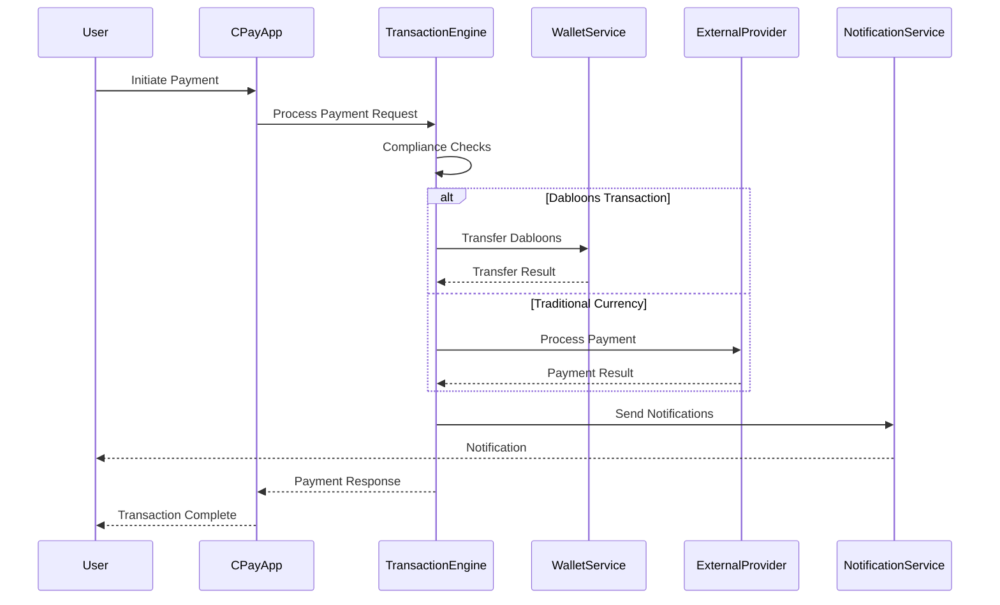

# CPay Architecture Documentation

## Overview

CPay is the payment processing system for the CPC platform, providing secure and efficient transaction processing for both internal (Dabloons) and external (traditional) currencies. It integrates with the existing wallet system, notification service, and social features to provide a comprehensive payment experience.

## Architecture Components

### 1. Core Modules

#### `cpay_core`
The core business logic package containing:
- **models**: Data structures for payments, transactions, and errors
- **transaction_engine**: Main processing engine for payment transactions
- **Service interfaces**: Traits defining the CPay service contract

#### `apps/cpay`
The main application package containing:
- **main.rs**: Entry point for the CPay service
- **Tauri frontend**: Desktop application interface
- **gRPC server**: Internal service API

### 2. Key Features

#### Payment Processing
- Support for Dabloons (internal currency) and traditional currencies (USD, EUR, etc.)
- Integration with existing wallet system for Dabloons transactions
- External payment provider integration for traditional currencies
- Real-time transaction processing

#### Compliance & Security
- KYC verification integration
- Transaction limit enforcement
- Fraud detection mechanisms
- Audit logging for all transactions
- Rate limiting middleware

#### Integration Points
- **Wallet Service**: For Dabloons transactions and balance management
- **Notification Service**: For transaction notifications and alerts
- **Social Integration**: For social payment features and feed updates

### 3. Data Flow



### 4. API Design

#### gRPC Services
CPay exposes internal services via gRPC:

```protobuf
service CPayService {
  rpc ProcessPayment(PaymentRequest) returns (PaymentResponse);
  rpc GetTransactionHistory(TransactionHistoryRequest) returns (TransactionHistoryResponse);
}
```

#### Tauri Desktop Interface
The desktop application uses Tauri for the frontend, providing:
- Payment initiation UI
- Transaction history view
- Account management
- Notification center

### 5. Security Considerations

#### Cryptography
- All sensitive data is encrypted using RustCrypto
- Digital signatures for transaction integrity
- Secure key management

#### Access Control
- Role-based access control for administrative functions
- User authentication integrated with CPC auth system
- API key management for service-to-service communication

#### Rate Limiting
- Middleware to prevent abuse
- Configurable limits per user/service
- Automatic throttling during high load

### 6. Database Schema

CPay uses the existing wallet schema with additional tables for traditional currency transactions:

```sql
-- Extended from existing wallet schema
CREATE TABLE IF NOT EXISTS traditional_currency_transactions (
    id UUID PRIMARY KEY,
    user_id UUID NOT NULL,
    transaction_type VARCHAR(10) NOT NULL,
    amount DECIMAL(20, 2) NOT NULL,
    currency VARCHAR(3) NOT NULL,
    external_reference VARCHAR(255),
    status VARCHAR(20) NOT NULL,
    description TEXT,
    created_at TIMESTAMP WITH TIME ZONE NOT NULL DEFAULT NOW(),
    updated_at TIMESTAMP WITH TIME ZONE NOT NULL DEFAULT NOW()
);
```

### 7. Deployment Architecture

```
┌─────────────────┐    ┌──────────────────┐    ┌──────────────────┐
│   CPay App      │    │   CPay Core      │    │   Dependencies   │
│  (Tauri Frontend)│◄──►│(Business Logic)  │◄──►│(Wallet, Notif,   │
└─────────────────┘    └──────────────────┘    │ Social, etc.)    │
                                               └──────────────────┘
                                                        │
                                                        ▼
                                               ┌──────────────────┐
                                               │   PostgreSQL     │
                                               │ (Transactions)   │
                                               └──────────────────┘
```

### 8. Error Handling

CPay implements comprehensive error handling:
- Specific error types for different failure modes
- Graceful degradation during service outages
- Detailed logging for audit and debugging
- User-friendly error messages

### 9. Monitoring & Observability

- Structured logging with tracing
- Metrics collection for performance monitoring
- Health checks for service status
- Alerting for critical failures

## Implementation Roadmap

1. **Phase 1**: Core transaction engine and Dabloons integration
2. **Phase 2**: Traditional currency support and external provider integration
3. **Phase 3**: Advanced compliance features and fraud detection
4. **Phase 4**: Desktop application and user interface
5. **Phase 5**: Performance optimization and scaling

## Dependencies

- `wallet`: For Dabloons transaction processing
- `notification_core`: For payment notifications
- `social_integration`: For social payment features
- `tonic`/`prost`: For gRPC services
- `sqlx`: For database access
- `rust-crypto`: For cryptographic operations