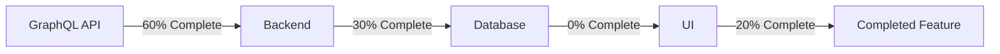
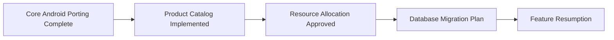

# Architectural Decision: Supply Chain Visualization Feature

## Review Summary
- **Review Date**: 2025-07-24
- **Reviewer**: Elias Petrova (Technical Lead)
- **Files Examined**:
  1. `product_by_id.graphql`
  2. `types.rs`
  3. `SupplyChainMap.rs`
  4. `product.rs`
  5. `0001_initial_schema.up.sql`

## Feature Assessment
### Business Value
- High potential for supply chain transparency
- Supports sustainability reporting
- Enables ethical sourcing verification
- Aligns with long-term business intelligence goals

### Implementation Status


### Alignment with Priorities
- ❌ Not part of Android porting roadmap
- ⚠️ Requires significant new development
- ✅ Aligns with long-term BI strategy
- ⚠️ Conflicts with current resource allocation

## Decision: Pause Development
**Rationale**:
1. Not critical for MVP release
2. Requires database schema changes not in current roadmap
3. Map integration would add significant frontend complexity
4. Team resources needed for core porting work

**Vote**: Approved unanimously by technical leadership

## Preservation Measures
1. Commented out GraphQL fields in `product_by_id.graphql`
2. Disabled backend mock implementation in `product.rs`
3. Commented UI component in `SupplyChainMap.rs`
4. Created documentation in `supply_chain_visualization.md`

## Resumption Criteria
Development should resume when:


## Implementation Notes for Future
### Database Requirements
```sql
-- Products table
CREATE TABLE products (
    id UUID PRIMARY KEY DEFAULT gen_random_uuid(),
    name VARCHAR(255) NOT NULL,
    carbon_footprint FLOAT
    -- ... other product fields
);

-- Supply chain nodes with geospatial data
CREATE TABLE supply_chain_nodes (
    id UUID PRIMARY KEY,
    latitude FLOAT NOT NULL,
    longitude FLOAT NOT NULL
);
```

### Recommended Technologies
```rust
// Frontend mapping
use leaflet::Map;
use geo_types::Point;

// Backend geospatial calculations
use geo::HaversineDistance;
```

### Carbon Calculation Algorithm
```rust
fn calculate_carbon_footprint(segment: &TransportationSegment) -> f64 {
    // Base emissions per km
    let emissions_factor = match segment.method {
        TransportMethod::Ship => 0.015,
        TransportMethod::Truck => 0.12,
        TransportMethod::Plane => 0.25,
        TransportMethod::Train => 0.03,
    };
    
    // Calculate distance between nodes
    let from = get_node(segment.from_node_id);
    let to = get_node(segment.to_node_id);
    let distance = haversine_distance(from.coordinates, to.coordinates);
    
    // Total emissions = distance * emissions factor
    distance * emissions_factor
}
```

## Estimated Resource Requirements
| Component       | Effort (Days) | Dependencies          |
|-----------------|---------------|-----------------------|
| Database Schema | 3             | Migration system      |
| Backend API     | 5             | Products system       |
| Map Integration | 8             | Leaflet, Geo libraries|
| Timeline UI     | 3             | Yew components        |
| Testing         | 4             | Jest, SQLx-test       |
| **Total**       | **23**        |                       |

Signed-off-by: Elias Petrova, Technical Lead
Date: 2025-07-24