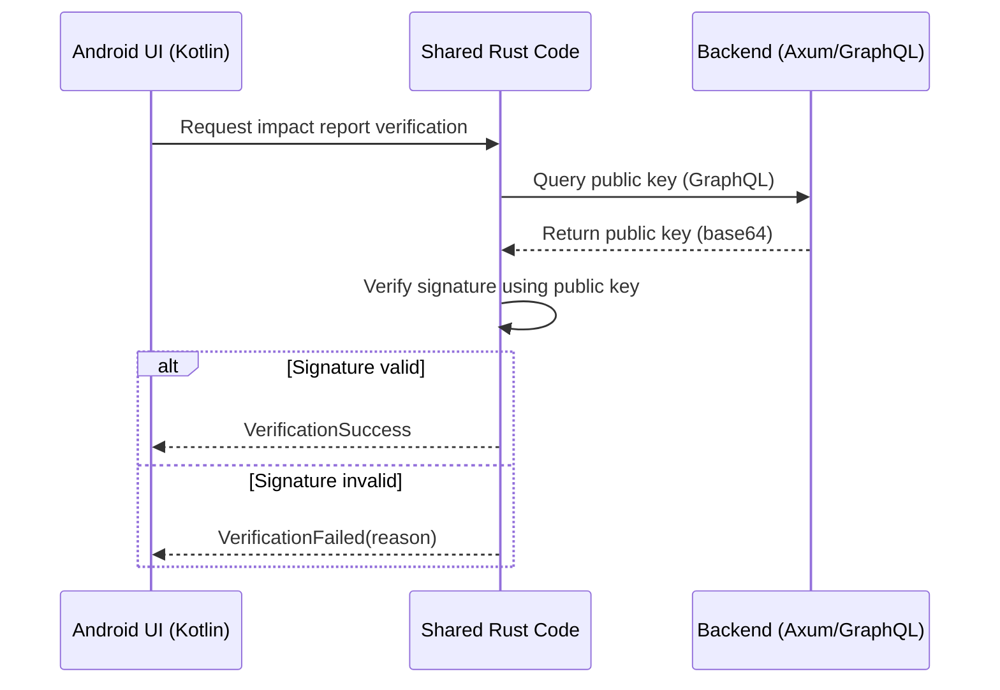

# Android Cryptographic Signature Verification Design

## Overview
This document outlines the design for verifying impact report signatures in the Android app using shared Rust code. The solution leverages our existing cryptographic infrastructure while ensuring cross-platform compatibility.

## Sequence Diagram



## Interface Definitions

### Rust-Kotlin FFI Interface (Rust side)
```rust
// packages/cpc-core/src/verification.rs
#[derive(Debug)]
pub enum VerificationResult {
    Valid,
    Invalid(String),
}

#[no_mangle]
pub extern "C" fn verify_impact_report_signature(
    report_json: *const c_char,
    public_key: *const c_char,
) -> *mut VerificationResult {
    let report_str = unsafe { CStr::from_ptr(report_json).to_str().unwrap() };
    let public_key_str = unsafe { CStr::from_ptr(public_key).to_str().unwrap() };
    
    match verify_signature_internal(report_str, public_key_str) {
        Ok(()) => Box::into_raw(Box::new(VerificationResult::Valid)),
        Err(e) => Box::into_raw(Box::new(VerificationResult::Invalid(e.to_string()))),
    }
}
```

### Android Interface (Kotlin side)
```kotlin
// apps/cpc-platform/android/app/src/main/java/coop/cpc/verification/SignatureVerifier.kt
class SignatureVerifier {
    external fun verifyImpactReport(
        reportJson: String,
        publicKey: String
    ): VerificationResult

    companion object {
        init {
            System.loadLibrary("cpc_core")
        }
    }
}

data class VerificationResult(
    val isValid: Boolean,
    val errorMessage: String? = null
)
```

## Error Handling Strategy

### Error Cases:
1. **Invalid Signature**: Report has been tampered with
2. **Expired Public Key**: Cached key no longer valid
3. **Network Issues**: Failed to fetch public key
4. **Malformed Data**: Invalid report structure

### Handling Approach:
```kotlin
// Android ViewModel example
fun verifyReport(report: ImpactReport) {
    viewModelScope.launch {
        try {
            val result = withContext(Dispatchers.IO) {
                SignatureVerifier().verifyImpactReport(
                    report.toJson(),
                    fetchPublicKey()
                )
            }
            
            when {
                result.isValid -> _uiState.value = VerificationSuccess
                else -> _uiState.value = VerificationFailed(result.errorMessage)
            }
        } catch (e: Exception) {
            _uiState.value = NetworkError(e.message)
        }
    }
}
```

## Multi-Platform Considerations

1. **Shared Core Logic**:
   - Verification implementation in `cpc-core` crate
   - FFI exposed for mobile platforms
   - Desktop apps use direct Rust calls

2. **Public Key Management**:
   ```mermaid
   graph LR
       A[Android] -->|FFI Call| B(cpc-core)
       C[Desktop] -->|Direct| B(cpc-core)
       B --> D[GraphQL Endpoint]
   ```

3. **Protocol Buffers**:
   - Maintain single source of truth in `impact.proto`
   - Generate language-specific bindings
   - Use JSON for Android-Rust communication

## Migration Plan for Android

1. **Implement FFI Bridge**:
   - Add Rust verification function to `cpc-core`
   - Configure Uniffi for Kotlin bindings

2. **Create Android Components**:
   - `SignatureVerifier.kt`: JNI interface
   - `ImpactVerificationViewModel.kt`: Business logic
   - Verification status UI components

3. **Integrate with GraphQL Client**:
   - Reuse existing GraphQL client in shared Rust code
   - Add public key query to Android startup sequence

4. **Error Handling Integration**:
   - Map Rust errors to Android UI states
   - Implement retry mechanisms for network issues

5. **Testing Strategy**:
   - Unit tests for signature verification in Rust
   - Integration tests for Android verification flow
   - Mock backend for different failure scenarios