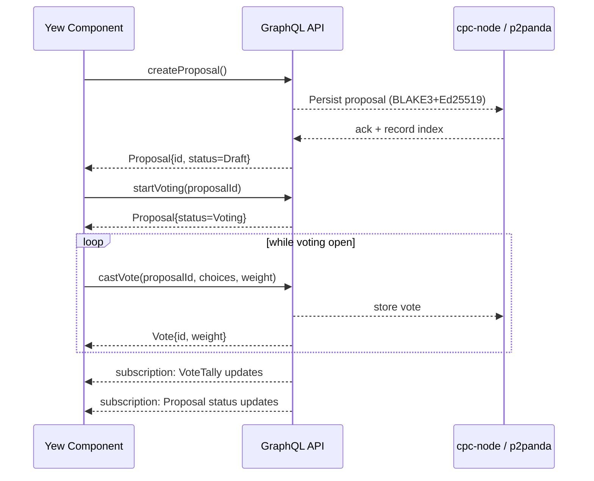

# Governance UI Components Architecture

_Task 8.5 — Design of proposal creation, voting and dashboard features in Yew with p2panda_

## Architectural Principles
- Hexagonal + Screaming architecture: UI layer isolated behind GraphQL & p2panda ports.  
- Vertical slices: each feature’s UI, state & service code grouped under `apps/cpc-platform/src/governance/<slice>`.  
- Rust/Yew functional components, strongly typed using shared structs from `cpc-core`.  
- Real-time sync via GraphQL subscriptions → p2panda (iroh/QUIC) under the hood.

## Component Slices

| Slice | Yew Component | Purpose |
|-------|---------------|---------|
| ProposalComposer | `<ProposalComposer />` | Draft & submit new `Proposal` objects |
| ProposalViewer   | `<ProposalViewer />`   | Display proposal details + live status |
| VotingInterface  | `<VotingInterface />`  | Let user rank / weight options (rated choice as default) and cast or update `Vote`s |
| GovernanceDashboard | `<GovernanceDashboard />` | Aggregate view of active & past proposals + user participation |

Directory layout:
```
apps/cpc-platform/src/governance/
  composer/
  viewer/
  voting/
  dashboard/
  services.rs         # Slice-agnostic hooks into GraphQL & p2panda
  context.rs          # GovernanceContext provider
```

### Interaction Diagram



## State Management

1. **`GovernanceContext`** (Yew `ContextProvider`):  
   • Holds `HashMap<Uuid, ProposalState>` where `ProposalState` bundles proposal, votes, tallies.  
   • Exposes async fns calling `GovernanceServiceClient` (generated by `async-graphql-wasm`).  
   • Subscribes on mount to `proposalUpdates` + `voteTallyUpdates` streams, dispatching state events.

2. Each slice uses `use_context::<GovernanceContext>()` and local `use_reducer` for UI-centric state.

3. Error & loading states surfaced via `apps/cpc-platform/src/components/status/`.

## GraphQL Interface Specification

### Mutations

```graphql
mutation CreateProposal($input: CreateProposalInput!) {
  createProposal(input: $input) {
    id
    title
    status
    votingDeadline
    quorumThreshold
    options
  }
}

mutation StartVoting($proposalId: UUID!) {
  startVoting(proposalId: $proposalId)
}

mutation CastVote($proposalId: UUID!, $choices: [String!]!, $anonymous: Boolean) {
  castVote(proposalId: $proposalId, choices: $choices, isAnonymous: $anonymous) {
    id
    votingWeight
    choices
  }
}

mutation UpdateVote($voteId: UUID!, $choices: [String!]!) {
  updateVote(voteId: $voteId, newChoices: $choices) {
    id
    votingWeight
    choices
    updatedAt
  }
}
```

### Queries

```graphql
query Proposal($id: UUID!) {
  proposal(id: $id) {
    id
    title
    description
    status
    options
    participationCount
    eligibleVoterCount
    votingDeadline
    quorumThreshold
    tallies {
      roundNumber
      roundResults {
        option
        weightedCount
        percentage
      }
      winner
      isFinalRound
    }
  }
}

query GovernanceDashboard($cooperativeId: UUID!, $limit: Int, $offset: Int) {
  proposals(cooperativeId: $cooperativeId, limit: $limit, offset: $offset) {
    id
    title
    status
    votingDeadline
  }
  userParticipation {
    proposalsCreated
    votesCast
    participationScore
  }
}
```

### Subscriptions

```graphql
subscription ProposalUpdates($proposalId: UUID!) {
  proposalUpdates(proposalId: $proposalId) {
    status
    participationCount
  }
}

subscription VoteTallyUpdates($proposalId: UUID!) {
  voteTallyUpdates(proposalId: $proposalId) {
    roundNumber
    roundResults {
      option
      weightedCount
      percentage
    }
    winner
  }
}
```

## Vote Weight Visualisation

- Display user’s stake/rep as a gauge next to their ballot.
- In `VotingInterface`, show each option’s current weighted % as live stacked bar.
- Support multiple mechanisms:  
  1. **Token-weighted** (default): weight = `cooperative_score.value`.  
  2. **Quadratic**: weight = `sqrt(tokens)`. UI toggles description; server handles math.
- Colour legend: primary brand colour for weighted counts, neutral for raw counts.

## Security Considerations

1. All mutations require JWT signed with Ed25519; backend validates signature + cooperative membership.
2. p2panda ensures tamper-evident logs (BLAKE3 hashing chain).
3. Voting fraud mitigations (rate-limit, pattern analysis) implemented in `GovernanceService`; UI surfaces errors clearly.
4. Sensitive actions (createProposal, startVoting, castVote) executed over TLS + QUIC.
5. Client stores draft proposals in local IndexedDB encrypted with WebCrypto until submitted.

## Open Tasks for Implementation
- Generate yew-graphql client bindings from backend schema.
- Build `GovernanceContext`.
- Implement each slice directory with common pattern: `mod.rs`, `state.rs`, `view.rs`.
- Add unit docs for each component explaining link to backend and p2p flows.

---

_Designed by Elias Petrova • 2025-07-25_