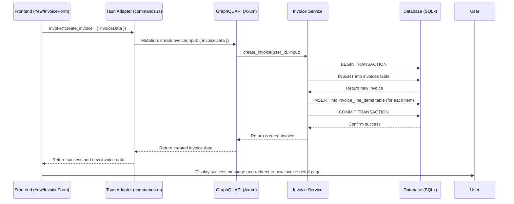

# Invoice Creation Feature: Architectural Plan

This document outlines the architecture and implementation plan for the invoice creation feature in the CPC platform.

## 1. Architectural Diagram: Invoice Creation Flow

This sequence diagram illustrates the end-to-end flow, from the user interface to the database.



## 2. Frontend Component Hierarchy

The new `InvoiceForm` component will be responsible for capturing user input.

**File:** `apps/cpc-platform/src/invoicing/components/invoice_form.rs`

**Component:** `InvoiceForm`

*   **Props:**
    *   `organization_id: String`
*   **State:**
    *   `customer_name: use_state(|| String::new())`
    *   `customer_email: use_state(|| String::new())`
    *   `customer_address: use_state(|| String::new())`
    *   `issue_date: use_state(|| Utc::now().naive_utc().date())`
    *   `due_date: use_state(|| Utc::now().naive_utc().date())`
    *   `line_items: use_state(|| vec![LineItem::default()])`
    *   `notes: use_state(|| String::new())`
    *   `tax_rate: use_state(|| 0.0)`
    *   `is_saving: use_state(|| false)`
    *   `error: use_state(|| None::<String>)`
    *   `success: use_state(|| None::<String>)`
*   **Child Components:**
    *   `LineItemInput`: A reusable component for a single line item row.
    *   Standard HTML input elements for other fields.

## 3. GraphQL Mutation Definition

We will use the existing `create_invoice` mutation. A new file will be created in the `src-tauri` directory to define the mutation for the frontend client.

**File:** `apps/cpc-platform/src-tauri/src/invoicing/graphql/mutations/create_invoice.graphql`

```graphql
mutation CreateInvoice($input: CreateInvoiceInput!) {
  createInvoice(input: $input) {
    id
    invoiceNumber
    status
    total
  }
}
```

**Input Type (`CreateInvoiceInput`):** This is already defined on the backend in `apps/backend/src/graphql/invoicing.rs`. The frontend will need to construct a matching object.

## 4. Form Validation Rules

Validation will be performed on the frontend before submitting the form.

*   **Customer Name:** Required, non-empty.
*   **Customer Email:** Required, must be a valid email format.
*   **Issue Date:** Required.
*   **Due Date:** Required, must be on or after the Issue Date.
*   **Line Items:**
    *   At least one line item is required.
    *   **Description:** Required, non-empty.
    *   **Quantity:** Required, must be a number greater than 0.
    *   **Unit Price:** Required, must be a number greater than or equal to 0.
*   **Tax Rate:** Required, must be a number between 0 and 100.

## 5. Success and Error Handling Strategy

*   **On Success:**
    1.  The `is_saving` state is set to `false`.
    2.  A success message is displayed to the user (e.g., "Invoice created successfully!").
    3.  The user is redirected to the newly created invoice's detail page (`/invoices/{new_invoice_id}`).
*   **On Error:**
    1.  The `is_saving` state is set to `false`.
    2.  The `error` state is populated with the error message from the backend.
    3.  An error message is displayed to the user in the form.
    4.  The form fields remain populated for the user to correct.

## 6. Task Breakdown for Implementation

This task breakdown can be used by the `ougcode` persona for implementation.

### Part 1: Backend & Tauri (No changes needed, verification step)

1.  **Verify Backend:** Confirm that the `create_invoice` mutation in `apps/backend/src/graphql/invoicing.rs` and the corresponding logic in `apps/backend/src/services/invoicing.rs` are complete and functional. (Verified during planning).

### Part 2: Frontend (Yew)

1.  **Create `InvoiceForm` Component:**
    *   Create a new file: `apps/cpc-platform/src/invoicing/components/invoice_form.rs`.
    *   Implement the `InvoiceForm` component with the state and props defined in section 2.
    *   Build the HTML structure for the form, including fields for customer details, dates, and notes.
    *   Implement the dynamic line item section, allowing users to add/remove line items.

2.  **Add to Component Module:**
    *   In `apps/cpc-platform/src/invoicing/components/mod.rs`, add `pub mod invoice_form;` and `pub use invoice_form::InvoiceForm;`.

3.  **Implement Routing:**
    *   In the main application router (likely in `apps/cpc-platform/src/app.rs` or similar), add a new route: `/invoices/new` that renders the `InvoiceForm` component.
    *   In `apps/cpc-platform/src/invoicing/components/dashboard.rs`, modify the "Create New Invoice" button to navigate to the `/invoices/new` route.

### Part 3: Tauri and GraphQL Integration

1.  **Create GraphQL Mutation File:**
    *   Create the file `apps/cpc-platform/src-tauri/src/invoicing/graphql/mutations/create_invoice.graphql` with the content from section 3.

2.  **Update Tauri GraphQL Client:**
    *   In `apps/cpc-platform/src-tauri/src/invoicing/graphql.rs`, add a new struct and function for the `CreateInvoice` mutation, similar to the existing `GenerateInvoicePdf`.

3.  **Create Tauri Command:**
    *   In `apps/cpc-platform/src-tauri/src/invoicing/commands.rs`, add a new `#[tauri::command]` named `create_invoice`.
    *   This command will take the invoice form data as an argument, call the GraphQL mutation function from the previous step, and return the result to the frontend.

4.  **Connect Frontend to Tauri:**
    *   In the `InvoiceForm` component, implement the `onsubmit` handler for the form.
    *   The handler will:
        *   Perform validation (as per section 4).
        *   If valid, set `is_saving` to `true`.
        *   Call the `create_invoice` Tauri command using `invoke`.
        *   Handle the success or error response, updating the component's state accordingly.