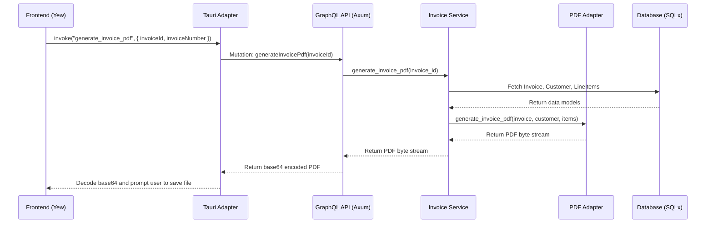

# Invoicing System Architectural Design

This document outlines the architecture of the invoicing system within the CPC platform. It details the design principles, data flow, and implementation details for generating and managing invoices, with a specific focus on PDF generation.

## 1. Architectural Principles

The invoicing system is designed based on the principles of **Hexagonal Architecture** (also known as Ports and Adapters). This approach ensures a clear separation of concerns between the core application logic and external dependencies like databases, APIs, and UI components.

-   **Domain Core**: The core of the system contains the business logic and domain models (`Invoice`, `Customer`, etc.), located in `packages/cpc-core/` and `apps/backend/src/invoicing/models.rs`. This core is completely independent of any specific technology or delivery mechanism.
-   **Ports**: The application defines "ports" (Rust traits) that represent contracts for interacting with the outside world. For the invoicing system, this is embodied by the `InvoiceService` trait.
-   **Adapters**: Concrete implementations of these ports are provided by "adapters."
    -   **Primary Adapters (Driving)**: These are the entry points to our application, such as the GraphQL API (`apps/backend/src/graphql/invoicing.rs`) and Tauri commands (`apps/cpc-platform/src-tauri/src/invoicing/commands.rs`).
    -   **Secondary Adapters (Driven)**: These are the implementations that our core logic uses, such as the database interaction layer (using `sqlx`) and the PDF generation service (`apps/backend/src/invoicing/pdf.rs`).

This architecture allows us to swap out external components (e.g., change the PDF generation library or database) with minimal impact on the core business logic.

## 2. Feature-Specific Designs

- **[Invoice Creation](./invoice_creation_plan.md)**: Detailed plan for the invoice creation form, GraphQL mutation, and frontend/backend workflow.
## 2. PDF Generation Flow

The generation of an invoice PDF involves multiple layers of the application, from the user interface to the backend service.

### Ideal Sequence Diagram

The following diagram illustrates the intended architectural flow for generating a PDF invoice, adhering strictly to our Hexagonal Architecture principles.

### Current Implementation and Deviations

The current implementation deviates from the ideal design in the GraphQL layer.

-   **`apps/backend/src/graphql/invoicing.rs`**: The `generate_invoice_pdf` mutation currently contains the logic for fetching data directly from the database using `sqlx`.
-   **Rationale**: This was likely implemented as a shortcut to expedite feature delivery. While functional, it bypasses the `InvoiceService`, coupling the GraphQL API directly to the database implementation for this specific operation.

This deviation should be addressed in a future refactoring to ensure the GraphQL layer acts purely as a primary adapter, delegating all business and data orchestration logic to the `InvoiceService`.

## 3. Data Flow and Base64 Encoding

1.  **Request**: The process is initiated by a user action in the Yew frontend, which calls a Tauri command.
2.  **GraphQL Mutation**: The Tauri command invokes the `generateInvoicePdf` GraphQL mutation on the Axum backend.
3.  **PDF Generation**: The backend fetches the required invoice data and uses the `pdf` adapter (`genpdf` library) to create the invoice as a raw byte vector (`Vec<u8>`).
4.  **Base64 Encoding**: Since GraphQL is a text-based protocol, the binary PDF data cannot be transmitted directly. It is encoded into a **base64 string** before being sent in the GraphQL response. This is a standard and efficient way to transport binary data over text-based channels.
5.  **Base64 Decoding**: The Tauri command adapter receives the base64 string, decodes it back into a `Vec<u8>`, and then uses the operating system's file dialog to save the bytes to a `.pdf` file.

## 4. Error Handling Strategy

Error handling is managed at each layer to provide clear feedback and maintain system stability.

-   **PDF Adapter (`pdf.rs`)**: Uses `anyhow::Result` to wrap errors from the `genpdf` library (e.g., font loading issues, rendering errors). These are propagated up to the caller.
-   **GraphQL API (`invoicing.rs`)**:
    -   Database query errors (`sqlx::Error`) are caught and mapped to `async_graphql::Error`, returning a user-friendly error message in the GraphQL response.
    -   PDF generation errors are similarly caught and mapped.
    -   Invalid input (e.g., a malformed `invoice_id`) is handled with a specific error message.
-   **Tauri Adapter (`commands.rs`)**:
    -   Errors from the GraphQL mutation are caught and converted to a `String` to be sent back to the frontend.
    -   Base64 decoding errors are handled, preventing the application from crashing due to corrupt data.
    -   File system errors during the save operation are logged to `stderr`.
-   **Frontend (Yew)**: The component uses a `use_state` hook to capture and display any error messages returned from the Tauri command, informing the user of the failure.

## 5. Performance Considerations

-   **Database Queries**: The current implementation fetches the invoice, customer, and line items in three separate queries. For invoices with a very large number of line items, this is efficient. If performance becomes an issue, these could be combined into a single, more complex `JOIN` query.
-   **PDF Generation**: The `genpdf` library operates in memory. Generating extremely large invoices (e.g., thousands of pages) could lead to high memory consumption on the backend server. This is not a concern for typical use cases but should be monitored if the system is used for bulk generation.
-   **Data Transfer**: Base64 encoding increases the size of the data by approximately 33%. For very large PDFs, this could increase network latency between the backend and the Tauri client. However, since the backend and client are often on the same machine for a desktop app, this is a low-risk concern.