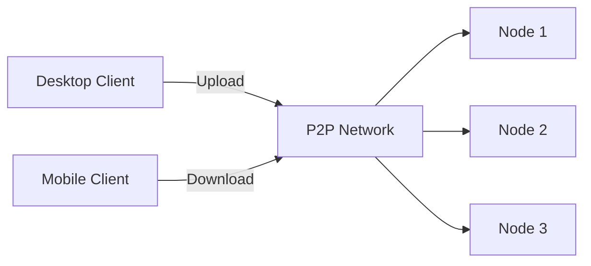
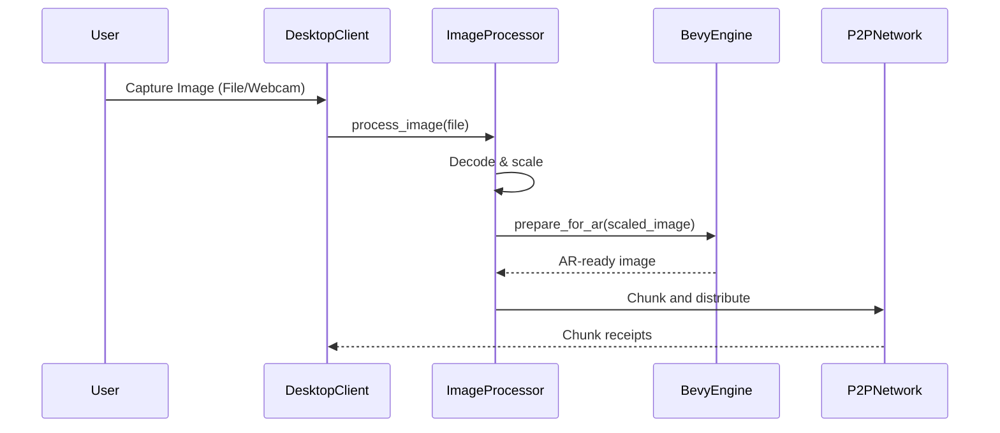

# Desktop Application Architecture

## Distributed File Hosting System


### Key Components:
1. **File Chunking Service**
   - Splits files into 5MB chunks
   - Uses BLAKE3 for hashing
2. **Distributed Index**
   - Tracks chunk locations
   - Uses Kademlia DHT
3. **Peer Manager**
   - Handles NAT traversal
   - Manages direct connections

## Image Processing Pipeline



### Key Components:
1. **Chunking Strategy:**
   - Files >5MB split using BLAKE3 hashing (see chunking.rs)
   - Distributed via P2P network (DHT for chunk discovery)
   - Reassembly after all chunks downloaded
   
2. **Error Handling:**
   - Decoding errors: Return ImageError::Decoding
   - Processing errors: Retry up to 3 times
   - Network failures: Switch to fallback peers

3. **AR Integration:**
   - Seamless handoff to Bevy engine
   - Image tracking markers
   - AR overlay rendering
   - Experience sharing previews

## Social Features

### GraphQL Schema:
```graphql
type Mutation {
    shareExperience(input: ShareInput!): SharePayload!
    inviteFriend(userId: ID!): InviteFriendPayload!
    postComment(experienceId: ID!, content: String!): Comment!
}

type Subscription {
    newComment(experienceId: ID!): Comment!
}

type ShareInput {
    experienceId: ID!
    visibility: Visibility! = FRIENDS
}

enum Visibility {
    PUBLIC
    FRIENDS
    PRIVATE
}

type SharePayload {
    experience: Experience!
}

type InviteFriendPayload {
    invitationCode: String!
    status: InviteStatus!
}

enum InviteStatus {
    SENT
    PENDING
    ACCEPTED
}

type Comment {
    id: ID!
    author: User!
    content: String!
    createdAt: DateTime!
}
```

### Permission Model:
- **Public**: Visible to all users
- **Friends**: Visible to accepted friends only
- **Private**: Visible only to creator

## Bevy AR Integration

### Extensions:
```rust
// apps/pds/src-tauri/src/bevy_integration.rs

// Image tracking
fn setup_image_tracking(commands: &mut Commands, asset_server: &Res<AssetServer>) {
    // Load image targets
}

// AR overlay rendering
fn render_ar_overlay(mut materials: ResMut<Assets<StandardMaterial>>, ...) {
    // Render 3D objects on tracked images
}

// Experience sharing previews
fn generate_preview(ar_scene: &ARScene) -> PreviewImage {
    // Capture low-res preview
}
```

### Performance Optimizations:
- Texture compression for AR assets
- Background loading of 3D models
- Frame rate throttling in non-visible tabs

## Implementation Roadmap
1. Image processing pipeline (1 week)
2. Social features core (1 week)
3. Bevy AR enhancements (3 days)
4. Performance tuning (ongoing)