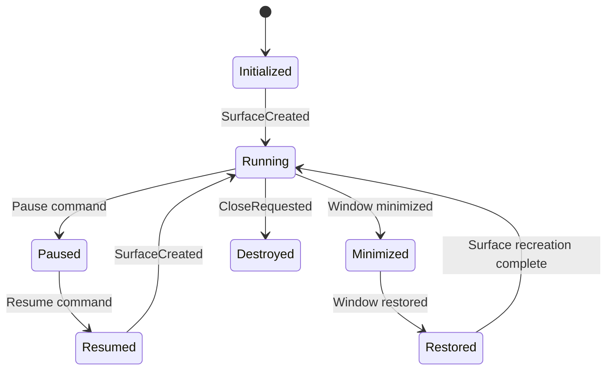

# Desktop Bevy Integration

This document describes the architecture for integrating Bevy with desktop platforms (Windows, macOS, Linux) using Tauri.

## Architecture Overview

The integration consists of:
1. **BevyThread**: Manages the Bevy game thread and handles lifecycle events
2. **DesktopLifecycle**: Platform-specific implementations for handling minimize/restore events
3. **BevyPlugin**: Tauri plugin that bridges window events to BevyThread
4. **Native Window Integration**: Surface creation using platform-native window handles

## Lifecycle State Transitions

## Performance Considerations

1. **Minimized State**: When minimized, the Bevy thread enters a low-power state by:
   - Reducing update frequency
   - Releasing GPU resources
   - Pausing non-essential systems

2. **Texture Management**: 
   - Texture manifests are captured before minimizing
   - Textures are reloaded when restoring
   - Uses reference counting to avoid redundant loads

3. **Focus Handling**:
   - Reduces rendering quality when window loses focus
   - Restores full quality when focus is regained

## Platform-Specific Notes

### macOS
- Uses Objective-C runtime to access NSApplication
- Requires `objc` crate for messaging
- Main window handle is obtained via `[NSApplication sharedApplication].mainWindow`

### Windows
- Uses `windows` crate for Win32 API access
- Window handle obtained via `GetActiveWindow()`
- Requires handling of DPI scaling

### Linux
- Currently uses placeholder implementation
- Future implementation will support both X11 and Wayland
- Will use `x11-dl` crate for X11 support