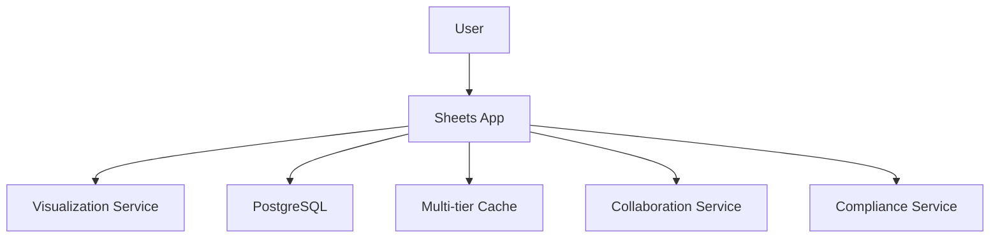
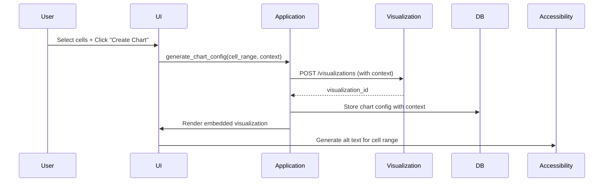

# Sheets App Architecture

## Overview
Spreadsheet application with real-time collaboration, formula support, visualization integration, and compliance features.

## System Context


## Container Diagram
```mermaid
graph TD
    subgraph Sheets App
        A[Web Interface] --> B[Formula Engine]
        A --> C[Cell Management]
        B --> D[GraphQL Client]
        C --> E[WebSocket Client]
        D --> F[Visualization Service]
        E --> G[Collaboration Service]
        H[Import/Export] --> I[File Parser]
        I --> J[PostgreSQL]
        K[Compliance Handler] --> H
        K --> C
        L[VisualizationContext] --> D
        L --> F
        M[AccessibilityService] --> L  # New connection
    end
```

## Core Components

### 1. Formula Engine
- Uses custom implementation for parsing/evaluation
- Supports Excel-like functions including financial functions (PMT, FV, NPV, IRR)
- Dependency graph for efficient recalculation

### 2. Data Management
- **In-memory**: Sled for undo/redo and collaboration state
- **Persistent**: PostgreSQL with tables:
  - sheets(id, name, owner_id, created_at, updated_at, version, compliance_metadata)
  - cells(sheet_id, position, value, formatted_value, style, pii_redacted)
  - formulas(sheet_id, position, expression, dependencies, last_evaluated, cache)
  - charts(id, sheet_id, title, chart_type, data_range, series_config, options, context)
  - permissions(sheet_id, user_id, level)
  - collaboration_sessions(id, sheet_id, created_at, expires_at)
  - collaborative_edits(id, session_id, user_id, edit_type, data, timestamp)
  - import_export_history(id, sheet_id, user_id, operation, file_format, file_path, timestamp, data_sovereignty)

### 3. Visualization Integration
- Reuses dashboard visualization components via the BI Visualization Toolkit
- Passes VisualizationContext with sharing_scope, accessibility_mode, lod_level
- Interactive charts with Bevy
- Reusable chart components

### 4. Real-time Collaboration
- Event bus protocol from core implementation
- CRDT operations for conflict resolution
- Presence tracking
- Collaborative editing sessions using standardized CELL_UPDATE action

### 5. Import/Export
- .xlsx using `calamine` (MIT) with compliance checks
- CSV using standard libraries with PII redaction
- PDF export via `pdf-rs` with accessibility metadata

### 6. Accessibility Framework
- Grid navigation with keyboard support
- Screen reader compatible cell content
- Alt text generation for cell ranges and visualizations
- Screen reader support for chart rendering
- CPC-wide accessibility standards integration

### 7. Compliance Architecture
- ComplianceMetadata struct tracking:
  - data_sovereignty (country/region of origin)
  - pii_redacted status
  - sharing_permissions
- PII redaction flags in cell operations
- Data sovereignty enforcement in import/export

## Technology Choices
- **Formula**: Custom implementation
- .xlsx: `calamine` 0.22.0 (MIT)
- Caching: Multi-tier (Sled + Redis) with TTLs
- Visualization: Reuse dashboard BI Visualization Toolkit + VisualizationContext
- Collaboration: Event bus from cpc_core
- Compliance: Custom implementation with region-based rules

## File Structure (Vertical Slices)
```
apps/sheets/
├── src/
│   ├── main.rs              # App entrypoint
│   ├── domain/              # Core logic
│   │   ├── formula.rs       # Formula parsing/evaluation
│   │   ├── spreadsheet.rs   # Spreadsheet model
│   │   └── cell.rs          # Cell operations (A1 notation)
│   ├── application/         # Use cases
│   │   ├── collaboration.rs # Real-time sync (CELL_UPDATE)
│   │   ├── import_export.rs # File handling with compliance
│   │   ├── charts.rs        # Visualization integration (context)
│   │   └── accessibility.rs # Grid/cell accessibility
│   ├── infrastructure/      # Adapters
│   │   ├── persistence.rs   # DB access
│   │   ├── visualization.rs # GraphQL client (VisualizationContext)
│   │   ├── websocket.rs     # Collaboration client (standardized protocol)
│   │   └── caching.rs       # Multi-tier caching
│   └── ui/                  # Yew components
│       ├── grid.rs          # Spreadsheet grid (accessibility)
│       ├── toolbar.rs       # Formatting tools
│       └── chart_view.rs    # Embedded visualizations (context)
├── Cargo.toml
└── ...
```

## Data Flow Example: Chart Creation with Context


## API Specifications

### GraphQL Mutations
```graphql
type Mutation {
  createChart(
    spreadsheetId: ID!
    chartType: ChartType!
    dataRange: String!
    title: String
    context: VisualizationContextInput!
  ): ChartResponse
}

enum ChartType {
  BAR
  LINE
  PIE
  SCATTER
}

input VisualizationContextInput {
  sharingScope: SharingScope!
  accessibilityMode: AccessibilityMode!
  lodLevel: Int!
}
```

### WebSocket Protocol
```json
{
  "action": "CELL_UPDATE",
  "payload": {
    "sheet_id": "uuid",
    "position": "A1",
    "value": "=SUM(B2:B10)",
    "pii_redacted": false
  }
}
```

## Performance Considerations
- Differential updates for large spreadsheets
- Lazy rendering of off-screen cells
- Multi-tier caching (edge + regional) with TTLs
- Cache keys: SHA256(visualization_id + params + version)
- Cache visualization renders with TTLs

## Error Handling
- `VizError` taxonomy covering:
  - Accessibility failures
  - Cache version conflicts
  - Rendering fallbacks
  - Data transformation errors
- Fallback rendering for failed visualizations
- Error propagation from visualization pipeline to UI
- WebSocket-triggered cache invalidation
- Version-aware cache retrieval

## Accessibility Features
- Alt text preferences in VisualizationContext
- Chart-specific alt text generation
- Screen reader announcements for chart rendering