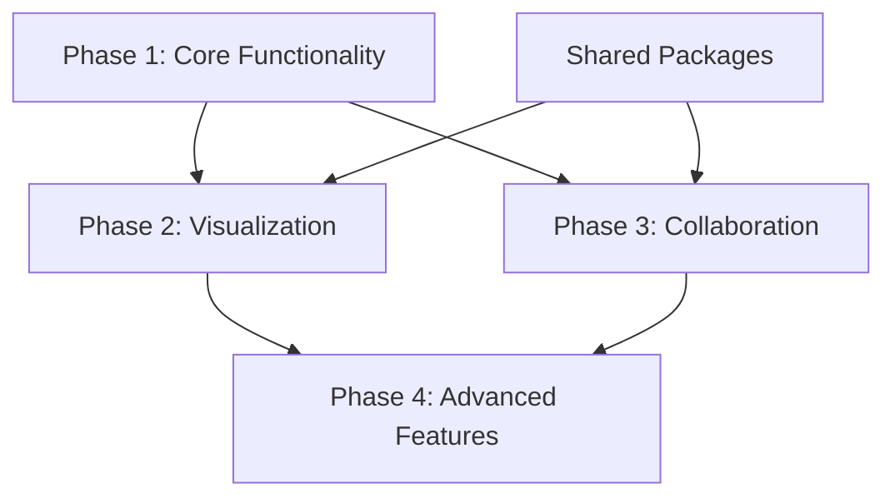
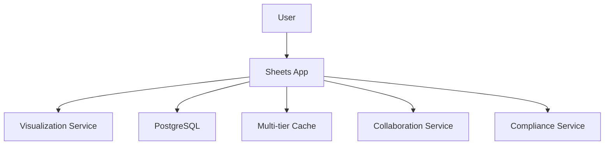
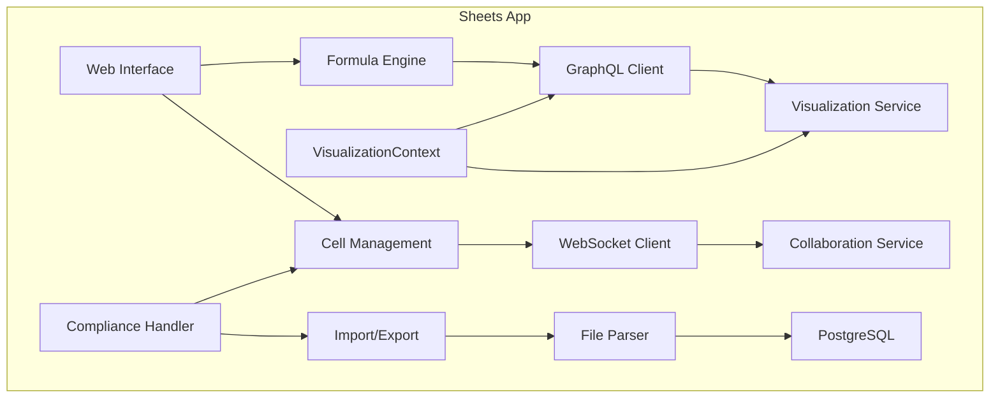
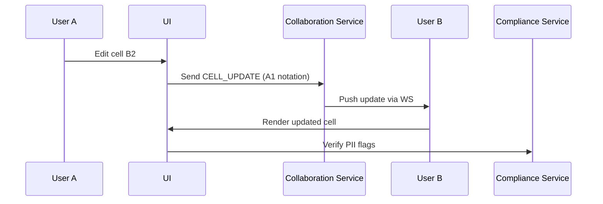

# Sheets App Implementation Plan

## Phased Rollout

### Phase 1: Core Functionality (Milestone: MVP Release)
- Implement spreadsheet grid UI with cell editing
- Create formula parsing/evaluation engine
- Set up PostgreSQL schema for sheets/cells
- Develop basic CRUD operations for spreadsheets
- Implement undo/redo using Sled

### Phase 2: Visualization Integration (Milestone: Release 2)
- Integrate BI Visualization Toolkit via GraphQL
- Add chart creation from cell ranges with VisualizationContext
- Implement embedded visualization rendering
- Extend accessibility to cover grid navigation and cell content
- Add alt text generation for cell ranges and visualizations
- Integrate screen reader announcements for chart rendering

### Phase 3: Collaboration (Milestone: Release 3)
- Integrate WebSocket client for real-time updates
- Implement CRDT-based conflict resolution
- Add presence tracking indicators
- Develop permission management
- Implement cache versioning for collaborative edits
- Add WebSocket-triggered cache invalidation

### Phase 4: Advanced Features (Milestone: Release 4)
- Implement .xlsx import/export with calamine (with compliance handling)
- Add financial functions (PMT, FV, NPV, IRR)
- Develop PDF export functionality
- Optimize performance with differential updates
- Implement visualization error taxonomy and propagation
- Add fallback rendering for failed visualizations

## Task Dependencies



## Integration Points with Dashboard

| Component          | Integration Method                          | Shared Dependencies       |
|--------------------|---------------------------------------------|---------------------------|
| Visualization      | GraphQL client (`apps/dashboard/src/graphql.rs`) | VisualizationSchema, LodConfig, VisualizationContext |
| Collaboration      | WebSocket client (`apps/dashboard/src/websocket.rs`) | UpdateMessage, ConnectionUpgrade |
| Caching            | Multi-tier caching (Sled + Redis) with TTLs | VisualizationCache, TtlConfig, CacheKey(SHA256) |
| Security           | JWT authentication                          | Same auth middleware      |
| Accessibility      | VisualizationContext integration            | CPC-wide standards        |
| Compliance         | ComplianceMetadata struct                   | Data sovereignty handling |

## API Contracts

### GraphQL Mutations
```graphql
extend type Mutation {
  createSheet(name: String!): Sheet
  updateCell(
    sheetId: ID!
    position: String!  # A1 notation
    value: String!
  ): Cell
  createChart(
    sheetId: ID!
    chartType: ChartType!
    dataRange: String!
    title: String
    context: VisualizationContextInput!
  ): Chart
}

enum ChartType {
  BAR
  LINE
  PIE
  SCATTER
}

input VisualizationContextInput {
  sharingScope: SharingScope!
  accessibilityMode: AccessibilityMode!
  lodLevel: Int!
}
```

### WebSocket Protocol
```json
{
  "action": "CELL_UPDATE",
  "payload": {
    "sheet_id": "uuid",
    "position": "A1",
    "value": "=SUM(B2:B10)",
    "cache_version": "a1b2c3"  # New version field
  }
}
```

### REST Endpoints
```
POST /api/sheets/import   # Import .xlsx/CSV (with compliance checks)
GET /api/sheets/{id}/export?format=pdf  # Export as PDF (with compliance flags)
```

## Updated Architecture Diagrams

### System Context (Updated)


### Container Diagram (Updated)


### Data Flow: Real-time Collaboration


## Accessibility Features
- Alt text preferences in VisualizationContext
- Chart-specific alt text generation with detail levels
- Screen reader announcements for chart rendering
- Fallback rendering for failed visualizations