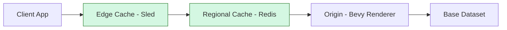

# Visualization Architecture

This document describes the architecture of the BI Visualization framework in the CPC platform.

## Overview

The visualization system provides a unified framework for cross-app visualization sharing with performance optimization and accessibility features. It follows a service-oriented architecture with clear separation of concerns.

## System Components

### 1. API Gateway

The API Gateway serves as the single entry point for all visualization requests:

```
Client App → API Gateway → Visualization Services
```

Key responsibilities:
- Request routing and protocol translation
- Authentication and authorization
- Rate limiting and throttling
- Caching coordination
- Response formatting

### 2. Visualization Context Package

A shared package that provides standardized context propagation:

```rust
pub struct VisualizationContext {
    pub originating_app: String,
    pub user_id: String,
    pub sharing_scope: SharingScope,
    pub accessibility_mode: AccessibilityMode,
    pub lod_level: u8,
}

pub enum SharingScope {
    Public,
    Team(Uuid),
    Private(Uuid),
}
```

### 3. BI Analytics Service

The core service responsible for generating visualizations:

- Data processing and transformation
- Chart and graph rendering
- 3D scene generation with Bevy
- Accessibility metadata generation

### 4. Caching Layer

Multi-tier caching strategy for performance optimization:



## Data Flow

### Request Processing

1. **Client Request**
   - Application sends visualization request with context
   - Context includes app ID, user ID, sharing scope, accessibility mode

2. **Gateway Processing**
   - Validate authentication and authorization
   - Apply rate limiting rules
   - Check cache for existing visualization
   - Route to appropriate backend service

3. **Service Processing**
   - Generate or retrieve visualization data
   - Apply Level of Detail (LOD) settings
   - Generate accessibility metadata
   - Apply compliance transformations

4. **Response Generation**
   - Format response according to client requirements
   - Add caching metadata
   - Include compliance flags

### Progressive Loading

The system implements a three-phase progressive loading approach:

1. **Phase 1 (0-500ms)**
   - Display skeleton UI with app-specific branding
   - Load low-resolution preview image

2. **Phase 2 (500-2000ms)**
   - Stream 3D scene data in background
   - Render accessibility metadata

3. **Phase 3 (2000ms+)**
   - Activate full interactive visualization
   - Establish WebSocket connection for updates

## Protocol Support

The visualization system supports multiple protocols:

### REST API

Standard HTTP endpoints for visualization requests:

```
GET /visualizations/:id
GET /visualizations/:id/image
GET /visualizations/:id/ws
POST /visualizations
```

### GraphQL

Composable visualization queries:

```graphql
query GetVisualization($id: ID!, $width: Int, $height: Int) {
  visualization(id: $id) {
    data(width: $width, height: $height) {
      type
      payload
      accessibility {
        altText
        navigationMap
      }
    }
    metadata {
      cacheTtl
      lodConfig
    }
  }
}
```

### WebSocket Streaming

Real-time visualization updates using the WebSocket protocol. The system implements
a robust connection upgrade mechanism and handles real-time data streaming:

```
Connection: Upgrade
Upgrade: websocket
```

The WebSocket implementation supports:
- Connection upgrades from HTTP to WebSocket
- Real-time update protocol with typed messages
- Graceful connection handling and error recovery
- Binary and text message support

## Security Model

### Authentication

All requests must include a valid JWT token with CPC-specific claims:

```json
{
  "sub": "user-uuid",
  "app": "dashboard",
  "scope": "visualization:read",
  "exp": 1234567890
}
```

### Authorization

Access control is based on:

1. **User Permissions** - What the user is allowed to access
2. **Sharing Scope** - Public, Team, or Private visibility
3. **App Context** - Originating application permissions
4. **Compliance Requirements** - Data sovereignty rules

## Performance Optimization

### Caching Strategy

Cache keys are generated using SHA256 hashes of visualization parameters:

```
key = sha256(visualization_id + width + height + lod_level + accessibility_mode)
```

The caching implementation uses Sled as the edge cache with the following features:
- SHA-256 based cache key generation
- Configurable TTL settings per visualization type
- Automatic expiration handling
- Thread-safe concurrent access

TTL settings by visualization type:
- Static Images: 5 minutes
- 3D Scene Data: 1 hour
- Real-time Data: 30 seconds

### Level of Detail (LOD)

Configurable detail levels per application type:

```toml
[dashboard]
default_lod = 2
max_points = 500

[reporting]
default_lod = 3
max_points = 2000

[collaboration]
default_lod = 1
max_points = 100
```

## Accessibility Framework

### Metadata Generation

Standardized accessibility metadata structure:

```json
{
  "alt_text": "Bar chart showing Q3 sales: $120k (up 15% from Q2)",
  "navigation_map": {
    "T": {"label": "Title", "position": [0,3,0]},
    "L": {"label": "Legend", "position": [-3,0,0]},
    "B": {"label": "Data bars", "position": [0,0,0]}
  },
  "aria_properties": {
    "role": "application",
    "live_region": "polite",
    "keyboard_shortcuts": ["T: title", "L: legend"]
  }
}
```

### App-Specific Enhancements

Each application type provides context-specific accessibility enhancements:

- **Dashboard**: Section context in alt text
- **Reporting**: Links to source data points
- **Collaboration**: Spatial audio cues for navigation

## Monitoring and Observability

### Key Metrics

1. **Usage Metrics**
   - Requests by application
   - Visualization types requested
   - LOD levels used

2. **Performance Metrics**
   - Render time distribution
   - Cache hit ratios
   - Stream latency

3. **Accessibility Metrics**
   - Screen reader usage rate
   - Keyboard navigation frequency
   - Accessibility feature adoption

### Alerting Configuration

Critical alerts for visualization service issues:

```yaml
visualization:
  critical:
    - metric: "stream_latency"
      threshold: "500ms"
      duration: "5m"
    - metric: "accessibility_failure_rate"
      threshold: "5%"
      duration: "1h"
```

## Compliance Architecture

### Data Sovereignty

All visualization data maintains metadata about its origin and sharing permissions:

```rust
pub struct ComplianceMetadata {
    pub data_sovereignty: String, // Country/region of origin
    pub pii_redacted: bool,       // Whether PII has been removed
    pub sharing_permissions: Vec<String>, // Who can access this data
}
```

The compliance metadata is integrated into all visualization responses and includes:
- Data sovereignty information (country/region of origin)
- PII redaction status
- Sharing permissions metadata

Applications can access compliance information through the visualization client API
which provides structured access to all compliance metadata.

### Privacy Controls

Users maintain control over their data through:
- Granular sharing permissions
- Data expiration policies
- Audit trails for access

## Future Extensions

Planned architectural improvements:

1. **Machine Learning Integration**
   - Automated chart type selection
   - Anomaly detection in visualizations
   - Predictive caching

2. **Advanced Rendering**
   - WebGL acceleration
   - AR/VR visualization support
   - Custom shader support

3. **Enhanced Collaboration**
   - Real-time co-editing
   - Comment and annotation systems
   - Version control for visualizations