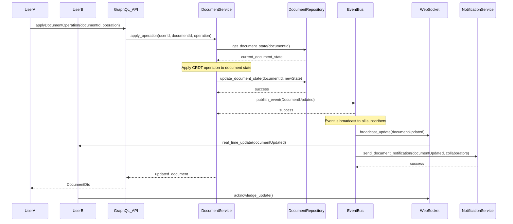
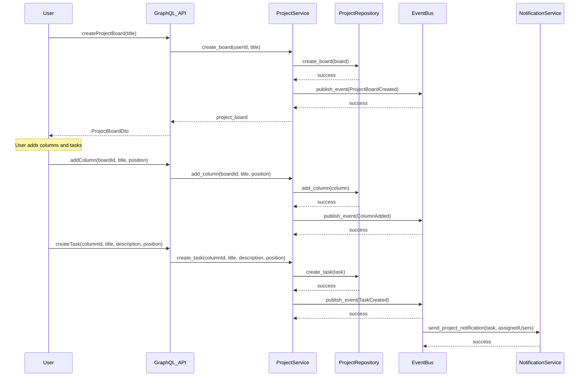
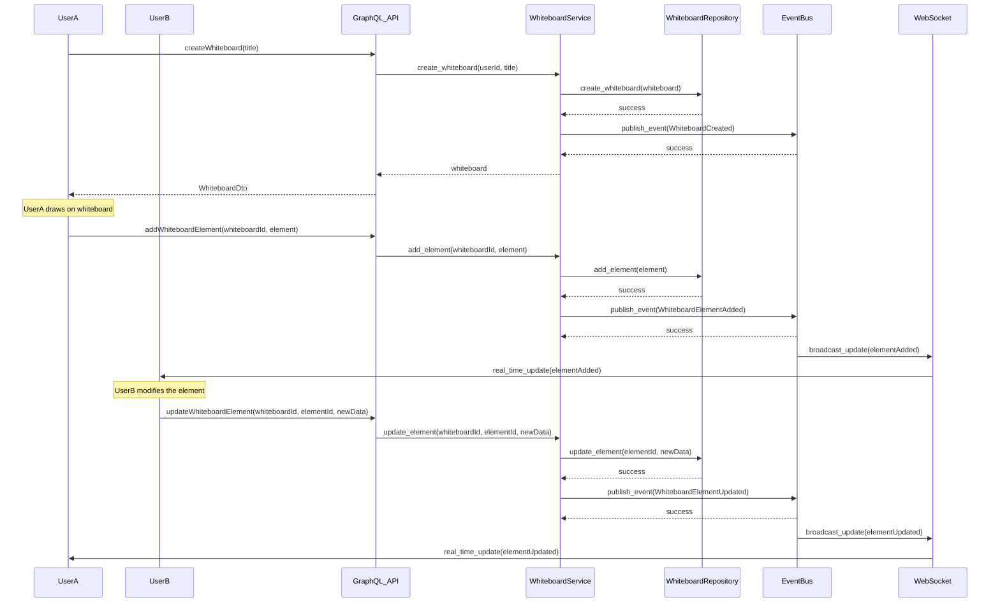
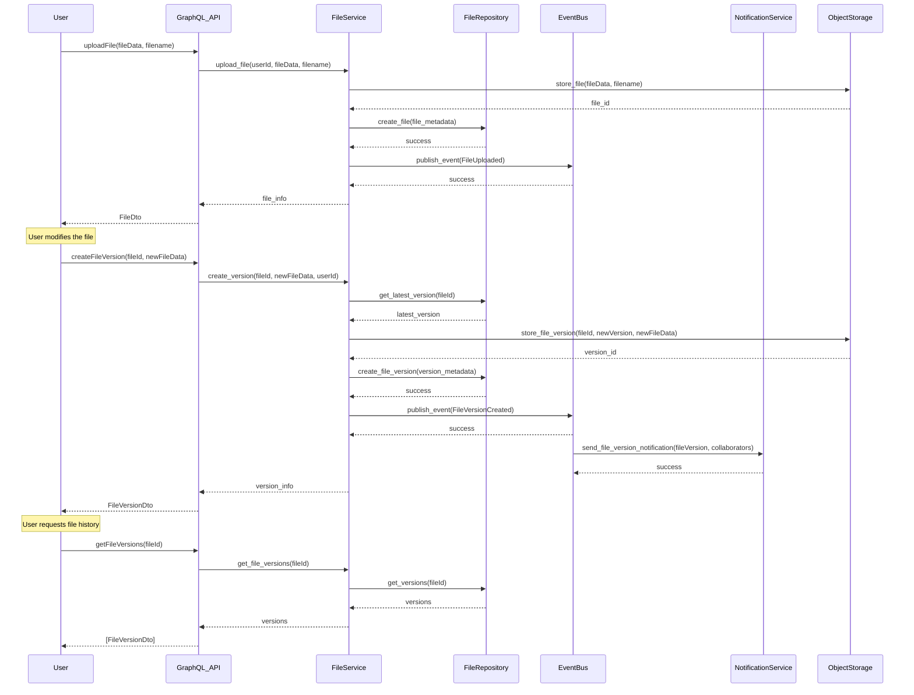
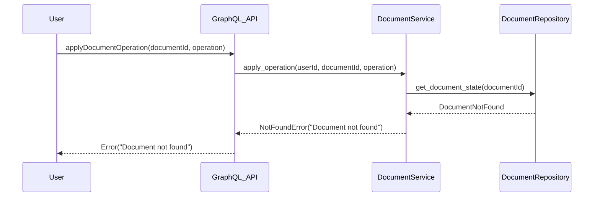

# Collaborative Workspace Sequence Diagrams

This document contains sequence diagrams for the collaborative workspace flows implemented in the CPC platform.

## 1. Real-time Document Collaboration Flow



### Flow Description:
1. UserA sends a GraphQL mutation to apply an operation to a document
2. GraphQL API validates the input and calls the DocumentService
3. DocumentService retrieves the current document state
4. The service applies the CRDT operation to update the document state
5. The updated state is saved via the repository
6. The service publishes a DocumentUpdated event to the EventBus
7. EventBus broadcasts the event to all subscribed WebSocket clients for real-time updates
8. UserB receives the real-time update about the document change
9. EventBus triggers notification sending for all collaborators
10. The updated document is returned to UserA
11. UserB acknowledges receiving the update

## 2. Project Board Creation and Task Management Flow



### Flow Description:
1. User sends a GraphQL mutation to create a new project board
2. GraphQL API validates the input and calls the ProjectService
3. ProjectService creates the board and saves it via the repository
4. The service publishes a ProjectBoardCreated event to the EventBus
5. The project board is returned to the user
6. User adds columns to the board, each triggering a ColumnAdded event
7. User creates tasks within columns, each triggering a TaskCreated event
8. EventBus triggers notification sending for assigned users

## 3. Whiteboard Synchronization Process



### Flow Description:
1. UserA creates a new whiteboard
2. WhiteboardService saves the whiteboard and publishes a creation event
3. UserA adds elements to the whiteboard, each triggering an ElementAdded event
4. EventBus broadcasts the events to all subscribed WebSocket clients
5. UserB receives real-time updates about new elements
6. UserB modifies an existing element, triggering an ElementUpdated event
7. UserA receives real-time updates about the modified element

## 4. Meeting Room Initiation with WebRTC

```mermaid
sequenceDiagram
    participant Host
    participant Participant
    participant GraphQL_API
    participant MeetingService
    participant MeetingRepository
    participant EventBus
    participant WebRTCService
    participant STUN/TURN

    Host->>GraphQL_API: createMeeting(title)
    GraphQL_API->>MeetingService: create_meeting(userId, title)
    MeetingService->>MeetingRepository: create_meeting(meeting)
    MeetingRepository-->>MeetingService: success
    
    MeetingService->>EventBus: publish_event(MeetingCreated)
    EventBus-->>MeetingService: success
    
    MeetingService-->>GraphQL_API: meeting
    GraphQL_API-->>Host: MeetingDto
    
    Participant->>GraphQL_API: joinMeeting(meetingId)
    GraphQL_API->>MeetingService: join_meeting(meetingId, participantId)
    MeetingService->>MeetingRepository: add_participant(meetingId, participantId)
    MeetingRepository-->>MeetingService: success
    
    MeetingService->>EventBus: publish_event(ParticipantJoined)
    EventBus-->>MeetingService: success
    
    Host->>WebRTCService: generate_offer(meetingId)
    WebRTCService->>STUN/TURN: get_ice_candidates()
    STUN/TURN-->>WebRTCService: ice_candidates
    
    WebRTCService->>EventBus: publish_event(WebRTCOfferGenerated)
    EventBus-->>WebRTCService: success
    
    EventBus->>WebSocket: broadcast_webrtc_offer(offer)
    WebSocket->>Participant: webrtc_offer(offer)
    
    Participant->>WebRTCService: generate_answer(meetingId, offer)
    WebRTCService->>STUN/TURN: get_ice_candidates()
    STUN/TURN-->>WebRTCService: ice_candidates
    
    WebRTCService->>EventBus: publish_event(WebRTCAnswerGenerated)
    EventBus-->>WebRTCService: success
    
    EventBus->>WebSocket: broadcast_webrtc_answer(answer)
    WebSocket->>Host: webrtc_answer(answer)
    
    Note over Host, Participant: WebRTC connection established
```

### Flow Description:
1. Host creates a new meeting room
2. MeetingService saves the meeting and publishes a creation event
3. Participant joins the meeting, triggering a ParticipantJoined event
4. Host generates a WebRTC offer, contacting STUN/TURN servers for ICE candidates
5. The offer is broadcast to all participants via WebSocket
6. Participant generates a WebRTC answer, also contacting STUN/TURN servers
7. The answer is broadcast back to the host via WebSocket
8. WebRTC connection is established between host and participant

## 5. File Versioning Workflow



### Flow Description:
1. User uploads a new file
2. FileService stores the file in object storage and saves metadata
3. A FileUploaded event is published
4. User creates a new version of the file
5. FileService retrieves the latest version and stores the new version
6. A FileVersionCreated event is published
7. EventBus triggers notification sending for collaborators
8. User requests the file version history
9. FileService retrieves and returns all versions of the file

## Error Handling Flow



### Flow Description:
1. User attempts to apply an operation to a non-existent document
2. DocumentService attempts to retrieve the document state
3. Repository returns that the document was not found
4. Service returns a NotFoundError
5. The error is propagated back to the user via GraphQL

## Performance Considerations

- **CRDT Optimization**: Document operations use efficient CRDT algorithms to minimize state size
- **WebSocket Management**: WebSocket connections are efficiently managed for real-time collaboration
- **Event Processing**: EventBus uses weak references and efficient broadcasting to prevent memory leaks
- **File Storage**: Large files are stored in object storage with metadata in PostgreSQL
- **WebRTC Optimization**: ICE candidate gathering is optimized for fast connection establishment
- **Version History**: File versions are stored with delta compression to reduce storage requirements

## Security Considerations

- **Authorization**: All operations verify user permissions before modifications
- **Document Encryption**: Document contents are encrypted end-to-end
- **WebRTC Security**: WebRTC connections use DTLS and SRTP for security
- **File Sanitization**: Uploaded files are scanned for malware and malicious content
- **Rate Limiting**: API endpoints implement rate limiting to prevent abuse
- **Permission Models**: Workspace permissions are enforced at the service level