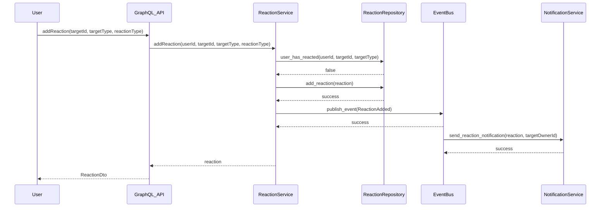
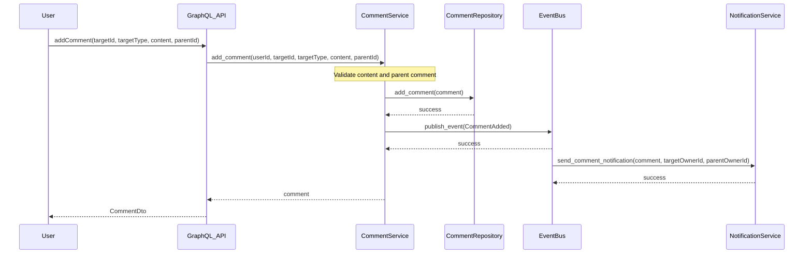
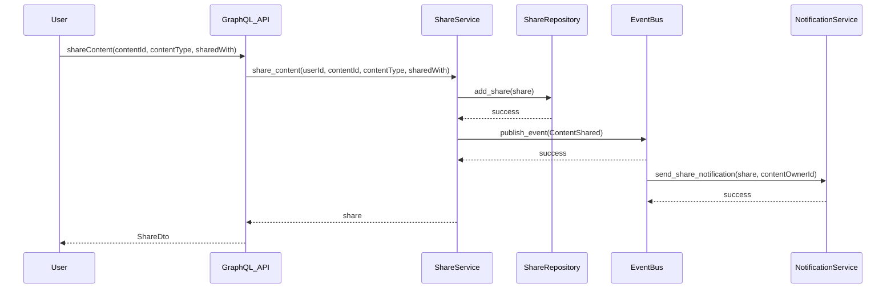
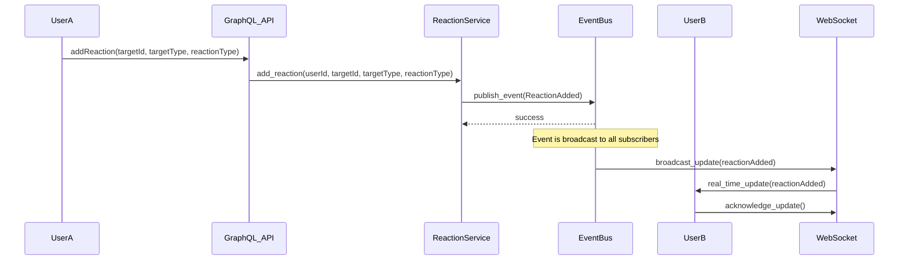
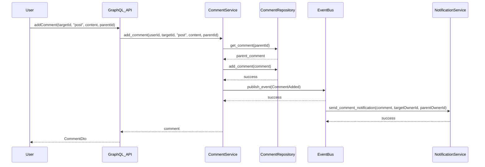
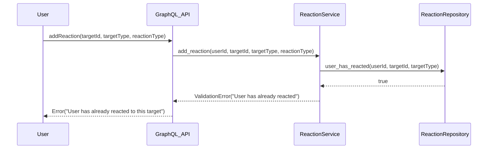

# Social Interaction Sequence Diagrams

This document contains sequence diagrams for the social interaction flows implemented in the CPC platform.

## 1. Adding a Reaction Flow

### Flow Description:
1. User sends a GraphQL mutation to add a reaction to content
2. GraphQL API validates the input and calls the ReactionService
3. ReactionService checks if the user has already reacted to this target
4. If not, it creates a new reaction and saves it via the repository
5. The service publishes a ReactionAdded event to the EventBus
6. EventBus triggers notification sending for the target owner
7. The reaction is returned to the user

## 2. Posting a Comment Flow

### Flow Description:
1. User sends a GraphQL mutation to add a comment to content
2. GraphQL API validates the input and calls the CommentService
3. CommentService validates the content and checks parent comment (if any)
4. It creates a new comment and saves it via the repository
5. The service publishes a CommentAdded event to the EventBus
6. EventBus triggers notification sending for the target owner and parent comment owner (if applicable)
7. The comment is returned to the user

## 3. Sharing Content Flow

### Flow Description:
1. User sends a GraphQL mutation to share content
2. GraphQL API validates the input and calls the ShareService
3. ShareService creates a new share and saves it via the repository
4. The service publishes a ContentShared event to the EventBus
5. EventBus triggers notification sending for the content owner
6. The share is returned to the user

## 4. Real-time Updates Flow

### Flow Description:
1. UserA adds a reaction to content
2. The reaction service processes the request and publishes an event
3. EventBus broadcasts the event to all subscribed WebSocket clients
4. UserB receives a real-time update about the new reaction
5. UserB acknowledges the update

## 5. Nested Comments Flow

### Flow Description:
1. User submits a reply to an existing comment
2. CommentService validates that the parent comment exists
3. It creates a nested comment and saves it via the repository
4. The service publishes a CommentAdded event to the EventBus
5. EventBus triggers notifications for both the target owner and parent comment owner
6. The nested comment is returned to the user

## Error Handling Flow

### Flow Description:
1. User attempts to add a reaction to content they've already reacted to
2. ReactionService checks for existing reactions and finds one
3. The service returns a validation error
4. The error is propagated back to the user via GraphQL

## Performance Considerations

- **Database Optimization**: All repository operations use indexed queries for efficient lookups
- **Event Processing**: EventBus uses weak references to prevent memory leaks
- **Notification Batching**: Multiple notifications for the same user are batched when possible
- **Real-time Updates**: WebSocket connections are efficiently managed for real-time updates
- **Caching**: Reaction summaries are cached to reduce database load

## Security Considerations

- **Authorization**: All operations verify user ownership before modifications
- **Input Validation**: All user inputs are validated before processing
- **Rate Limiting**: API endpoints implement rate limiting to prevent abuse
- **Content Sanitization**: Comment content is sanitized to prevent XSS attacks
- **Privacy Settings**: Share visibility is enforced at the repository level