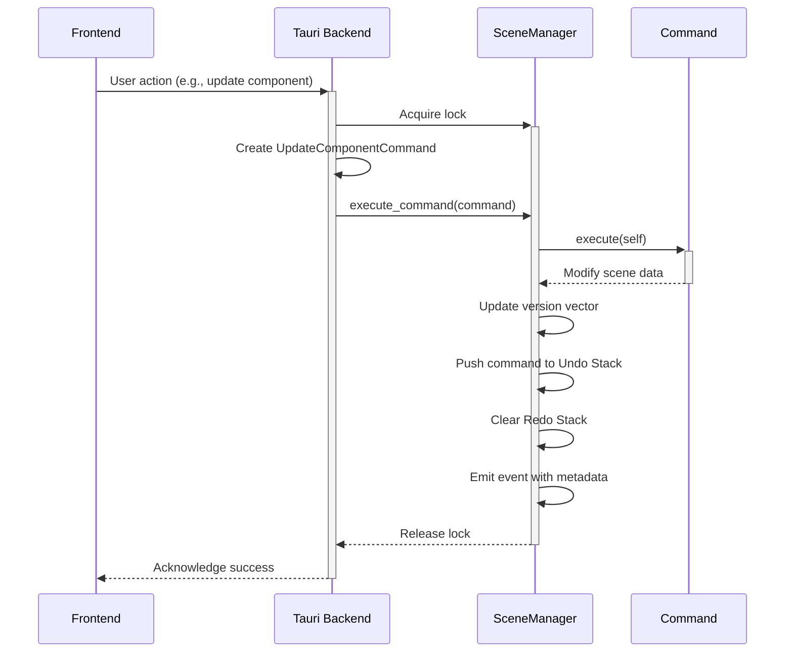
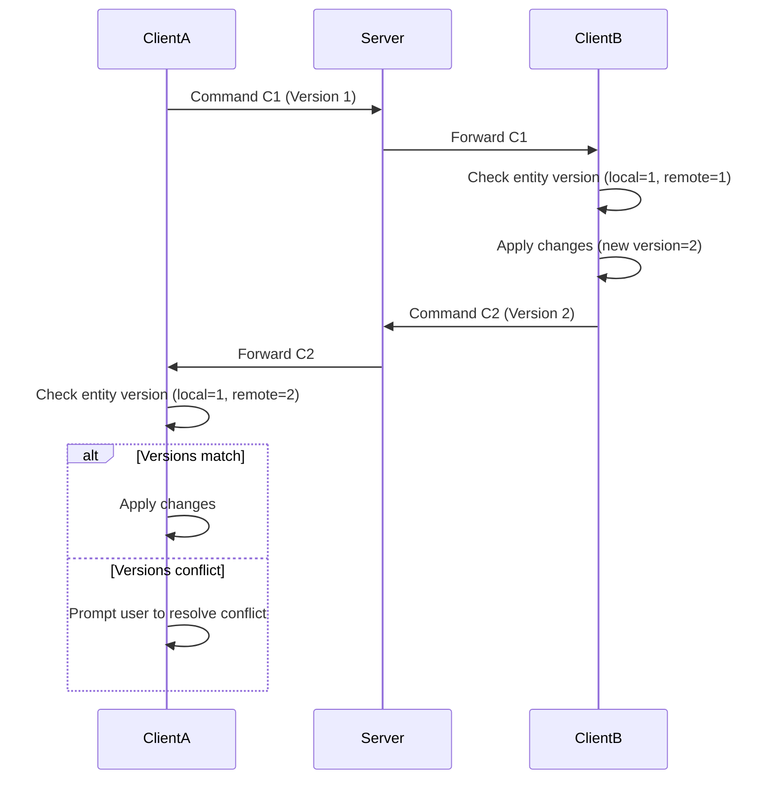

# Editor Core: Scene Management Architecture

## 1. Overview

This document outlines the architecture for the scene management system within the CPC Studio editor core. The system is built around the **Command Pattern** to provide a robust, extensible, and undo/redo-capable mechanism for all scene modifications. This design is fundamental for ensuring data integrity, supporting complex editor operations, and laying the groundwork for future collaborative features.

## 2. Core Components

The architecture is composed of three main components:

### 2.1. `Command` Trait

The `Command` trait defines a common interface for all operations that modify the scene state. Any action, such as creating an entity, changing a component's value, or deleting an object, will be implemented as a concrete `Command`.

-   **`execute(scene: &mut SceneManager)`:** Applies the command's changes to the scene.
-   **`undo(scene: &mut SceneManager)`:** Reverts the changes made by the `execute` method.

This simple contract is the foundation of the entire system's flexibility.

### 2.2. `SceneManager`

The `SceneManager` is the central authority for all scene-related data. It holds the scene graph (the collection of all entities and their relationships) and manages the command history.

-   **State:** It maintains the `HashMap` of entities and the command history stacks.
-   **Execution:** It is responsible for executing commands, passing a mutable reference of itself to the command's `execute` or `undo` methods.
-   **Concurrency:** The `SceneManager` will be wrapped in an `Arc<Mutex<...>>` to allow for safe, concurrent access from different parts of the application (e.g., the Tauri command handlers and potentially a future networking thread).

### 2.3. Command History

The command history is managed within the `SceneManager` and consists of two stacks:

-   **Undo Stack:** A `VecDeque` containing `Box<dyn Command>` instances that have been executed. When a user requests an "undo," the most recent command is popped from this stack, its `undo` method is called, and it is moved to the redo stack.
-   **Redo Stack:** A `VecDeque` containing commands that have been undone. When a user requests a "redo," the most recent command is popped from this stack, its `execute` method is called, and it is moved back to the undo stack.

Executing a new command clears the redo stack, ensuring a consistent history timeline.

## 3. Concurrency and Thread Safety

Given that the editor will handle UI events, background tasks, and eventually real-time network updates, thread safety is paramount.

The entire `SceneManager` will be managed as a shared, mutable state object using `Arc<Mutex<SceneManager>>`. Any part of the application that needs to modify the scene must first acquire a lock on the mutex. This ensures that all modifications are serialized, preventing race conditions and ensuring the scene state remains consistent.

## 4. Future-Proofing for Collaboration

This command-based architecture has been extended to support real-time collaborative editing with the following enhancements:

- **Synchronization Metadata:** Each command event now includes:
  - Timestamp of modification
  - User ID and session ID of the editor
  - Version vector for conflict resolution
  - Serialized component data for full state restoration
  
- **Conflict Detection:**
  - Entities now have version numbers in their metadata
  - The scene manager maintains a version vector tracking the latest version of each entity
  - When applying changes, the system checks for version conflicts
  
- **Conflict Resolution Strategies:**
  - Automatic merging when safe (non-overlapping changes)
  - User prompting for conflicting changes
  - Last-write-wins as fallback with logging
  
- **UI Indicators:**
  - User avatars showing who last modified an entity
  - Timestamps showing when entities were last modified
  - Visual cues for conflicting versions
## 5. High-Level Flow Diagram

## 6. Conflict Resolution Flow

