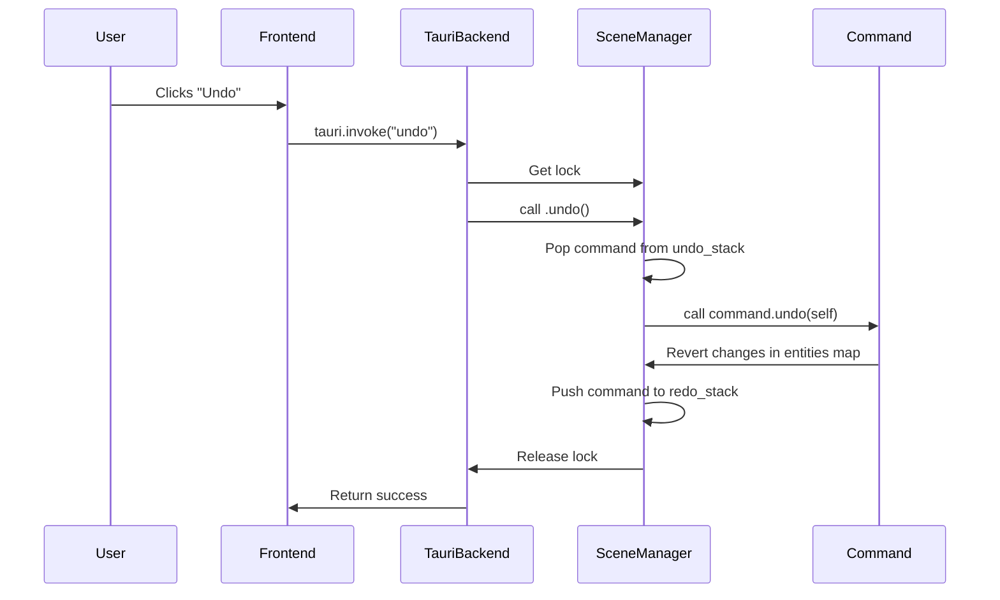

# Scene Command System: Detailed Implementation Plan

## 1. Introduction

This document provides a detailed technical plan for implementing the command-based scene management system as outlined in the `architecture.md`. It is intended for the developer responsible for the implementation (`ougcode`).

## 2. File and Module Structure

The following changes should be made to the module structure under `apps/cpc-studio/src-tauri/src/editor_core/scene/`:

-   **`mod.rs`:** Should be created to declare the modules: `pub mod command;`, `pub mod component;`, `pub mod entity;`, `pub mod manager;`.
-   **`command.rs`:** Will contain the `Command` trait and all concrete command implementations (`UpdateComponentCommand`, `AddComponentCommand`, etc.).
-   **`manager.rs`:** Will contain the `SceneManager` struct and its implementation.
-   **`entity.rs`:** The Tauri commands currently in this file will be moved and refactored. The file will only contain the `Entity` struct and related definitions.
-   **`component.rs`:** (Already exists) Will continue to hold component-related logic.
-   **`apps/cpc-studio/src-tauri/src/commands/scene_commands.rs`:** A new file to house the public-facing Tauri commands that interact with the `SceneManager`.

## 3. Data Structures and Trait Definitions

### 3.1. `command.rs`

The `Command` trait needs to be slightly adjusted to not require `&mut self` for `execute` and `undo`, as the command itself shouldn't change during these operations. It also needs `Send` and `Sync` to be thread-safe.

```rust
use crate::editor_core::scene::manager::SceneManager;
use serde::{Serialize, Deserialize};
use std::any::Any;

// Make commands serializable for future collaboration features
pub trait Command: Send + Sync {
    fn execute(&self, scene: &mut SceneManager);
    fn undo(&self, scene: &mut SceneManager);
    
    // For serialization purposes
    fn as_any(&self) -> &dyn Any;
}
```

#### Concrete Commands

The component commands should be generic to handle any component type that is serializable. We will use `serde_json::Value` for now to store the "before" and "after" states of components.

```rust
// In command.rs

use super::manager::SceneManager;
use uuid::Uuid;
use serde_json::Value;
use bevy::prelude::Component;

// --- Update Component ---
#[derive(Serialize, Deserialize)]
pub struct UpdateComponentCommand {
    entity_id: Uuid,
    component_type_name: String,
    old_value: Value,
    new_value: Value,
}

impl Command for UpdateComponentCommand {
    // ... implementation ...
}


// --- Add Component ---
#[derive(Serialize, Deserialize)]
pub struct AddComponentCommand {
    entity_id: Uuid,
    component_type_name: String,
    component_data: Value,
}

impl Command for AddComponentCommand {
    // ... implementation ...
}


// --- Remove Component ---
#[derive(Serialize, Deserialize)]
pub struct RemoveComponentCommand {
    entity_id: Uuid,
    component_type_name: String,
    // Store the data so we can restore it on undo
    removed_component_data: Value,
}

impl Command for RemoveComponentCommand {
    // ... implementation ...
}
```

### 3.2. `manager.rs`

The `SceneManager` will hold the command history.

```rust
// In manager.rs

use std::collections::{HashMap, VecDeque};
use uuid::Uuid;
use crate::editor_core::scene::entity::Entity;
use crate::editor_core::scene::command::Command;

pub struct SceneManager {
    pub entities: HashMap<Uuid, Entity>,
    undo_stack: VecDeque<Box<dyn Command>>,
    redo_stack: VecDeque<Box<dyn Command>>,
}

impl SceneManager {
    pub fn new() -> Self { /* ... */ }

    pub fn add_entity(&mut self, entity: Entity) { /* ... */ }
    pub fn get_entity(&self, id: Uuid) -> Option<&Entity> { /* ... */ }
    pub fn get_entity_mut(&mut self, id: Uuid) -> Option<&mut Entity> { /* ... */ }
    pub fn remove_entity(&mut self, id: Uuid) -> Option<Entity> { /* ... */ }

    pub fn execute_command(&mut self, command: Box<dyn Command>) {
        command.execute(self);
        self.undo_stack.push_back(command);
        self.redo_stack.clear();
    }

    pub fn undo(&mut self) {
        if let Some(command) = self.undo_stack.pop_back() {
            command.undo(self);
            self.redo_stack.push_back(command);
        }
    }

    pub fn redo(&mut self) {
        if let Some(command) = self.redo_stack.pop_back() {
            command.execute(self);
            self.undo_stack.push_back(command);
        }
    }
}
```

### 3.3. `main.rs` (State Management)

The `SceneManager` must be wrapped in `Arc<Mutex<...>>` and added to Tauri's managed state.

```rust
// In main.rs

use std::sync::{Arc, Mutex};
use crate::editor_core::scene::manager::SceneManager;

fn main() {
    let scene_manager = Arc::new(Mutex::new(SceneManager::new()));

    tauri::Builder::default()
        .setup(move |app| {
            app.manage(scene_manager.clone());
            // ... other setup ...
            Ok(())
        })
        .invoke_handler(tauri::generate_handler![
            // ... other commands
            // NEW:
            crate::commands::scene_commands::update_component,
            crate::commands::scene_commands::add_component,
            crate::commands::scene_commands::remove_component,
            crate::commands::scene_commands::undo,
            crate::commands::scene_commands::redo,
        ])
        // ...
}
```

## 4. Tauri Command Integration

A new file `apps/cpc-studio/src-tauri/src/commands/scene_commands.rs` will be created. The old commands in `entity.rs` will be removed. These new commands will be lean, responsible only for:
1.  Parsing arguments from the frontend.
2.  Acquiring a lock on the `SceneManager` state.
3.  Creating the appropriate `Command` object.
4.  Calling `scene_manager.execute_command(...)`.

```rust
// In apps/cpc-studio/src-tauri/src/commands/scene_commands.rs

use tauri::State;
use std::sync::{Arc, Mutex};
use crate::editor_core::scene::manager::SceneManager;
use crate::editor_core::scene::command::{UpdateComponentCommand, /* ... other commands */ };
use uuid::Uuid;
use serde_json::Value;

#[tauri::command]
pub fn update_component(
    entity_id: Uuid,
    component_type_name: String,
    new_value: Value,
    scene_manager_state: State<Arc<Mutex<SceneManager>>>
) -> Result<(), String> {
    let mut scene_manager = scene_manager_state.lock().unwrap();
    
    // 1. Get the old value for the undo operation
    let old_value = /* logic to get current component value as a Value */;

    // 2. Create the command
    let command = Box::new(UpdateComponentCommand::new(
        entity_id,
        component_type_name,
        old_value,
        new_value,
    ));

    // 3. Execute
    scene_manager.execute_command(command);

    Ok(())
}

// Similar implementations for add_component, remove_component

#[tauri::command]
pub fn undo(scene_manager_state: State<Arc<Mutex<SceneManager>>>) -> Result<(), String> {
    scene_manager_state.lock().unwrap().undo();
    Ok(())
}

#[tauri::command]
pub fn redo(scene_manager_state: State<Arc<Mutex<SceneManager>>>) -> Result<(), String> {
    scene_manager_state.lock().unwrap().redo();
    Ok(())
}
```

## 5. Sequence Diagrams

### Undo/Redo Flow



## 6. Implementation Steps

1.  Create the new files and directories as described in section 2.
2.  Update `apps/cpc-studio/src-tauri/src/editor_core/scene/mod.rs`.
3.  Implement the generic `Command` trait and concrete command structs in `command.rs`.
4.  Implement the `SceneManager` in `manager.rs`.
5.  Update `main.rs` to initialize and manage the `Arc<Mutex<SceneManager>>`.
6.  Remove the old tauri commands from `entity.rs`.
7.  Implement the new tauri commands in `scene_commands.rs`.
8.  Ensure `Cargo.toml` includes `serde_json` if it's not already present.

This plan provides a clear path to a robust and scalable scene management system.