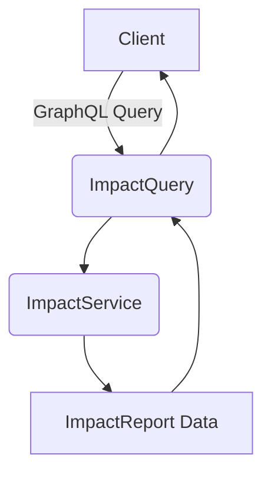

<!-- DEPRECATED: Superseded by docs/architecture/impact-service.md -->
<!-- Last valid as of: 2025-07-26 -->
# Impact Report Architecture

## Overview
The impact report system provides users with insights into their sustainability impact across environmental, social, and economic dimensions.

## GraphQL API Flow
1. Client queries `impactReport(userId)` via GraphQL
2. Query handled by `ImpactQuery.impact_report` resolver
3. Resolver calls `ImpactService.get_user_impact_report()`
4. Service returns `ImpactReport` struct with:
   - Overall ethical score
   - Category distribution
   - Historical timeline
   - Itemized contributions
5. Response serialized and sent to client



## Service Layer
The `ImpactService` (in `apps/backend/src/services/impact_service.rs`) handles:
- Aggregating impact metrics
- Generating report structure
- Calculating overall ethical score
- Formatting timeline data
- Creating itemized breakdowns

Current implementation uses sample data. Production would connect to analytics services.

## Android Integration
- `ImpactReportActivity`: Entry point for Android app
- `ImpactReportScreen`: Main composable with tab navigation
- ViewModel pattern for data loading and state management
- Three main views: Distribution, Timeline, Breakdown

## Data Model Relationships
```mermaid
erDiagram
    IMPACT_REPORT ||--o{ IMPACT_TIMELINE_POINT : contains
    IMPACT_REPORT ||--o{ IMPACT_BREAKDOWN_ITEM : contains
    IMPACT_REPORT {
        uuid user_id
        datetime generated_at
        float overall_score
        string signature
    }
    IMPACT_TIMELINE_POINT {
        datetime timestamp
        float value
        ImpactCategory category
    }
    IMPACT_BREAKDOWN_ITEM {
        uuid item_id
        string name
        ImpactCategory category
        float value
        float ethical_score
    }