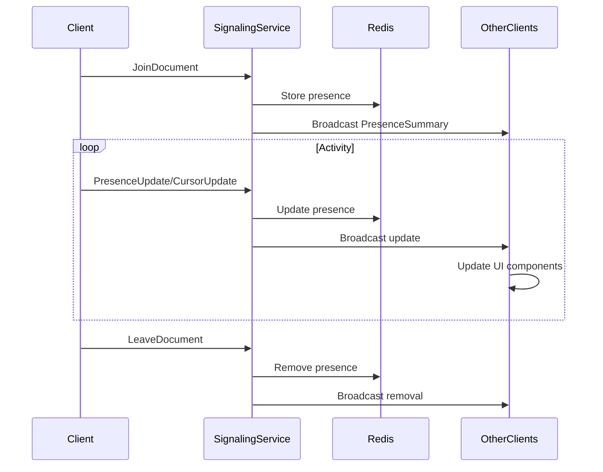

# Presence Integration Guide

This document explains how to integrate presence indicators with the signaling service in our document editor application.

## 1. State Management Plan

### Presence State Structure
The client maintains two primary data structures:
```rust
// Map of user IDs to presence information
HashMap<Uuid, PresenceUser>

// Map of user IDs to cursor positions (line, column)
HashMap<Uuid, (usize, usize)>
```

### State Initialization
The presence state is initialized when a user joins a document:
```rust
let users = use_state(|| {
    let mut map = HashMap::new();
    map.insert(current_user_id, PresenceUser {
        avatar_url: Some("..."),
        color: "#007bff",
        status: PresenceStatus::Online,
    });
    map
});
```

### State Updates
State updates occur through:
- `PresenceUpdate` messages from signaling service
- Local user activity events (cursor movement, typing)
- Timer-based expiration checks

## 2. Signaling Service Connection

### Initialization
Connect to signaling service when component mounts:
```rust
let signaling = use_context::<SignalingServiceContext>().unwrap();
signaling.register_connection(document_id).await;
signaling.send(SignalingMessage::JoinDocument {
    document_id,
    user_id: current_user_id
});
```

### Handling Events
Subscribe to document-specific events:
```rust
let mut receiver = signaling.subscribe(document_id).await;
while let Some(message) = receiver.recv().await {
    match message {
        SignalingMessage::PresenceUpdate(update) => {
            // Update local presence state
        }
        SignalingMessage::CursorUpdate(position) => {
            // Update cursor position
        }
        // Handle other message types...
    }
}
```

### Key Message Types
| Message Type        | Purpose                                  |
|---------------------|------------------------------------------|
| `PresenceUpdate`    | Full presence state for a user           |
| `PresenceSummary`   | Aggregated presence state for efficiency |
| `CursorUpdate`      | Real-time cursor position                |
| `TypingIndicator`   | User typing status                       |

## 3. Data Flow

### Sequence Diagram


### Message Handling Flow
1. Client sends activity updates to signaling service
2. Signaling service stores state in Redis
3. Service broadcasts updates to all document participants
4. Clients receive updates and modify local state
5. UI components re-render based on state changes

## 4. Presence Expiration

### Inactivity Tracking
```rust
// On any user activity:
presence.last_active = Utc::now();

// Background timer checks every second:
for user in presence.values_mut() {
    let inactive_secs = (Utc::now() - user.last_active).num_seconds();
    if inactive_secs > 30 {
        // Remove user
    } else if inactive_secs > 5 {
        user.status = PresenceStatus::Away;
    }
}
```

### Expiration Process
1. **5 seconds inactive**: Mark user as `Away`
   - Visual indicator changes color
   - User remains in presence list
2. **30 seconds inactive**: Remove user completely
   - Emit `LeaveDocument` event
   - Remove from local state

## 5. Performance Considerations

### Scaling Strategies
- **Batched Updates**: Aggregate changes before broadcasting
- **Delta Encoding**: Only send changed presence attributes
- **Throttling**: Limit cursor updates to 10Hz max
- **Virtualization**: Only render visible cursors

### Efficient Rendering
```rust
// CursorOverlay component optimizations:
// Only re-render when cursor positions change
let should_render = use_memo((), |_| {
    !prev_positions.eq(&current_positions)
});
```

### Memory Management
- Use LRU cache for presence data (max 1000 users/doc)
- Compress cursor positions using delta encoding
- Clean up timers on component unmount

## Integration Points
| Component              | Signaling Connection          |
|------------------------|-------------------------------|
| `EditorWithPresence`   | Manages signaling lifecycle   |
| `PresenceSidebar`      | Listens for presence updates  |
| `CursorOverlay`        | Subscribes to cursor updates  |
| `StatusIndicator`      | Reacts to status changes      |
| `AvatarBadge`          | Shows user typing status      |