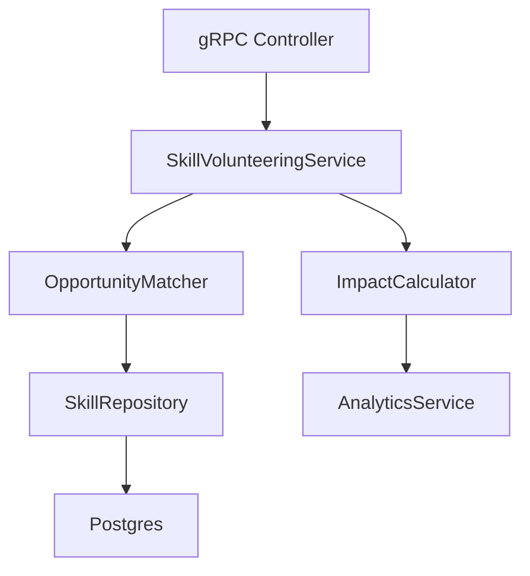
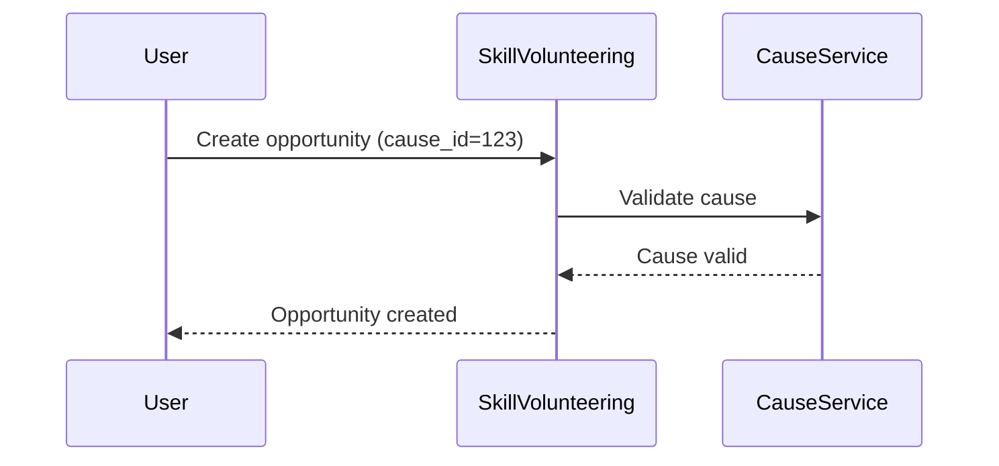
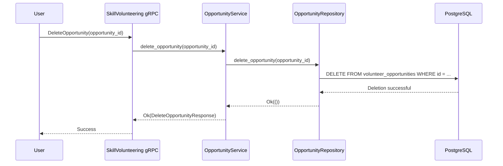

# Skill Volunteering Module Design

## Overview
The Skill Volunteering module enables users to offer and exchange skills for causes they care about. It supports:
- Skill-based micro-volunteering opportunities
- Skill exchange between users
- Integration with cause management
- Volunteer impact tracking

## Vertical Slices

### 1. Skill Management
- **Models**: `Skill`, `UserSkill`, `SkillCategory`
- **Repository**: CRUD operations for skills
- **Service**: Skill validation and categorization

### 2. Opportunity Management
- **Models**: `VolunteerOpportunity`, `OpportunityApplication`
- **Repository**: Opportunity CRUD, application tracking
- **Service**: Opportunity publishing and matching

### 3. Volunteer Matching
- **Models**: `VolunteerMatch`, `MatchCriteria`
- **Repository**: Match storage and retrieval
- **Service**: Matching algorithm implementation

### 4. Impact Tracking
- **Models**: `VolunteerImpact`, `SkillImpact`
- **Repository**: Impact metrics storage
- **Service**: Impact calculation and reporting

## Hexagonal Architecture


## Proto Definitions
```protobuf
service SkillVolunteeringService {
  rpc CreateOpportunity(CreateOpportunityRequest) returns (CreateOpportunityResponse);
  rpc UpdateOpportunity(UpdateOpportunityRequest) returns (UpdateOpportunityResponse);
  rpc DeleteOpportunity(DeleteOpportunityRequest) returns (DeleteOpportunityResponse);
  rpc ApplyForOpportunity(ApplyRequest) returns (ApplyResponse);
  rpc ListOpportunities(ListOpportunitiesRequest) returns (ListOpportunitiesResponse);
  rpc RecordImpact(ImpactRecordRequest) returns (ImpactRecordResponse);
}

message VolunteerOpportunity {
  string id = 1;
  string cause_id = 2;
  repeated string required_skills = 3;
  string description = 4;
  int32 estimated_hours = 5;
  google.protobuf.Timestamp deadline = 6;
}

message Skill {
  string id = 1;
  string name = 2;
  string category = 3;
  string description = 4;
}
```

## Integration with CauseService


## Database Schema
```sql
CREATE TABLE skills (
  id UUID PRIMARY KEY,
  name TEXT NOT NULL UNIQUE,
  category TEXT NOT NULL,
  description TEXT
);

CREATE TABLE volunteer_opportunities (
  id UUID PRIMARY KEY,
  cause_id UUID REFERENCES causes(id),
  title TEXT NOT NULL,
  description TEXT NOT NULL,
  required_skills UUID[],
  estimated_hours INT,
  created_at TIMESTAMPTZ DEFAULT NOW(),
  deadline TIMESTAMPTZ
);

CREATE TABLE opportunity_applications (
  opportunity_id UUID REFERENCES volunteer_opportunities(id),
  user_id UUID NOT NULL,
  applied_at TIMESTAMPTZ DEFAULT NOW(),
  status TEXT CHECK(status IN ('pending', 'accepted', 'rejected', 'completed'))
);
```

### Deleting a Volunteer Opportunity

The process for deleting a volunteer opportunity follows a similar layered approach, ensuring separation of concerns and maintainability.

1.  **gRPC Endpoint**: A `DeleteOpportunity` RPC is exposed in the `SkillVolunteeringService`. It takes a `DeleteOpportunityRequest` containing the `opportunity_id`.
2.  **Service Layer**: The `SkillVolunteeringServiceImpl` handles the request. It calls the `delete_opportunity` method in the `OpportunityService`.
3.  **Domain Logic**: The `OpportunityService` receives the `opportunity_id`. It may perform validation, such as checking if the user has permission to delete the opportunity (a feature for future consideration). It then calls the `delete_opportunity` method on the `OpportunityRepository`.
4.  **Repository Layer**: The `OpportunityRepository` trait defines the `delete_opportunity` method.
5.  **Database Implementation**: The `PostgresOpportunityRepository` implements the deletion logic, executing a `DELETE` SQL statement against the `volunteer_opportunities` table.



## Future Enhancements
- Skill verification system
- Volunteer reputation scoring
- Integration with learning resources
- Social sharing of volunteer achievements