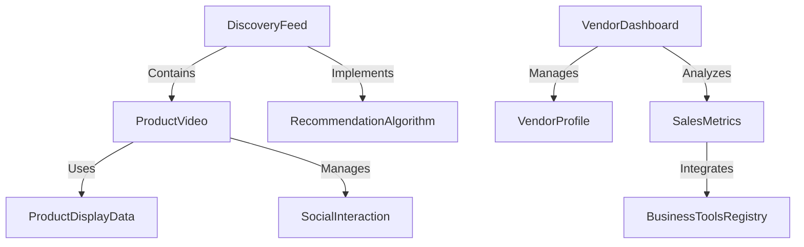
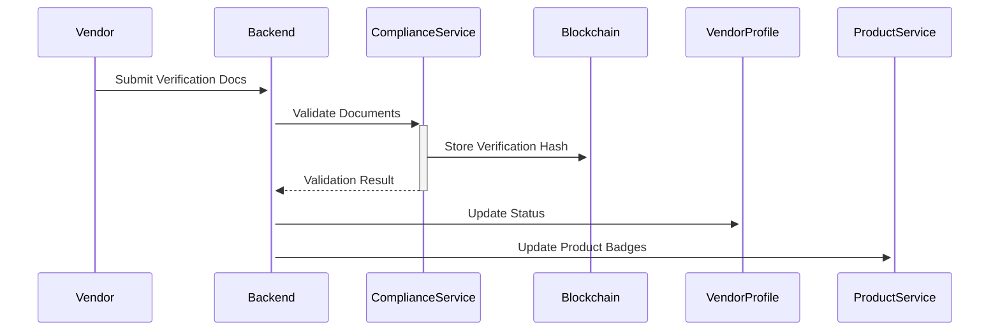

# TikTok-Style Shop Architecture

## Extended Data Models

```rust
// apps/cpc-platform/src/components/product/models.rs

#[derive(Debug, Clone, Serialize, Deserialize)]
pub struct ProductDisplayData {
    // Existing fields...
    pub vendor_id: String,
    pub social_stats: SocialStats,
}

#[derive(Debug, Clone, Serialize, Deserialize)]
pub struct VendorProfile {
    pub id: String,
    pub business_name: String,
    pub verification_status: VerificationStatus,
    pub products: Vec<ProductPreview>,
    pub metrics: VendorMetrics,
    pub payment_methods: Vec<PaymentMethod>,
}

#[derive(Debug, Clone, Serialize, Deserialize)]
pub struct SocialStats {
    pub likes: u32,
    pub saves: u32,
    pub shares: u32,
    pub comments: Vec<Comment>,
}

// Reuses existing SupplyChain from cpc_core
```

## Component Architecture



## API Extensions

```graphql
# apps/backend/src/graphql/schema.graphql

type Mutation {
    createVendorProfile(input: VendorInput!): VendorProfile
    updateVendorVerification(status: VerificationStatus!): Boolean
    postProductComment(productId: ID!, content: String!): Comment
}

type Subscription {
    productFeedUpdated: [ProductDisplayData!]!
    vendorAnalyticsUpdated: VendorMetrics!
}

# Reuses existing product and supply chain subscriptions
```

## Service Integration

```rust
// apps/cpc-platform/src/services/shop.rs

pub struct ShopService {
    product_client: ProductClient,
    vendor_db: VendorStore,
    social_engine: SocialEngine,
}

impl ShopService {
    pub async fn get_discovery_feed(&self, user_id: &str) -> Result<Vec<ProductDisplayData>> {
        // Combines recommendation algorithm with social signals
        let base_products = self.product_client.get_recommended_products(user_id).await?;
        self.social_engine.rank_products(base_products).await
    }
    
    pub async fn update_vendor_metrics(&self, vendor_id: &str) {
        // Integrates with existing business tools registry
        let metrics = self.vendor_db.calculate_metrics(vendor_id).await;
        self.product_client.publish_metrics(vendor_id, metrics).await;
    }
}
```

## Verification System Flow



## Implementation Plan

1. **Vendor Profile Extension** (3 days)
   - Add new fields to ProductDisplayData
   - Create VendorProfile struct
   - Modify existing product fetching to include vendor data

2. **Discovery Feed Component** (5 days)
   - Create new VerticalVideo component
   - Implement swipe gestures
   - Integrate with recommendation algorithm

3. **Social Features** (4 days)
   - Add comment threading to existing ProductDisplay
   - Implement likes/shares using existing supply_chain update system

4. **Analytics Integration** (2 days)
   - Connect to BusinessToolsRegistry
   - Add metrics dashboard using existing plotting utilities

Reference these existing patterns:
- Product data fetching: `apps/cpc-platform/src/components/product/display.rs:220-239`
- Real-time updates: `apps/cpc-platform/src/components/product/display.rs:99-125`
- Tool registry permissions: `apps/cpc-platform/src/lib/business-tools/tool-registry.js:286-291`