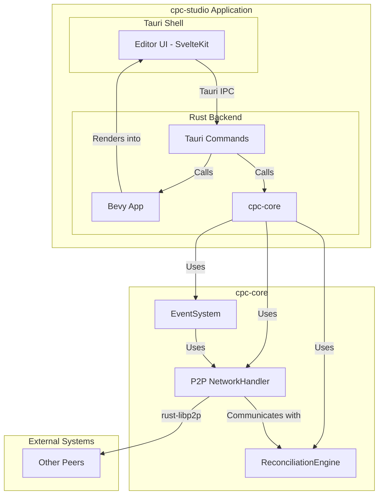

# cpc-studio Game Editor Architecture

## 1. Executive Summary

This document outlines the architectural design for `cpc-studio`, a real-time collaborative game editor for the `cpc` ecosystem. The editor will leverage Bevy for high-performance rendering of the game world, Tauri for a cross-platform desktop shell, and SvelteKit for a modern, reactive user interface.

A core feature of `cpc-studio` is its deep integration with our existing P2P network, enabling multiple users to seamlessly co-edit game scenes and assets. This architecture is designed to be modular, extensible, and consistent with our established principles of decentralization and permissive technologies.

## 2. High-Level Component Diagram

The following diagram illustrates the main components of the `cpc-studio` architecture and their interactions.



**Component Descriptions:**

*   **Editor UI (SvelteKit):** The web-based user interface for the editor, providing tools for scene manipulation, asset management, and project configuration.
*   **Tauri Shell:** The cross-platform desktop application wrapper. It hosts the SvelteKit UI and manages the main application window.
*   **Tauri Commands:** Rust functions exposed to the SvelteKit frontend via Tauri's IPC mechanism. These commands form the API between the UI and the backend logic.
*   **Bevy App:** The Bevy engine instance responsible for rendering the game scene, running game logic in "preview" mode, and providing a visual representation of the world being edited.
*   **cpc-core:** Our shared Rust library containing the core P2P networking, state synchronization, and event handling logic.
*   **P2P NetworkHandler:** The unified interface for all P2P communication, as defined in the `p2p_unification_plan.md`.
*   **ReconciliationEngine:** Manages state consistency and conflict resolution using vector clocks and CRDTs.

## 3. Bevy-Tauri Integration Strategy

The integration of Bevy and Tauri is a cornerstone of this architecture.

1.  **Bevy as a Library:** The Bevy App will be instantiated and run within the main Rust process managed by Tauri. It will not be a separate executable.
2.  **Rendering to a Texture:** Instead of rendering to a window it controls, the Bevy App will be configured to render its output to an off-screen texture.
3.  **Texture Sharing with UI:** This texture will be shared with the Tauri webview. The SvelteKit UI will have a designated `<canvas>` element where the rendered scene from Bevy will be displayed in real-time. This can be achieved using WebGL contexts or by passing raw image data.
4.  **Communication via Tauri Commands:**
    *   **UI to Bevy:** User interactions in the SvelteKit UI (e.g., selecting an object, moving the camera) will trigger Tauri commands. These commands will then update the state of the Bevy world accordingly.
    *   **Bevy to UI:** Changes in the Bevy world (e.g., an object updated by another peer) will be sent to the UI. This can be done by having the Bevy app emit events that are captured by the Tauri backend and forwarded to the SvelteKit frontend.

## 4. Editor Workflow Specifications

### 4.1. Project Creation and Loading

1.  User launches `cpc-studio`.
2.  The UI presents options to "Create New Project" or "Open Project".
3.  **Creating a new project:**
    *   The user specifies a project name and directory.
    *   The backend creates a new folder containing a `cpc-project.json` file and standard asset directories (`scenes/`, `assets/`, etc.).
4.  **Opening a project:**
    *   The user selects an existing `cpc-project.json` file.
    *   The backend loads the project configuration and the default scene.

### 4.2. Scene Editing

1.  The Bevy instance loads and renders the selected scene.
2.  The SvelteKit UI displays a scene graph, an inspector panel for selected entities, and an asset browser.
3.  When the user selects an entity in the UI's scene graph, a Tauri command is sent to notify the Bevy app, which might highlight the corresponding object in the rendered view.
4.  When the user modifies a component's property in the inspector (e.g., changing an entity's position), a `P2PEvent` is generated.
5.  This event is processed by the local `ReconciliationEngine`, updating the Bevy world.
6.  The event is then broadcast to other peers via the `P2P NetworkHandler`.

### 4.3. Collaborative Session

1.  A user can "Share" a project, which makes them a host.
2.  Other users can join using the host's PeerID.
3.  When a peer joins, they receive the current state snapshot.
4.  As editors make changes, `P2PEvent`s are gossiped to all participants.
5.  The `ReconciliationEngine` on each peer ensures that all participants' states converge. Conflicts are handled according to the rules in `p2p_event_system.md`.

## 5. Game Project Serialization Format

To ensure interoperability and version control friendliness, game projects will be stored in a human-readable format.

**`cpc-project.json`:**

```json
{
  "projectName": "My Awesome Game",
  "version": "1.0.0",
  "defaultScene": "scenes/main.scene.json",
  "p2p": {
    "bootstrap_nodes": [
      "/ip4/192.168.1.10/tcp/4001/p2p/Qm..."
    ]
  },
  "assets": {
    "textures": [
      {"id": "tex_player", "path": "assets/player.png"},
      {"id": "tex_enemy", "path": "assets/enemy.png"}
    ],
    "models": [
      {"id": "model_tree", "path": "assets/tree.glb"}
    ]
  }
}
```

**`*.scene.json`:**

Scenes will be serialized as a list of entities and their components, compatible with Bevy's scene format.

```json
{
  "entities": [
    {
      "entity": 0,
      "components": [
        {
          "type": "Transform",
          "translation": [0.0, 1.0, 0.0],
          "rotation": [0.0, 0.0, 0.0, 1.0],
          "scale": [1.0, 1.0, 1.0]
        },
        {
          "type": "Mesh",
          "model_id": "model_tree"
        }
      ]
    }
  ]
}