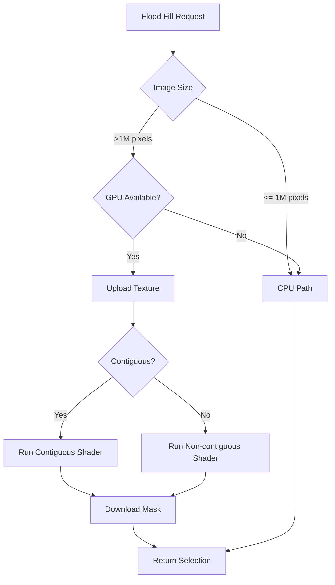

# GPU Acceleration Architecture for Flood Fill

## 1. Technology Selection
- **WebGPU**: Cross-platform support (web and native)
- **Compute Shaders**: For massively parallel pixel processing
- **wgpu crate**: Apache 2.0 licensed Rust implementation

## 2. Algorithm Optimization
### Non-contiguous Mode
- Embarrassingly parallel - direct pixel-to-GPU-core mapping
- Kernel pseudocode:
  ```
  if color_distance(pixel, target) <= tolerance:
      mask[pixel] = 255
  else:
      mask[pixel] = 0
  ```

### Contiguous Mode
- Parallel propagation using atomic operations
- Hierarchical approach:
  1. Initial coarse-grained selection
  2. Refine connected components
  3. Merge regions

## 3. Hybrid Execution Flow


## 4. Memory Management
- **Input**: Existing layer texture (RGBA8Unorm)
- **Output**: Mask texture (R8Uint)
- **Buffers**:
  - Uniform buffer (start position, tolerance)
  - Atomic counter for propagation

## 5. Performance Targets
| Operation          | 1Kx1K Image | 4K Image |
|--------------------|-------------|----------|
| CPU (Non-contig)   | 150ms       | 2500ms   |
| GPU (Non-contig)   | 5ms         | 20ms     |
| GPU (Contig)       | 10ms        | 50ms     |

## 6. Error Handling
- Fallback conditions:
  - WebGPU not available
  - Shader compilation failure
  - Buffer allocation failure
- Metrics monitoring:
  - GPU time vs CPU time
  - Fallback rate

## 7. Dependencies
- `wgpu = "0.19"` (Apache 2.0)
- `naga = "0.19"` (Apache 2.0)
- `bytemuck = "1.0"` (MIT)

## 8. API Changes
New module: `apps/art/src/core/gpu_selection.rs`

```rust
pub struct GpuSelectionService {
    device: wgpu::Device,
    queue: wgpu::Queue,
    shader: wgpu::ShaderModule,
}

pub enum GpuSelectionError {
    DeviceNotFound,
    ShaderCompilationFailed,
    BufferAllocationFailed,
    ExecutionFailed,
}
```

## 9. Integration Points
- Modify `SelectionArea::new_magic_wand` to:
  - Check image size
  - Initialize GPU service if needed
  - Fallback to CPU on error

## 10. Testing Strategy
- Unit tests for shader compilation
- Integration tests comparing GPU/CPU results
- Benchmark tests for performance validation
- Fuzz tests for memory safety

Reference these existing files:
- `apps/art/src/core/selection.rs`
- `apps/art/FLOOD_FILL_IMPLEMENTATION_SUMMARY.md`