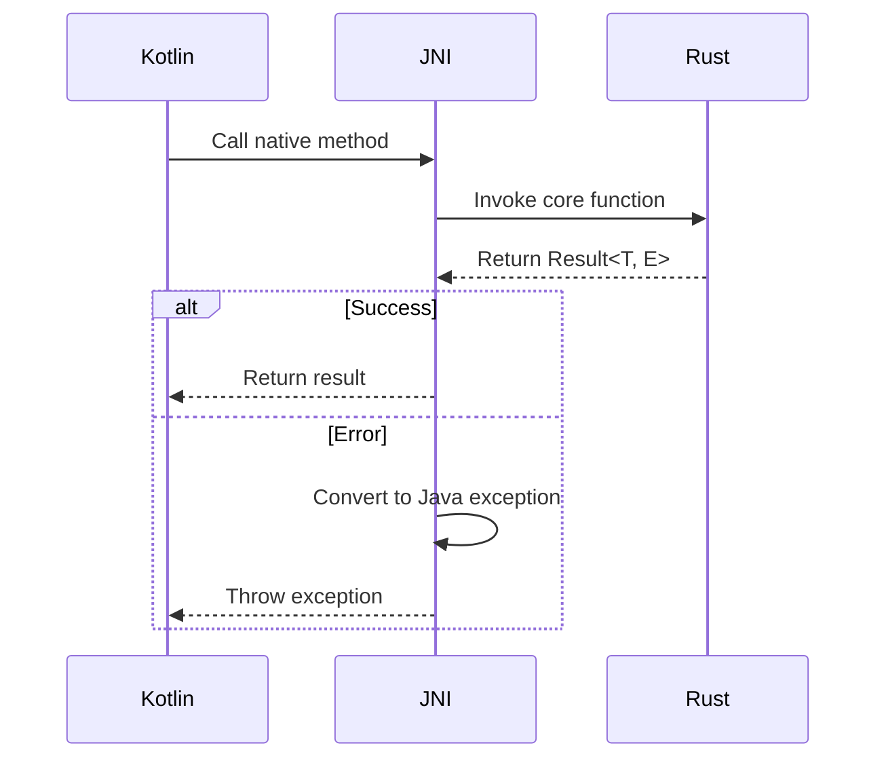

# Error Propagation to Kotlin Layer

## Technical Specifications
### Goals
1. Propagate Rust errors to Kotlin as exceptions
2. Create custom JNI exceptions
3. Map core error types to Java exceptions
4. Maintain error context during propagation

### Architecture


## Implementation Approach
### Step 1: Define Custom Exceptions
Create Java exceptions in Kotlin:
```kotlin
// JniExceptions.kt
class JniNullPointerException(msg: String) : RuntimeException(msg)
class JniSerializationException(msg: String) : RuntimeException(msg)
class JniValidationException(msg: String) : RuntimeException(msg)
```

### Step 2: Error Conversion in Rust
Implement error mapping in JNI bridge:
```rust
fn to_jni_result<T>(env: &JNIEnv, result: Result<T, CoreError>) -> jlong {
    match result {
        Ok(val) => Box::into_raw(Box::new(val)) as jlong,
        Err(e) => {
            let _ = env.throw_new(
                match e {
                    CoreError::Validation(_) => "com/cpc/android/JniValidationException",
                    CoreError::Serialization(_) => "com/cpc/android/JniSerializationException",
                    _ => "java/lang/RuntimeException",
                },
                &e.to_string()
            );
            0
        }
    }
}
```

### Step 3: Modify JNI Functions
Update existing functions to use error propagation:
```rust
#[no_mangle]
pub extern "system" fn Java_com_cpc_android_JniBridge_deserializeProduct(
    env: JNIEnv,
    _class: JClass,
    bytes: jbyteArray,
) -> jlong {
    let bytes = env.convert_byte_array(bytes)
        .map_err(|e| CoreError::Serialization(e.to_string()))?;
        
    let product: Product = from_protobuf(&bytes)
        .map_err(|e| CoreError::Deserialization(e.to_string()))?;
        
    to_jni_result(env, product.validate().map(|_| product))
}
```

## References
- Error handling: `packages/cpc-core/src/product/error.rs`
- JNI bridge: `apps/cpc-platform/android/app/src/main/rust/jni_bridge.rs`
- Kotlin models: `apps/cpc-platform/android/app/src/main/kotlin/com/cpc/social/models/`

## Compatibility
- Requires new exception classes in Kotlin
- Maintains existing function signatures
- Preserves all error context