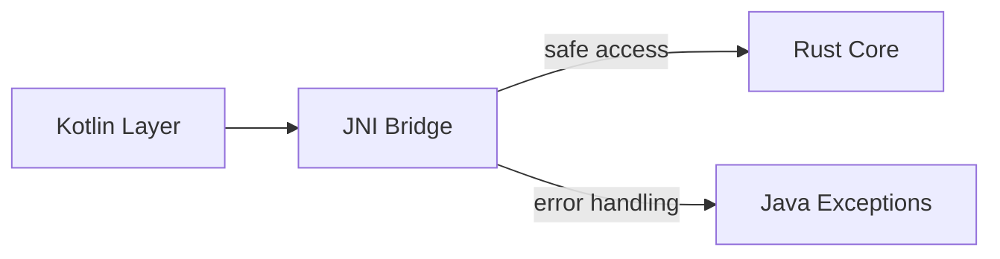

# JNI Safety Improvements

## Technical Specifications
### Goals
1. Eliminate `unwrap()` usage in JNI functions
2. Add null pointer validation for all JNI object handles
3. Implement proper error handling for JNI operations
4. Ensure memory safety with Rust pointers

### Architecture Components


## Implementation Approach
### Step 1: Null Pointer Checks
Add validation for all JNI object handles before dereferencing:
```rust
let handle = env.get_field(product, "nativeHandle", "J")
    .map_err(|e| JniSafetyError::FieldAccess(e.to_string()))?
    .j()
    .ok_or(JniSafetyError::NullHandle)?;
```

### Step 2: Safe Pointer Handling
Create helper functions for safe pointer access:
```rust
fn safe_deref<T>(ptr: jlong) -> Result<&'static T, JniSafetyError> {
    if ptr == 0 {
        Err(JniSafetyError::NullPointer)
    } else {
        Ok(unsafe { &*(ptr as *const T) })
    }
}

/// Safe conversion from protobuf Timestamp to Java long (milliseconds)
pub fn safe_timestamp_conversion(ts: &prost_types::Timestamp) -> jlong {
    let millis = ts.seconds * 1000 + (ts.nanos as i64) / 1_000_000;
    millis
}
```

### Step 3: Error Handling
Define custom error type:
```rust
pub enum JniSafetyError {
    NullPointer,
    NullHandle,
    FieldAccess(String),
    // ...
}
```

### Step 4: Exception Propagation
Map Rust errors to Java exceptions:
```rust
fn throw_jni_exception(env: &JNIEnv, error: JniSafetyError) {
    match error {
        JniSafetyError::NullPointer => {
            let _ = env.throw_new("java/lang/NullPointerException", "Null pointer accessed");
        }
        // Handle other error variants
    }
}
```

## Timestamp Handling Best Practices
When working with timestamps across JNI:
1. Always use protobuf Timestamp type for time fields
2. Convert to milliseconds for Java compatibility using safe_timestamp_conversion
3. On Java side, use Instant.ofEpochMilli() to create time objects

## References
- Current JNI bridge: `apps/cpc-platform/android/app/src/main/rust/jni_bridge.rs`
- Core models: `packages/cpc-core/src/product/model.rs`
- Serialization helpers: `packages/cpc-core/src/serialization.rs`

## Compatibility
- Maintains existing JNI function signatures
- Backward compatible with current Kotlin code
- Requires adding new error types to Rust core