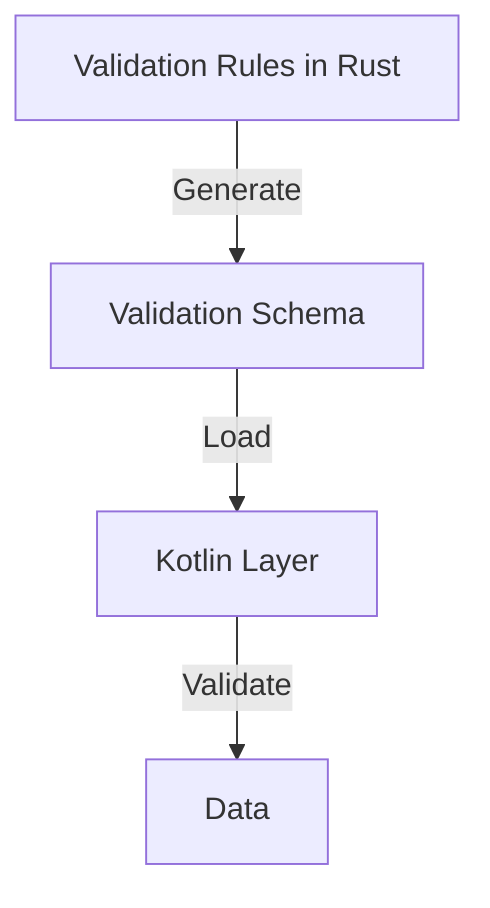
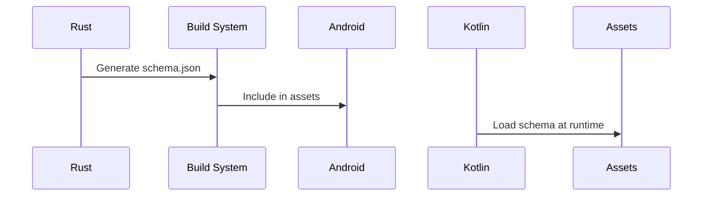

# Shared Validation Logic

## Technical Specifications
### Goals
1. Reuse Rust validation rules in Kotlin
2. Maintain single source of truth for validation
3. Synchronize validation across layers
4. Provide rich error messages

### Architecture


## Implementation Approach
### Step 1: Schema Generation
Add schema generation to Rust validation:
```rust
pub fn generate_validation_schema() -> ValidationSchema {
    ValidationSchema {
        product: ProductSchema {
            id: FieldSchema { min_length: 1, max_length: None },
            name: FieldSchema { min_length: 1, max_length: 100 },
            // ... other fields
        }
    }
}
```

### Step 2: Schema Serialization
Serialize schema to JSON:
```rust
pub fn export_schema_json() -> String {
    let schema = generate_validation_schema();
    serde_json::to_string(&schema).unwrap()
}
```

### Step 3: Kotlin Validation
Load schema in Kotlin:
```kotlin
// ValidationLoader.kt
object ValidationLoader {
    private val schema: ValidationSchema by lazy {
        val json = loadSchemaFromAssets()
        Json.decodeFromString(json)
    }
    
    fun validate(product: Product) {
        if (product.id.isEmpty()) {
            throw ValidationException("ID is required")
        }
        // Apply other rules from schema
    }
}
```

### Step 4: Schema Update Process


## References
- Core models: `packages/cpc-core/src/product/model.rs`
- Kotlin models: `apps/cpc-platform/android/app/src/main/kotlin/com/cpc/social/models/`
- Validation crate: `validator`

## Compatibility
- Requires adding new schema generation to Rust
- Kotlin needs new validation loader
- Backward compatible with existing models