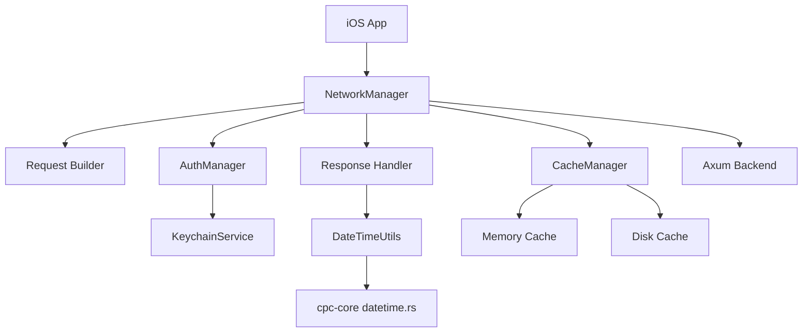

# iOS Network Architecture Proposal

## 1. Overview
This document outlines the networking architecture for the iOS application, designed to maximize code sharing with our Rust core and align with cross-platform patterns. The architecture focuses on:
- Secure communication with Axum backend
- Consistent datetime serialization
- Token-based authentication
- Robust error handling
- Efficient caching strategies

## 2. Core Components


## 3. DateTime Serialization Integration
To align with `cpc-core/src/utils/datetime.rs`:

```swift
// DateTimeUtils.swift
import Foundation

struct DateTimeUtils {
    static let formatter: DateFormatter = {
        let formatter = DateFormatter()
        formatter.dateFormat = "yyyy-MM-dd'T'HH:mm:ss.SSSZ"
        formatter.timeZone = TimeZone(secondsFromGMT: 0)
        formatter.locale = Locale(identifier: "en_US_POSIX")
        return formatter
    }()
    
    static func date(from string: String) -> Date? {
        return formatter.date(from: string)
    }
    
    static func string(from date: Date) -> String {
        return formatter.string(from: date)
    }
}
```

Usage in models:
```swift
// AuthToken.swift
struct AuthToken: Codable {
    let accessToken: String
    let refreshToken: String
    let expiresAt: Date
    
    enum CodingKeys: String, CodingKey {
        case accessToken
        case refreshToken
        case expiresAt
    }
    
    init(from decoder: Decoder) throws {
        let container = try decoder.container(keyedBy: CodingKeys.self)
        accessToken = try container.decode(String.self, forKey: .accessToken)
        refreshToken = try container.decode(String.self, forKey: .refreshToken)
        
        let dateString = try container.decode(String.self, forKey: .expiresAt)
        guard let date = DateTimeUtils.date(from: dateString) else {
            throw DecodingError.dataCorruptedError(
                forKey: .expiresAt,
                in: container,
                debugDescription: "Date string does not match format"
            )
        }
        expiresAt = date
    }
}
```

## 4. Network Communication with Axum Backend

### Request Building
```swift
class NetworkManager {
    private let baseURL = URL(string: "https://api.ourplatform.com")!
    private let session: URLSession
    
    init(session: URLSession = .shared) {
        self.session = session
    }
    
    func request<T: Decodable>(_ endpoint: Endpoint) async throws -> T {
        var request = URLRequest(url: baseURL.appendingPathComponent(endpoint.path))
        request.httpMethod = endpoint.method.rawValue
        
        // Add authentication if needed
        if endpoint.requiresAuth {
            guard let token = AuthManager.shared.accessToken else {
                throw NetworkError.unauthorized
            }
            request.setValue("Bearer \(token)", forHTTPHeaderField: "Authorization")
        }
        
        // Handle parameters
        switch endpoint.parameters {
        case .url(let params):
            var components = URLComponents(url: request.url!, resolvingAgainstBaseURL: false)
            components?.queryItems = params.map { URLQueryItem(name: $0.key, value: $0.value) }
            request.url = components?.url
        case .body(let data):
            request.httpBody = data
        case .none:
            break
        }
        
        let (data, response) = try await session.data(for: request)
        
        guard let httpResponse = response as? HTTPURLResponse else {
            throw NetworkError.invalidResponse
        }
        
        // Handle token expiration
        if httpResponse.statusCode == 401 {
            try await handleTokenRefresh()
            return try await request(endpoint) // Retry original request
        }
        
        guard (200...299).contains(httpResponse.statusCode) else {
            throw NetworkError.serverError(statusCode: httpResponse.statusCode)
        }
        
        return try JSONDecoder().decode(T.self, from: data)
    }
    
    private func handleTokenRefresh() async throws {
        guard let refreshToken = AuthManager.shared.refreshToken else {
            throw NetworkError.refreshTokenMissing
        }
        
        let newTokens = try await AuthService.refreshToken(refreshToken)
        AuthManager.shared.saveTokens(newTokens)
    }
}
```

## 5. Authentication Token Handling

### AuthManager Implementation
```swift
class AuthManager {
    static let shared = AuthManager()
    private let keychainService: KeychainService
    
    init(keychainService: KeychainService = KeychainService()) {
        self.keychainService = keychainService
    }
    
    var accessToken: String? {
        return keychainService.get(key: .accessToken)
    }
    
    var refreshToken: String? {
        return keychainService.get(key: .refreshToken)
    }
    
    func saveTokens(_ tokens: AuthToken) {
        keychainService.set(tokens.accessToken, key: .accessToken)
        keychainService.set(tokens.refreshToken, key: .refreshToken)
        keychainService.set(DateTimeUtils.string(from: tokens.expiresAt), key: .expiresAt)
    }
    
    func clearTokens() {
        keychainService.delete(key: .accessToken)
        keychainService.delete(key: .refreshToken)
        keychainService.delete(key: .expiresAt)
    }
}
```

### KeychainService
```swift
class KeychainService {
    private let service = "com.ourplatform.auth"
    
    enum Key: String {
        case accessToken
        case refreshToken
        case expiresAt
    }
    
    func set(_ value: String, key: Key) {
        let query: [String: Any] = [
            kSecClass as String: kSecClassGenericPassword,
            kSecAttrService as String: service,
            kSecAttrAccount as String: key.rawValue,
            kSecValueData as String: value.data(using: .utf8)!
        ]
        
        SecItemDelete(query as CFDictionary)
        SecItemAdd(query as CFDictionary, nil)
    }
    
    func get(key: Key) -> String? {
        let query: [String: Any] = [
            kSecClass as String: kSecClassGenericPassword,
            kSecAttrService as String: service,
            kSecAttrAccount as String: key.rawValue,
            kSecReturnData as String: true,
            kSecMatchLimit as String: kSecMatchLimitOne
        ]
        
        var dataTypeRef: AnyObject?
        let status = SecItemCopyMatching(query as CFDictionary, &dataTypeRef)
        
        guard status == errSecSuccess, 
              let data = dataTypeRef as? Data,
              let value = String(data: data, encoding: .utf8) else {
            return nil
        }
        
        return value
    }
    
    func delete(key: Key) {
        let query: [String: Any] = [
            kSecClass as String: kSecClassGenericPassword,
            kSecAttrService as String: service,
            kSecAttrAccount as String: key.rawValue
        ]
        
        SecItemDelete(query as CFDictionary)
    }
}
```

## 6. Error Handling Strategy

### NetworkError Enum
```swift
enum NetworkError: Error {
    case invalidURL
    case unauthorized
    case refreshTokenMissing
    case tokenRefreshFailed
    case serverError(statusCode: Int)
    case decodingError
    case noInternetConnection
    case timeout
    case invalidResponse
}

extension NetworkError: LocalizedError {
    var errorDescription: String? {
        switch self {
        case .unauthorized:
            return "Authentication required"
        case .refreshTokenMissing:
            return "Refresh token not available"
        case .tokenRefreshFailed:
            return "Failed to refresh access token"
        case .serverError(let statusCode):
            return "Server error (\(statusCode))"
        case .decodingError:
            return "Failed to parse response"
        case .noInternetConnection:
            return "No internet connection"
        case .timeout:
            return "Request timed out"
        case .invalidResponse:
            return "Received invalid response"
        case .invalidURL:
            return "Invalid URL"
        }
    }
}
```

## 7. Caching Approach

### CacheManager Implementation
```swift
class CacheManager {
    static let shared = CacheManager()
    private let memoryCache = NSCache<NSString, AnyObject>()
    private let diskCacheURL: URL
    
    init() {
        let paths = FileManager.default.urls(for: .cachesDirectory, in: .userDomainMask)
        diskCacheURL = paths[0].appendingPathComponent("NetworkCache")
        try? FileManager.default.createDirectory(at: diskCacheURL, withIntermediateDirectories: true)
    }
    
    // Memory cache (like Caffeine on Android)
    func setMemoryCache(_ object: AnyObject, forKey key: String) {
        memoryCache.setObject(object, forKey: key as NSString)
    }
    
    func getMemoryCache(forKey key: String) -> AnyObject? {
        return memoryCache.object(forKey: key as NSString)
    }
    
    // Disk cache
    func setDiskCache(_ data: Data, forKey key: String) {
        let fileURL = diskCacheURL.appendingPathComponent(key)
        try? data.write(to: fileURL)
    }
    
    func getDiskCache(forKey key: String) -> Data? {
        let fileURL = diskCacheURL.appendingPathComponent(key)
        return try? Data(contentsOf: fileURL)
    }
    
    // Combined cache strategy
    func getCachedResponse<T: Decodable>(for endpoint: Endpoint) -> T? {
        let cacheKey = endpoint.cacheKey
        
        // Check memory cache
        if let cached = getMemoryCache(forKey: cacheKey) as? T {
            return cached
        }
        
        // Check disk cache
        if let diskData = getDiskCache(forKey: cacheKey),
           let decoded = try? JSONDecoder().decode(T.self, from: diskData) {
            // Store in memory for faster access
            setMemoryCache(decoded as AnyObject, forKey: cacheKey)
            return decoded
        }
        
        return nil
    }
    
    func cacheResponse<T: Encodable>(_ response: T, for endpoint: Endpoint) {
        let cacheKey = endpoint.cacheKey
        
        // Cache in memory
        setMemoryCache(response as AnyObject, forKey: cacheKey)
        
        // Cache on disk
        if let data = try? JSONEncoder().encode(response) {
            setDiskCache(data, forKey: cacheKey)
        }
    }
}
```

## 8. Future Refactoring to Rust
To prepare for shared Rust code:
1. Abstract network interfaces using protocols that can be implemented in Rust
```swift
protocol NetworkService {
    func send<T: Decodable>(_ request: URLRequest) async throws -> T
}

protocol AuthTokenStore {
    func saveTokens(accessToken: String, refreshToken: String, expiresAt: Date)
    func getAccessToken() -> String?
    func getRefreshToken() -> String?
}
```
2. Use consistent model definitions between Swift and Rust
3. Maintain identical datetime formatting across all platforms
4. Use the same API endpoint paths and parameters

## 9. Network Flow Diagram


## 10. Security Considerations
1. All tokens stored in Keychain with device encryption
2. HTTPS with certificate pinning for all network requests
3. Token expiration enforced with strict validation
4. Refresh tokens rotated on each use
5. Sensitive data never logged