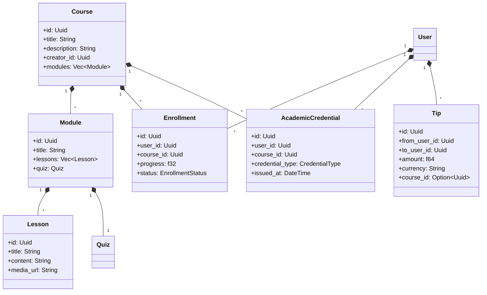
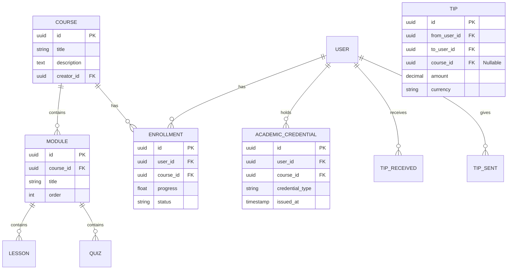
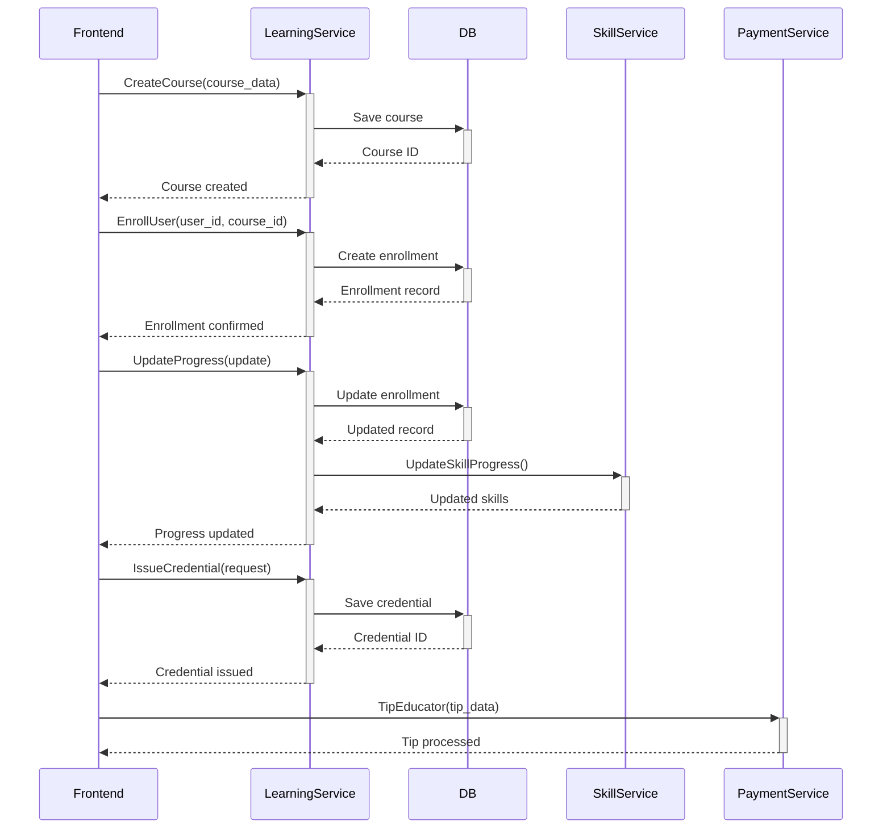

# Learning Platform Architecture

## Overview
Educational platform extending our skill development system with course management, enrollment tracking, credential issuance, and tipping functionality.

## Domain Model

## Service Interfaces
### gRPC Service Methods
- `CreateCourse(CourseRequest) → CourseResponse`
- `EnrollUser(EnrollmentRequest) → EnrollmentResponse`
- `UpdateProgress(ProgressUpdateRequest) → ProgressResponse`
- `IssueCredential(CredentialRequest) → CredentialResponse`
- `TipEducator(TipRequest) → TipResponse`

## Database Schema

## Component Interaction

## Reusable Components
1. **From skill_tracking**:
   - `LearningPathCreator` → Adapt for course creation
   - `SkillProgressTracker` → Reuse for course progress tracking
   - `CertificationDisplay` → Extend for academic credentials

2. **Shared Infrastructure**:
   - gRPC server setup from `grpc_server.rs`
   - Database connection pooling
   - Error handling patterns
   - Type conversion utilities

## Implementation Plan
1. **Core Domain Setup**:
   - Course/Module/Lesson entities
   - Enrollment tracking system
   - Credential issuance workflow

2. **Service Layer**:
   - gRPC service implementation
   - Database repositories
   - Integration with skill service

3. **UI Components**:
   - Course management interface
   - Enrollment dashboard
   - Progress tracking view
   - Credential display

4. **Tipping Integration**:
   - Educator tipping UI
   - Payment processing
   - Tip history tracking