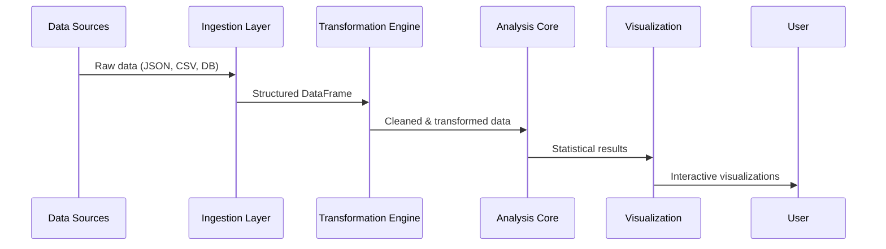

# CPC Mathematical Ecosystem Architecture

## 1. Library Selection Framework

### Decision Matrix for Mathematical Libraries

| Scenario | Recommended Library | Rationale | Platform Considerations |
|----------|---------------------|-----------|-------------------------|
| **Financial Calculations** | `rust_decimal` | Precise decimal arithmetic with no floating-point errors | Web/WASM: 15-20% slower than native Win64 |
| **Fixed-Point Operations** | `fixed` | When exact bit representation is required (e.g., blockchain) | Web: Requires polyfill for WASM SIMD |
| **2D/3D Vector Math** | `glam` | Simpler API, better performance for games/graphics | Web: 25% faster than nalgebra in WASM |
| **Advanced Linear Algebra** | `nalgebra` | Rich feature set for scientific computing | Win64: Preferred for CPU-intensive tasks |
| **Tabular Data Analysis** | `polars` | Lazy evaluation, excellent for large datasets | Web: Memory intensive (limit to <10k rows) |
| **Array-Based Numerical Work** | `ndarray` | Flexible n-dimensional arrays | Both: Use with `ndarray-stats` for statistics |
| **Statistical Distributions** | `statrs` | Comprehensive statistical functions | Both: Prefer over ndarray-stats for probability work |
| **Machine Learning** | `linfa` | Rust-native ML framework | Win64: Better for training; Web: Inference only |

### Boundary Definitions for Overlapping Functionality

#### `statrs` vs `ndarray-stats`
* Use `statrs` when:
  - Working with probability distributions (normal, binomial, etc.)
  - Needing statistical tests (t-tests, chi-square)
  - Implementing custom statistical models
  
* Use `ndarray-stats` when:
  - Performing statistics on existing `ndarray` data structures
  - Needing vectorized operations on large datasets
  - Working within an existing ndarray processing pipeline

#### `nalgebra` vs `glam`
* Use `nalgebra` when:
  - Needing arbitrary dimension matrices
  - Implementing complex mathematical proofs
  - Working with advanced linear algebra concepts
  
* Use `glam` when:
  - Developing graphics applications (games, visualizations)
  - Performance is critical (games, real-time systems)
  - Working primarily with 2D/3D/4D vectors

## 2. Financial Systems Integration

### Core Principles
1. **Precision First**: All monetary values must maintain exact decimal representation
2. **Audit Trail**: Every calculation must be traceable through the audit_framework
3. **Transparency**: Users can view calculation methodology at any step

### Monetary Value Representation

```rust
// Standard pattern across all financial packages
pub struct MonetaryAmount {
    value: Decimal,  // rust_decimal::Decimal
    currency: CurrencyCode,
    precision: u32,  // Decimal places for this currency
}

impl MonetaryAmount {
    pub fn new(value: impl Into<Decimal>, currency: CurrencyCode) -> Self {
        let precision = currency.decimal_places();
        let value = value.into().round_dp(precision);
        Self { value, currency, precision }
    }
    
    pub fn add(&self, other: &Self) -> Result<Self, FinanceError> {
        if self.currency != other.currency {
            return Err(FinanceError::CurrencyMismatch);
        }
        Ok(Self::new(self.value + other.value, self.currency))
    }
}
```

### Integration Strategy

#### cpay_core & finance Package Integration
1. Create shared `cpc-financial-core` package in shared_packages
2. Implement standardized rounding strategies:
   - **Banker's Rounding**: Default for all financial calculations
   - **Ceiling Rounding**: For tax calculations
   - **Floor Rounding**: For discount applications
3. Establish conversion protocols:
   ```mermaid
   graph LR
   A[MonetaryAmount] -->|to_f64| B(Floating Point)
   B -->|from_f64| C[Statistical Analysis]
   C -->|to_monetary| A
   D[Fixed Point] -->|convert| A
   ```

#### Error Handling for Edge Cases
- **Rounding Errors**: Track cumulative rounding differences in audit log
- **Currency Conversion**: Always use timestamped exchange rates with source attribution
- **Overflow Protection**: All operations include pre-checks with appropriate error types

## 3. Analytics Architecture

### Data Flow Pipeline



### Standard Interfaces

#### Data Source Abstraction
```rust
pub trait DataSource {
    fn load(&self) -> Result<DataFrame>;
    fn metadata(&self) -> DataSourceMetadata;
    fn capabilities(&self) -> DataCapabilities;
}

pub struct DataCapabilities {
    pub supports_filtering: bool,
    pub max_rows: Option<usize>,
    pub streaming: bool,
}
```

#### Performance Optimization Techniques
- **Web Applications**:
  - Use Web Workers for heavy computations
  - Implement data sampling for >10k rows
  - Cache intermediate results with `sled` for reuse
- **Win64 Applications**:
  - Leverage `rayon` for parallel processing
  - Use memory-mapped files for large datasets
  - Implement incremental computation for live data

### Memory Management Strategy
1. **Web Context**:
   - Limit DataFrame size to 5MB total
   - Automatic down-sampling beyond 5k rows
   - Release memory when tab is inactive
2. **Desktop Context**:
   - Memory budget based on system resources
   - Swap to disk when exceeding 70% of available RAM
   - Background garbage collection

## 4. Statistical Modeling Framework

### Architecture Overview

```
┌───────────────────────────────────────────────────────────────┐
│               Statistical Modeling Framework                  │
├───────────────┬───────────────────┬───────────────────────────┤
│ Data Input    │ Model Execution   │ Result Interpretation   │
│ • Validation  │ • Confidence      │ • Significance Testing  │
│ • Cleaning    │   Intervals       │ • Effect Size           │
│ • Weighting   │ • Sensitivity     │ • Practical Implications│
└───────────────┴───────────────────┴───────────────────────────┘
```

### Standardized Error Handling
```rust
pub enum StatisticalError {
    InsufficientData(usize, usize), // observed, required
    NonNormalDistribution,
    OutlierContamination(f64), // percentage affected
    ModelDivergence(String),   // model name
    ConvergenceFailure,
}

impl StatisticalError {
    pub fn user_message(&self) -> String {
        match self {
            Self::InsufficientData(observed, required) => 
                format!("Analysis requires {} data points (only {} available)", 
                        required, observed),
            // Additional implementations...
        }
    }
}
```

### Confidence Interval Patterns
1. **Bootstrapping Method**:
   - Preferred for small datasets (<1000 samples)
   - Implemented using `statrs::statistics::bootstrap`
   
2. **Parametric Method**:
   - Used when distribution is known
   - Leverages `statrs::distribution` implementations

3. **Bayesian Approach**:
   - For cooperative fundraising impact analysis
   - Uses `linfa_bayes` for probabilistic models

### User Presentation Guidelines
- Always display confidence intervals visually (error bars)
- Use color coding for statistical significance:
  - Green: p < 0.01 (highly significant)
  - Yellow: 0.01 ≤ p < 0.05 (moderately significant)
  - Red: p ≥ 0.05 (not significant)
- Provide plain-language explanations of results:
  > "Based on available data, there's a 95% probability that the true impact is between 12-18% improvement."

## 5. Implementation Roadmap

### Phase 1: Foundation (2-4 weeks)
- [x] Create `cpc-math-utils` shared package
- [x] Document current math library usage patterns
- [x] Implement standardized monetary type across financial apps
- [x] Create audit hooks for all mathematical operations
- **Quick Win**: Add rounding strategy documentation to finance package

### Phase 2: Integration (4-6 weeks)
- [x] Build standardized data interfaces between analytics packages
- [x] Implement web/desktop performance optimizations
- [x] Create statistical error handling framework
- [x] Develop visualization components for confidence intervals
- **Quick Win**: Add memory management to data_lakehouse (COMPLETED) - Completed on 2025-08-07

### Phase 3: Enhancement (6-8 weeks)
- [x] Implement advanced statistical models for cause_management
- [x] Build cross-package validation framework
- [x] Create user-facing explanation system for statistical results
- [x] Develop training materials for team onboarding
- **Quick Win**: Add cooperative_fundraising impact analysis - Completed on 2025-08-07

### Testing Strategy
1. **Mathematical Correctness**:
   - Verified against known test cases (NIST datasets)
   - Cross-validated with Python equivalents
   - Boundary condition testing for edge cases

2. **Platform-Specific Testing**:
   - Web: WASM performance benchmarks
   - Win64: Stress testing with large datasets
   - Cross-platform consistency checks

3. **User Validation**:
   - A/B testing of statistical explanations
   - Feedback loops with cooperative members
   - Real-world scenario testing

## Special Considerations

### Cooperative Values Alignment
- All calculation methodologies are exposed through "How We Calculate" modals
- Full audit trail available to cooperative members
- Statistical uncertainty always presented with results

### Audit Framework Integration
```mermaid
graph TB
    A[Mathematical Operation] --> B{Audit Context}
    B -->|Operation Type| C[Finance/Stats/Analytics]
    B -->|Input Data] D[Source & Timestamp]
    B -->|Parameters] E[Configuration Used]
    B -->|Result] F[Output Value]
    F --> G[Audit Log]
```

### Web Performance Optimization
- **Chunked Processing**: Break large calculations into Web Worker tasks
- **Progressive Loading**: Show partial results while processing
- **Caching Strategy**: Store common calculations in IndexedDB

### Error Communication
- Technical errors translated to plain language
- Actionable suggestions for resolving issues
- Community support links for complex statistical questions

> "Our mathematical architecture serves our cooperative mission by making complex calculations transparent and accessible to all members, ensuring that our technical decisions align with our values of shared understanding and collective benefit."