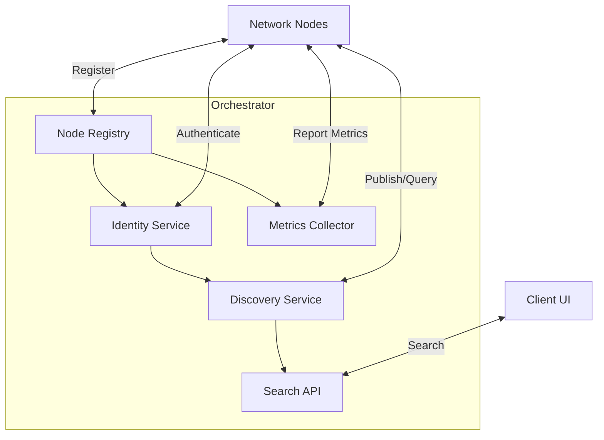

# CPC Orchestrator Architecture

## Overview
The CPC Orchestrator provides centralized coordination for our hybrid P2P network. It handles node registration, resource allocation, identity management, and content discovery while maintaining compatibility with our libp2p-based decentralized infrastructure.

## Architecture Diagram


## Core Components

### 1. Node Registry Service
- **Purpose**: Track peer status and resource availability
- **Features**:
  - Node registration with heartbeat monitoring (30s intervals)
  - Resource allocation and load balancing
  - Failure detection and automatic re-routing
  - Peer discovery for efficient P2P connections
- **Storage**:
  - PostgreSQL: Persistent node metadata
  - Valkey: Cached node status and resource metrics (TTL: 5 minutes)

### 2. Identity System
- **Purpose**: Handle authentication and authorization
- **Features**:
  - Ed25519-based public key authentication
  - JWT token issuance and validation (HS256 algorithm)
  - Friend list management with bidirectional relationships
  - Fine-grained permission controls (read/write/admin)
- **Storage**:
  - PostgreSQL: User profiles and relationships
  - Valkey: Session tokens and revocation lists

### 3. Discovery Service
- **Purpose**: Manage content metadata and search
- **Features**:
  - Content indexing with OpenSearch integration
  - Tag-based categorization system
  - Social graph recommendations
  - Content availability tracking (seeders/leechers)
- **Storage**:
  - PostgreSQL: Core metadata storage
  - OpenSearch: Full-text search index
  - Valkey: Popular content cache

### 4. Metrics System
- **Purpose**: Monitor network health and performance
- **Features**:
  - Real-time dashboard for node status
  - Anomaly detection
  - Automated scaling alerts
  - OpenMetrics-compatible endpoint

## API Specifications

### gRPC Services (port 50051)
```protobuf
service NodeOrchestration {
  rpc RegisterNode(NodeInfo) returns (RegistrationResponse);
  rpc Heartbeat(NodePing) returns (HeartbeatResponse);
  rpc RequestResources(ResourceRequest) returns (ResourceAllocation);
}

service IdentityService {
  rpc Authenticate(AuthRequest) returns (AuthResponse);
  rpc RefreshToken(RefreshRequest) returns (AuthResponse);
  rpc ManageFriends(FriendRequest) returns (FriendResponse);
}

service DiscoveryService {
  rpc PublishContent(ContentMetadata) returns (PublishResponse);
  rpc SearchContent(SearchQuery) returns (SearchResults);
}
```

### REST Endpoints (port 3030)
```
GET  /health         # Service status
POST /register       # Node registration
POST /auth           # JWT authentication
GET  /search?q=...   # Content search
GET  /metrics        # OpenMetrics endpoint
```

## Database Schema

### Nodes Table
| Column       | Type          | Description               |
|--------------|---------------|---------------------------|
| id           | UUID          | Unique node identifier    |
| public_key   | BYTEA         | Ed25519 public key        |
| last_seen    | TIMESTAMPTZ   | Last heartbeat timestamp  |
| resources    | JSONB         | CPU/Memory/Bandwidth      |
| status       | ENUM          | online/offline/degraded   |

### Users Table
| Column       | Type          | Description               |
|--------------|---------------|---------------------------|
| id           | UUID          | User identifier           |
| username     | VARCHAR(50)   | Unique handle             |
| public_key   | BYTEA         | Ed25519 public key        |
| friends      | UUID[]        | List of friend IDs        |
| permissions  | JSONB         | Access control rules      |

### Content Table
| Column       | Type          | Description               |
|--------------|---------------|---------------------------|
| id           | UUID          | Content identifier        |
| owner_id     | UUID          | User who published        |
| title        | VARCHAR(255)  | Content title             |
| description  | TEXT          | Detailed description      |
| tags         | VARCHAR(50)[] | Categorization tags       |
| availability | INT           | Number of active seeders  |

## Implementation Roadmap
1. **Phase 1 (Core)**: Node registry with heartbeat monitoring (2 weeks)
2. **Phase 2 (Auth)**: JWT authentication system (1 week)
3. **Phase 3 (Discovery)**: Content indexing and search (3 weeks)
4. **Phase 4 (Metrics)**: Monitoring and alerting (2 weeks)
5. **Phase 5 (Optimization)**: Caching and performance tuning (1 week)

## License Compliance
All components use permissively licensed crates:
- Tonic (gRPC): MIT
- Warp (REST): MIT
- SQLx (PostgreSQL): MIT
- Valkey-rs: MIT
- OpenSearch-rs: Apache 2.0
  -